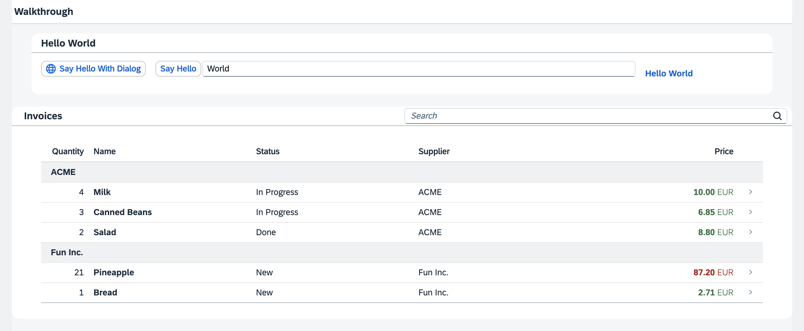

<!--
# SAP-samples/repository-template
This default template for SAP Samples repositories includes files for README, LICENSE, and .reuse/dep5. All repositories on github.com/SAP-samples will be created based on this template.

# Containing Files

1. The LICENSE file:
In most cases, the license for SAP sample projects is `Apache 2.0`.

2. The .reuse/dep5 file: 
The [Reuse Tool](https://reuse.software/) must be used for your samples project. You can find the .reuse/dep5 in the project initial. Please replace the parts inside the single angle quotation marks < > by the specific information for your repository.

3. The README.md file (this file):
Please edit this file as it is the primary description file for your project. You can find some placeholder titles for sections below.
-->

[](https://api.reuse.software/info/github.com/SAP-samples/ui5-typescript-walkthrough)

# OpenUI5 TypeScript Walkthrough

In this tutorial we'll introduce you to all major development paradigms of OpenUI5. We'll demonstrate the use of TypeScript with OpenUI5 and highlight the specific characteristics of this approach.

## Description

We first introduce you to the basic development paradigms like *Model-View-Controller* and establish a best-practice structure of our application. We'll do this along the classic example of “Hello World” and start a new app from scratch. Next, we'll introduce the fundamental data binding concepts of OpenUI5 and extend our app to show a list of invoices. We'll continue to add more functionality by adding navigation, extending controls, and making our app responsive. We'll also have look at the testing features and the built-in support tools of OpenUI5.

### Preview



> 💡 **Tip:** <br>
> You don't have to do all tutorial steps sequentially, you can also jump directly to any step you want. Just download the code from the previous step and make sure that the application runs as intended.
> 
> You can view the samples for all steps here in this repository.
>
> For more information, read the [Getting Started](#getting-started) section below.

### Steps

The tutorial consists of the following steps. To start, just open the first link - you`ll be guided from there.

- **[Step 1: Hello World!](steps/01/README.md "As you know OpenUI5 is all about HTML5. Let’s get started with building a first &quot;Hello World&quot; with only HTML.")** ([🔗 Live Preview](https://sap-samples.github.io/ui5-typescript-walkthrough/build/01/index.html) \| <details class="ts-only"> [📥 Download Solution](https://sap-samples.github.io/ui5-typescript-walkthrough/ui5-typescript-walkthrough-step-01.zip) </details><details class="js-only"> [📥 Download Solution](https://sap-samples.github.io/ui5-typescript-walkthrough/ui5-typescript-walkthrough-step-01-js.zip) </details> )
- **[Step 2: Bootstrap](steps/02/README.md "Before we can do something with OpenUI5, we need to load and initialize it. This process of loading and initializing OpenUI5 is called bootstrapping. Once this bootstrapping is finished, we simply display an alert.")** ([🔗 Live Preview](https://sap-samples.github.io/ui5-typescript-walkthrough/build/02/index-cdn.html) \| <details class="ts-only"> [📥 Download Solution](https://sap-samples.github.io/ui5-typescript-walkthrough/ui5-typescript-walkthrough-step-02.zip) </details><details class="js-only"> [📥 Download Solution](https://sap-samples.github.io/ui5-typescript-walkthrough/ui5-typescript-walkthrough-step-02-js.zip) </details> )
- **[Step 3: Controls](steps/03/README.md "Now it is time to build our first little UI by replacing the &quot;Hello World&quot; text in the HTML body by the OpenUI5 control sap/m/Text. In the beginning, we will use the	JavaScript control interface to set up the UI, the control instance is then placed into the HTML body. ")** ([🔗 Live Preview](https://sap-samples.github.io/ui5-typescript-walkthrough/build/03/index-cdn.html) \| <details class="ts-only"> [📥 Download Solution](https://sap-samples.github.io/ui5-typescript-walkthrough/ui5-typescript-walkthrough-step-03.zip) </details><details class="js-only"> [📥 Download Solution](https://sap-samples.github.io/ui5-typescript-walkthrough/ui5-typescript-walkthrough-step-03-js.zip)</details> )
- **[Step 4: XML Views](steps/04/README.md "Putting all our UI into the index.ts file will very soon result in a messy setup, and there is quite a bit of work ahead of us. So let’s do a first modularization by putting the sap/m/Text control into a dedicated view.")** ([🔗 Live Preview](https://sap-samples.github.io/ui5-typescript-walkthrough/build/04/index-cdn.html) \| <details class="ts-only"> [📥 Download Solution](https://sap-samples.github.io/ui5-typescript-walkthrough/ui5-typescript-walkthrough-step-04.zip) </details> <details class="js-only"> [📥 Download Solution](https://sap-samples.github.io/ui5-typescript-walkthrough/ui5-typescript-walkthrough-step-04-js.zip) </details>)
- **[Step 5: Controllers](steps/05/README.md "In this step, we replace the text with a button and show the &quot;Hello World&quot; message when the button is pressed. The handling of the button's press event is implemented in the controller of the view.")** ([🔗 Live Preview](https://sap-samples.github.io/ui5-typescript-walkthrough/build/05/index-cdn.html) \| <details class="ts-only"> [📥 Download Solution](https://sap-samples.github.io/ui5-typescript-walkthrough/ui5-typescript-walkthrough-step-05.zip) </details><details class="js-only"> [📥 Download Solution](https://sap-samples.github.io/ui5-typescript-walkthrough/ui5-typescript-walkthrough-step-05-js.zip) </details>)
- **[Step 6: Modules](steps/06/README.md "In OpenUI5, resources are often referred to as modules. In this step, we replace the alert from the last exercise with a proper Message Toast from the sap.m library.")** ([🔗 Live Preview](https://sap-samples.github.io/ui5-typescript-walkthrough/build/06/index-cdn.html) \| <details class="ts-only"> [📥 Download Solution](https://sap-samples.github.io/ui5-typescript-walkthrough/ui5-typescript-walkthrough-step-06.zip) </details> <details class="js-only"> [📥 Download Solution](https://sap-samples.github.io/ui5-typescript-walkthrough/ui5-typescript-walkthrough-step-06-js.zip) </details>)
- **[Step 7: JSON Model](steps/07/README.md "Now that we have set up the view and controller, it’s about time to think about the M in MVC.")** ([🔗 Live Preview](https://sap-samples.github.io/ui5-typescript-walkthrough/build/07/index-cdn.html) \| <details class="ts-only"> [📥 Download Solution](https://sap-samples.github.io/ui5-typescript-walkthrough/ui5-typescript-walkthrough-step-07.zip) </details><details class="js-only"> [📥 Download Solution](https://sap-samples.github.io/ui5-typescript-walkthrough/ui5-typescript-walkthrough-step-07-js.zip) </details>)
- **[Step 8: Translatable Texts](steps/08/README.md "In this step we move the texts of our UI to a separate resource file.")** ([🔗 Live Preview](https://sap-samples.github.io/ui5-typescript-walkthrough/build/08/index-cdn.html) \| <details class="ts-only"> [📥 Download Solution](https://sap-samples.github.io/ui5-typescript-walkthrough/ui5-typescript-walkthrough-step-08.zip) </details><details class="js-only"> [📥 Download Solution](https://sap-samples.github.io/ui5-typescript-walkthrough/ui5-typescript-walkthrough-step-08-js.zip) </details>) 
- **[Step 9: Component Configuration](steps/09/README.md "After we have introduced all three parts of the Model-View-Controller /(MVC/) concept, we now come to another important structural aspect of OpenUI5. ")** ([🔗 Live Preview](https://sap-samples.github.io/ui5-typescript-walkthrough/build/09/index-cdn.html) \| <details class="ts-only">[📥 Download Solution](https://sap-samples.github.io/ui5-typescript-walkthrough/ui5-typescript-walkthrough-step-09.zip) </details><details class="js-only"> [📥 Download Solution](https://sap-samples.github.io/ui5-typescript-walkthrough/ui5-typescript-walkthrough-step-09-js.zip)</details>)  
- **[Step 10: Descriptor for Applications](steps/10/README.md "All application-specific configuration settings will now further be put in a separate descriptor file called manifest.json. This clearly separates the application coding from the configuration settings and makes our app even more flexible. For example, all SAP Fiori applications are realized as components and come with a descriptor file in order to be hosted in the SAP Fiori launchpad.")**  ([🔗 Live Preview](https://sap-samples.github.io/ui5-typescript-walkthrough/build/10/index-cdn.html) \| <details class="ts-only"> [📥 Download Solution](https://sap-samples.github.io/ui5-typescript-walkthrough/ui5-typescript-walkthrough-step-10.zip) </details><details class="js-only"> [📥 Download Solution](https://sap-samples.github.io/ui5-typescript-walkthrough/ui5-typescript-walkthrough-step-10-js.zip) </details>)
- **[Step 11: Pages and Panels](steps/11/README.md "After all the work on the app structure it’s time to improve the look of our app. We will use two controls from the sap.m library to add a bit more &quot;bling&quot; to our UI. You will also learn about control aggregations in this step.")** ([🔗 Live Preview](https://sap-samples.github.io/ui5-typescript-walkthrough/build/11/index-cdn.html) \| <details class="ts-only"> [📥 Download Solution](https://sap-samples.github.io/ui5-typescript-walkthrough/ui5-typescript-walkthrough-step-11.zip) </details><details class="js-only"> [📥 Download Solution](https://sap-samples.github.io/ui5-typescript-walkthrough/ui5-typescript-walkthrough-step-11-js.zip) </details>) 
- **[Step 12: Shell Control as Container](steps/12/README.md "Now we use a shell control as container for our app and use it as our new root element. The shell takes care of visual adaptation of the application to the device’s screen size by introducing a so-called letterbox on desktop screens.")** ([🔗 Live Preview](https://sap-samples.github.io/ui5-typescript-walkthrough/build/12/index-cdn.html) \| <details class="ts-only"> [📥 Download Solution](https://sap-samples.github.io/ui5-typescript-walkthrough/ui5-typescript-walkthrough-step-12.zip) </details><details class="js-only"> [📥 Download Solution](https://sap-samples.github.io/ui5-typescript-walkthrough/ui5-typescript-walkthrough-step-12-js.zip) </details>) 
- **[Step 13: Margins and Paddings](steps/13/README.md "Our app content is still glued to the corners of the letterbox. To fine-tune our layout, we can add margins and paddings to the controls that we added in the previous step. ")** ([🔗 Live Preview](https://sap-samples.github.io/ui5-typescript-walkthrough/build/13/index-cdn.html) \| <details class="ts-only"> [📥 Download Solution](https://sap-samples.github.io/ui5-typescript-walkthrough/ui5-typescript-walkthrough-step-13.zip) </details><details class="js-only"> [📥 Download Solution](https://sap-samples.github.io/ui5-typescript-walkthrough/ui5-typescript-walkthrough-step-13-js.zip) </details>) 
- **[Step 14: Custom CSS and Theme Colors](steps/14/README.md "Sometimes we need to define some more fine-granular layouts and this is when we can use the flexibility of CSS by adding custom style classes to controls and style them as we like. ")** ([🔗 Live Preview](https://sap-samples.github.io/ui5-typescript-walkthrough/build/14/index-cdn.html) | <details class="ts-only"> [📥 Download Solution](https://sap-samples.github.io/ui5-typescript-walkthrough/ui5-typescript-walkthrough-step-14.zip) </details><details class="js-only"> [📥 Download Solution](https://sap-samples.github.io/ui5-typescript-walkthrough/ui5-typescript-walkthrough-step-14-js.zip)</details>) 
- **[Step 15: Nested Views](steps/15/README.md "Our panel content is getting more and more complex and now it is time to move the panel content to a separate view. With that approach, the application structure is much easier to understand, and the individual parts of the app can be reused.")** ([🔗 Live Preview](https://sap-samples.github.io/ui5-typescript-walkthrough/build/15/index-cdn.html) \| <details class="ts-only"> [📥 Download Solution](https://sap-samples.github.io/ui5-typescript-walkthrough/ui5-typescript-walkthrough-step-15.zip) </details><details class="js-only"> [📥 Download Solution](https://sap-samples.github.io/ui5-typescript-walkthrough/ui5-typescript-walkthrough-step-15-js.zip)</details>) 
- **[Step 16: Dialogs and Fragments](steps/16/README.md "In this step, we will take a closer look at another element which can be used to assemble views: the fragment. ")** ([🔗 Live Preview](https://sap-samples.github.io/ui5-typescript-walkthrough/build/16/index-cdn.html) \| <details class="ts-only"> [📥 Download Solution](https://sap-samples.github.io/ui5-typescript-walkthrough/ui5-typescript-walkthrough-step-16.zip) </details><details class="js-only"> [📥 Download Solution](https://sap-samples.github.io/ui5-typescript-walkthrough/ui5-typescript-walkthrough-step-16-js.zip)</details>) 
- **[Step 17: Fragment Callbacks](steps/17/README.md "Now that we have integrated the dialog, it's time to add some user interaction. The user will definitely want to close the dialog again at some point, so we add a button to close the dialog and assign an event handler.")** ([🔗 Live Preview](https://sap-samples.github.io/ui5-typescript-walkthrough/build/17/index-cdn.html) \| <details class="ts-only"> [📥 Download Solution](https://sap-samples.github.io/ui5-typescript-walkthrough/ui5-typescript-walkthrough-step-17.zip) </details><details class="js-only"> [📥 Download Solution](https://sap-samples.github.io/ui5-typescript-walkthrough/ui5-typescript-walkthrough-step-17-js.zip)</details>)
- **[Step 18: Icons](steps/18/README.md "Our dialog is still pretty much empty. Since OpenUI5 is shipped with a large icon font that contains more than 500 icons, we will add an icon to greet our users when the dialog is opened.")** ([🔗 Live Preview](https://sap-samples.github.io/ui5-typescript-walkthrough/build/18/index-cdn.html) \| <details class="ts-only"> [📥 Download Solution](https://sap-samples.github.io/ui5-typescript-walkthrough/ui5-typescript-walkthrough-step-18.zip) </details><details class="js-only"> [📥 Download Solution](https://sap-samples.github.io/ui5-typescript-walkthrough/ui5-typescript-walkthrough-step-18-js.zip)</details>)  
- **[Step 19: Aggregation Binding](steps/19/README.md "Now that we have established a good structure for our app, it's time to add some more functionality. We start exploring more features of data binding by adding some invoice data in JSON format that we display in a list below the panel.")** ([🔗 Live Preview](https://sap-samples.github.io/ui5-typescript-walkthrough/build/19/index-cdn.html) \| <details class="ts-only"> [📥 Download Solution](https://sap-samples.github.io/ui5-typescript-walkthrough/ui5-typescript-walkthrough-step-19.zip) </details><details class="js-only"> [📥 Download Solution](https://sap-samples.github.io/ui5-typescript-walkthrough/ui5-typescript-walkthrough-step-19-js.zip)</details>) 
- **[Step 20: Data Types](steps/20/README.md "The list of invoices is already looking nice, but what is an invoice without a price assigned? Typically prices are stored in a technical format and with a /'./' delimiter in the data model. For example, our invoice for pineapples has the calculated price 87.2 without a currency. We are going to use the OpenUI5 data types to format the price properly, with a locale-dependent decimal separator and two digits after the separator.")** ([🔗 Live Preview](https://sap-samples.github.io/ui5-typescript-walkthrough/build/20/index-cdn.html) \| <details class="ts-only"> [📥 Download Solution](https://sap-samples.github.io/ui5-typescript-walkthrough/ui5-typescript-walkthrough-step-20.zip) </details><details class="js-only"> [📥 Download Solution](https://sap-samples.github.io/ui5-typescript-walkthrough/ui5-typescript-walkthrough-step-20-js.zip) </details>) 
- **[Step 21: Expression Binding](steps/21/README.md "Sometimes the predefined types of OpenUI5 are not flexible enough and you want to do a simple calculation or formatting in the view - that is where expressions are really helpful. We use them to format our price according to the current number in the data model.")** ([🔗 Live Preview](https://sap-samples.github.io/ui5-typescript-walkthrough/build/21/index-cdn.html) \| <details class="ts-only"> [📥 Download Solution](https://sap-samples.github.io/ui5-typescript-walkthrough/ui5-typescript-walkthrough-step-21.zip) </details><details class="js-only"> [📥 Download Solution](https://sap-samples.github.io/ui5-typescript-walkthrough/ui5-typescript-walkthrough-step-21-js.zip)</details>)  
- **[Step 22: Custom Formatters](steps/22/README.md "If we want to do a more complex logic for formatting properties of our data model, we can also write a custom formatting function. We will now add a localized status with a custom formatter, because the status in our data model is in a rather technical format.")** ([🔗 Live Preview](https://sap-samples.github.io/ui5-typescript-walkthrough/build/22/index-cdn.html) \| <details class="ts-only"> [📥 Download Solution](https://sap-samples.github.io/ui5-typescript-walkthrough/ui5-typescript-walkthrough-step-22.zip) </details><details class="js-only"> [📥 Download Solution](https://sap-samples.github.io/ui5-typescript-walkthrough/ui5-typescript-walkthrough-step-22-js.zip)</details>)
- **[Step 23: Filtering](steps/23/README.md "In this step, we add a search field for our product list and define a filter that represents the search term. When searching, the list is automatically updated to show only the items that match the search term.")** ([🔗 Live Preview](https://sap-samples.github.io/ui5-typescript-walkthrough/build/23/index-cdn.html) \| <details class="ts-only"> [📥 Download Solution](https://sap-samples.github.io/ui5-typescript-walkthrough/ui5-typescript-walkthrough-step-23.zip) </details><details class="js-only"> [📥 Download Solution](https://sap-samples.github.io/ui5-typescript-walkthrough/ui5-typescript-walkthrough-step-23-js.zip)</details>)
- **[Step 24: Sorting and Grouping](steps/24/README.md "To make our list of invoices even more user-friendly, we sort it alphabetically instead of just showing the order from the data model. Additionally, we introduce groups and add the company that ships the products so that the data is easier to consume.")** ([🔗 Live Preview](https://sap-samples.github.io/ui5-typescript-walkthrough/build/24/index-cdn.html) \| <details class="ts-only"> [📥 Download Solution](https://sap-samples.github.io/ui5-typescript-walkthrough/ui5-typescript-walkthrough-step-24.zip) </details><details class="js-only"> [📥 Download Solution](https://sap-samples.github.io/ui5-typescript-walkthrough/ui5-typescript-walkthrough-step-24-js.zip)</details>)
- **[Step 25: Remote OData Service](steps/25/README.md "So far we have worked with local JSON data, but now we will access a real OData service to visualize remote data.")** (🔗 Live Preview *unfeasible* \| <details class="ts-only"> [📥 Download Solution](https://sap-samples.github.io/ui5-typescript-walkthrough/ui5-typescript-walkthrough-step-25.zip) </details><details class="js-only"> [📥 Download Solution](https://sap-samples.github.io/ui5-typescript-walkthrough/ui5-typescript-walkthrough-step-25-js.zip)</details>)
- **[Step 26: Mock Server Configuration](steps/26/README.md "We just ran our app against a real service, but for developing and testing our app we do not want to rely on the availability of the “real” service or put additional load on the system where the data service is located.")** ([🔗 Live Preview](https://sap-samples.github.io/ui5-typescript-walkthrough/build/26/test/mockServer-cdn.html) \| <details class="ts-only"> [📥 Download Solution](https://sap-samples.github.io/ui5-typescript-walkthrough/ui5-typescript-walkthrough-step-26.zip) </details><details class="js-only"> [📥 Download Solution](https://sap-samples.github.io/ui5-typescript-walkthrough/ui5-typescript-walkthrough-step-26-js.zip)</details>)
- **[Step 27: Unit Test with QUnit](steps/27/README.md "Now that we have a test folder in the app, we can start to increase our test coverage. ")** ([🔗 Live Preview](https://sap-samples.github.io/ui5-typescript-walkthrough/build/27/test/Test.cdn.qunit.html?testsuite=test-resources/ui5/walkthrough/testsuite.cdn.qunit&test=unit/unitTests) \| <details class="ts-only"> [📥 Download Solution](https://sap-samples.github.io/ui5-typescript-walkthrough/ui5-typescript-walkthrough-step-27.zip) </details><details class="js-only"> [📥 Download Solution](https://sap-samples.github.io/ui5-typescript-walkthrough/ui5-typescript-walkthrough-step-27-js.zip)</details>)
- **[Step 28: Integration Test with OPA](steps/28/README.md "If we want to test interaction patterns or more visual features of our app, we can also write an integration test. ")** ([🔗 Live Preview](https://sap-samples.github.io/ui5-typescript-walkthrough/build/28/test/Test.cdn.qunit.html?testsuite=test-resources/ui5/walkthrough/testsuite.cdn.qunit&test=integration/opaTests) \| <details class="ts-only"> [📥 Download Solution](https://sap-samples.github.io/ui5-typescript-walkthrough/ui5-typescript-walkthrough-step-28.zip) </details><details class="js-only"> [📥 Download Solution](https://sap-samples.github.io/ui5-typescript-walkthrough/ui5-typescript-walkthrough-step-28-js.zip)</details>)
- **[Step 29: Debugging Tools](steps/29/README.md "Even though we have added a basic test coverage in the previous steps, it seems like we accidentally broke our app, because it does not display prices to our invoices anymore. We need to debug the issue and fix it before someone finds out.")** (*code remains unchanged from the previous step*)
- **[Step 30: Routing and Navigation](steps/30/README.md "So far, we have put all app content on one single page. As we add more and more features, we want to split the content and put it on separate pages.")** ([🔗 Live Preview](https://sap-samples.github.io/ui5-typescript-walkthrough/build/30/test/mockServer-cdn.html) \| <details class="ts-only"> [📥 Download Solution](https://sap-samples.github.io/ui5-typescript-walkthrough/ui5-typescript-walkthrough-step-30.zip) </details><details class="js-only"> [📥 Download Solution](https://sap-samples.github.io/ui5-typescript-walkthrough/ui5-typescript-walkthrough-step-30-js.zip)</details>)
- **[Step 31: Routing with Parameters](steps/31/README.md "We can now navigate between the overview and the detail page, but the actual item that we selected in the overview is not displayed on the detail page yet. A typical use case for our app is to show additional information for the selected item on the detail page. ")** ([🔗 Live Preview](https://sap-samples.github.io/ui5-typescript-walkthrough/build/31/test/mockServer-cdn.html) | <details class="ts-only"> [📥 Download Solution](https://sap-samples.github.io/ui5-typescript-walkthrough/ui5-typescript-walkthrough-step-31.zip) </details><details class="js-only"> [📥 Download Solution](https://sap-samples.github.io/ui5-typescript-walkthrough/ui5-typescript-walkthrough-step-31-js.zip)</details>)
- **[Step 32: Routing Back and History](steps/32/README.md "Now we can navigate to our detail page and display an invoice, but we cannot go back to the overview page yet. We'll add a back button to the detail page and implement a function that shows our overview page again.")** ([🔗 Live Preview](https://sap-samples.github.io/ui5-typescript-walkthrough/build/32/test/mockServer-cdn.html) \| <details class="ts-only"> [📥 Download Solution](https://sap-samples.github.io/ui5-typescript-walkthrough/ui5-typescript-walkthrough-step-32.zip) </details><details class="js-only"> [📥 Download Solution](https://sap-samples.github.io/ui5-typescript-walkthrough/ui5-typescript-walkthrough-step-32-js.zip)</details>)
- **[Step 33: Custom Controls](steps/33/README.md "In this step, we are going to extend the functionality of OpenUI5 with a custom control. We want to rate the product shown on the detail page, so we create a composition of multiple standard controls using the OpenUI5 extension mechanism and add some glue code to make them work nicely together. This way, we can reuse the control across the app and keep all related functionality in one module.")** ([🔗 Live Preview](https://sap-samples.github.io/ui5-typescript-walkthrough/build/33/test/mockServer-cdn.html) \| <details class="ts-only"> [📥 Download Solution](https://sap-samples.github.io/ui5-typescript-walkthrough/ui5-typescript-walkthrough-step-33.zip)</details> <details class="js-only"> [📥 Download Solution](https://sap-samples.github.io/ui5-typescript-walkthrough/ui5-typescript-walkthrough-step-33-js.zip)</details>)
- **[Step 34: Responsiveness](steps/34/README.md "In this step, we improve the responsiveness of our app. OpenUI5 applications can be run on phone, tablet, and desktop devices and we can configure the application to make best use of the screen estate for each scenario. Fortunately, OpenUI5 controls like the 	sap.m.Table already deliver a lot of features that we can use.")** ([🔗 Live Preview](https://sap-samples.github.io/ui5-typescript-walkthrough/build/34/test/mockServer-cdn.html) \| <details class="ts-only"> [📥 Download Solution](https://sap-samples.github.io/ui5-typescript-walkthrough/ui5-typescript-walkthrough-step-34.zip) </details><details class="js-only"> [📥 Download Solution](https://sap-samples.github.io/ui5-typescript-walkthrough/ui5-typescript-walkthrough-step-34-js.zip)</details>)
- **[Step 35: Device Adaptation](steps/35/README.md "We now configure the visibility and properties of controls based on the device that we run the application on. By making use of the sap.ui.Device API and defining a device model we will make the app look great on many devices.")** ([🔗 Live Preview](https://sap-samples.github.io/ui5-typescript-walkthrough/build/35/test/mockServer-cdn.html) \| <details class="ts-only"> [📥 Download Solution](https://sap-samples.github.io/ui5-typescript-walkthrough/ui5-typescript-walkthrough-step-35.zip) </details><details class="js-only"> [📥 Download Solution](https://sap-samples.github.io/ui5-typescript-walkthrough/ui5-typescript-walkthrough-step-35-js.zip)</details>)
- **[Step 36: Content Density](steps/36/README.md "In this step of our Walkthrough tutorial, we adjust the content density based on the user’s device. OpenUI5 contains different content densities allowing you to display larger controls for touch-enabled devices and a smaller, more compact design for devices that are operated by mouse. In our app, we will detect the device and adjust the density accordingly.")** ([🔗 Live Preview](https://sap-samples.github.io/ui5-typescript-walkthrough/build/36/test/mockServer-cdn.html) \| <details class="ts-only"> [📥 Download Solution](https://sap-samples.github.io/ui5-typescript-walkthrough/ui5-typescript-walkthrough-step-36.zip) </details><details class="js-only"> [📥 Download Solution](https://sap-samples.github.io/ui5-typescript-walkthrough/ui5-typescript-walkthrough-step-36-js.zip)</details>)
- **[Step 37: Accessibility](steps/37/README.md "In this step we're going to improve the accessibility of our app.")** ([🔗 Live Preview](https://sap-samples.github.io/ui5-typescript-walkthrough/build/37/test/mockServer-cdn.html) \| <details class="ts-only"> [📥 Download Solution](https://sap-samples.github.io/ui5-typescript-walkthrough/ui5-typescript-walkthrough-step-37.zip) </details><details class="js-only"> [📥 Download Solution](https://sap-samples.github.io/ui5-typescript-walkthrough/ui5-typescript-walkthrough-step-37-js.zip)</details>)
- **[Step 38: Build Your Application](steps/38/README.md "In this step we're going to build our application and consume the speed of a built OpenUI5 application.")** (<details class="ts-only"> [📥 Download Solution](https://sap-samples.github.io/ui5-typescript-walkthrough/ui5-typescript-walkthrough-step-38.zip) </details><details class="js-only"> [📥 Download Solution](https://sap-samples.github.io/ui5-typescript-walkthrough/ui5-typescript-walkthrough-step-38-js.zip)</details>)

## Requirements

The project uses npm workspaces and requires a [Node.js](https://nodejs.org/) version  >= `20.11.0` to be installed.

### Getting Started

The project is setup as monorepo. All steps are located inside the `steps` folder and labelled with their step number. The monorepo uses `npm` workspaces to manage all steps together. But you can also run `npm` inside each individual step.

To setup the monorepo you first need to install all depenedencies:

```sh
npm install
```

To run any step, just execute one of the scripts from `package.json` via npm, e.g.:

```sh
# Option 1: use workspace command to start the step
npm start -w ui5.walkthrough.step01

# Option 2: change to the folder of the step and start it
cd steps/01 
npm start
```

## Download and Installation

<!--
TODO

* create GitHub pages to showcase the built examples
* create ZIP files for each step which can be downloaded
-->

## Known Issues

No known issues.

## How to obtain support

[Create an issue](https://github.com/SAP-samples/ui5-typescript-walkthrough/issues) in this repository if you find a bug or have questions about the content.

For additional support, [ask a question in OpenUI5 Community on Slack](https://ui5-slack-invite.cfapps.eu10.hana.ondemand.com/).

## Contributing

If you wish to contribute code, offer fixes or improvements, please send a pull request. Due to legal reasons, contributors will be asked to accept a DCO when they create the first pull request to this project. This happens in an automated fashion during the submission process. SAP uses [the standard DCO text of the Linux Foundation](https://developercertificate.org/).

## License

Copyright (c) 2024 SAP SE or an SAP affiliate company. All rights reserved. This project is licensed under the Apache Software License, version 2.0 except as noted otherwise in the [LICENSE](LICENSE) file.
