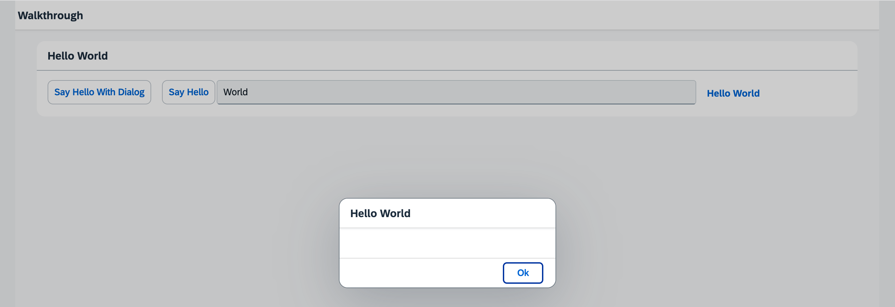

## Step 17: Fragment Callbacks

Now that we have integrated the dialog, it's time to add some user interaction. The user will definitely want to close the dialog again at some point, so we add a button to close the dialog and assign an event handler.

 

***

### Preview
  


<sup>*The dialog now has an &quot;OK&quot; button to close the dialog*</sup>

You can access the live preview by clicking on this link: [🔗 Live Preview of Step 17](https://sap-samples.github.io/ui5-typescript-walkthrough/build/17/index-cdn.html).
***

### Coding

<details class="ts-only">

You can download the solution for this step here: [📥 Download step 17](https://sap-samples.github.io/ui5-typescript-walkthrough/ui5-typescript-walkthrough-step-17.zip).

</details>

<details class="js-only">

You can download the solution for this step here: [📥 Download step 17](https://sap-samples.github.io/ui5-typescript-walkthrough/ui5-typescript-walkthrough-step-17-js.zip).

</details>
***

### webapp/controller/HelloPanel.controller.?s

We add an `onCloseDialog` event handler function into the HelloPanel controller file that closes the dialog when triggered. To get the dialog instance we use the `byId` function and then call the `close` function of the dialog.

```ts
import Controller from "sap/ui/core/mvc/Controller";
import MessageToast from "sap/m/MessageToast";
import JSONModel from "sap/ui/model/json/JSONModel";
import ResourceModel from "sap/ui/model/resource/ResourceModel";
import ResourceBundle from "sap/base/i18n/ResourceBundle";
import Dialog from "sap/m/Dialog";

/**
 * @namespace ui5.walkthrough.controller
 */
export default class HelloPanel extends Controller {
    private dialog: Dialog;
    onShowHello(): void {
        // read msg from i18n model
        const recipient = (this.getView()?.getModel() as JSONModel)?.getProperty("/recipient/name");
        const resourceBundle = (this.getView()?.getModel("i18n") as ResourceModel)?.getResourceBundle() as ResourceBundle;
        const msg = resourceBundle.getText("helloMsg", [recipient]);
        // show message
        MessageToast.show(msg);
    }
    async onOpenDialog(): Promise<void> {
        this.dialog ??= await this.loadFragment({
             name: "ui5.walkthrough.view.HelloDialog"
        }) as Dialog;
        this.dialog.open();
    }
    onCloseDialog(): void {
        (this.byId("helloDialog") as Dialog)?.close();
    }
};

```

```js
sap.ui.define(["sap/ui/core/mvc/Controller", "sap/m/MessageToast"], function (Controller, MessageToast) {
  "use strict";

  const HelloPanel = Controller.extend("ui5.walkthrough.controller.HelloPanel", {
    onShowHello() {
      // read msg from i18n model
      const recipient = this.getView()?.getModel()?.getProperty("/recipient/name");
      const resourceBundle = this.getView()?.getModel("i18n")?.getResourceBundle();
      const msg = resourceBundle.getText("helloMsg", [recipient]);
      // show message
      MessageToast.show(msg);
    },
    async onOpenDialog() {
      this.dialog ??= await this.loadFragment({
        name: "ui5.walkthrough.view.HelloDialog"
      });
      this.dialog.open();
    },
    onCloseDialog() {
      this.byId("helloDialog")?.close();
    }
  });
  ;
  return HelloPanel;
});

```

### webapp/i18n/i18n.properties

We extend the text bundle by the new text for the dialog’s close button.


```ini
...
# Hello Panel
showHelloButtonText=Say Hello
helloMsg=Hello {0}
homePageTitle=UI5 TypeScript Walkthrough
helloPanelTitle=Hello World
openDialogButtonText=Say Hello With Dialog
dialogCloseButtonText=Ok
```

### webapp/view/HelloDialog.fragment.xml

In the fragment definition, we add a button to the `beginButton` aggregation of the dialog and refer the press handler to the event handler we just defined in the controller of the panel’s content view.

```xml
<core:FragmentDefinition
   xmlns="sap.m"
   xmlns:core="sap.ui.core" >
   <Dialog
      id="helloDialog"
      title="Hello {/recipient/name}">
      <beginButton>
         <Button
            text="{i18n>dialogCloseButtonText}"
            press=".onCloseDialog"/>
      </beginButton>
   </Dialog>
</core:FragmentDefinition>
```
&nbsp;
By using the `loadFragment` function to create the fragment content in the controller of the panel’s content view, the method will be invoked there when the button is pressed. The dialog has an aggregation named `beginButton` as well as `endButton`. Placing buttons in both of these aggregations makes sure that the `beginButton` is placed before the `endButton` on the UI. What `before` means, however, depends on the text direction of the current language. We therefore use the terms `begin` and `end` as a synonym to "left" and "right". In languages with left-to-right direction, the `beginButton` will be rendered left, the `endButton` on the right side; in right-to-left mode for specific languages the order is switched.

&nbsp;

***

**Next:** [Step 18: Icons](../18/README.html "Our dialog is still pretty much empty. Since  OpenUI5 is shipped with a large icon font that contains more than 500 icons, we will add an icon to greet our users when the dialog is opened.")

**Previous** [Step 16: Dialogs and Fragments](../16/README.html "In this step, we will take a closer look at another element which can be used to assemble views: the fragment.")

***

**Related Information**

[Reusing UI Parts: Fragments](https://sdk.openui5.org/topic/36a5b130076e4b4aac2c27eebf324909.html "Fragments are light-weight UI parts (UI sub-trees) which can be reused, defined similar to views, but do not have any controller or other behavior code involved.")

[Instantiation of Fragments](https://sdk.openui5.org/topic/04129b2798c447368f4c8922c3c33cd7.html "OpenUI5 provides two options to instantiate a fragment: If it is instantiated inside a controller extending sap.ui.core.mvc.Controller, the loadFragment() function is the way to go. However, if it is instantiated in a non-controller artefact, the generic function sap.ui.core.Fragment.load() can be used.")

[API Reference: sap.m.Dialog](https://sdk.openui5.org/api/sap.m.Dialog)

[Samples: sap.m.Dialog](https://sdk.openui5.org/entity/sap.m.Dialog)
