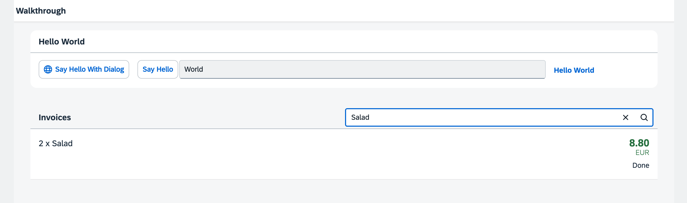

## Step 23: Filtering

In this step, we add a search field for our product list and define a filter that represents the search term. When searching, the list is automatically updated to show only the items that match the search term.

&nbsp;

***

### Preview
  


<sup>*A search field is displayed above the list*</sup>

You can access the live preview by clicking on this link: [🔗 Live Preview of Step 23](https://sap-samples.github.io/ui5-typescript-walkthrough/build/23/index-cdn.html).

***

### Coding

<details class="ts-only">

You can download the solution for this step here: [📥 Download step 23](https://sap-samples.github.io/ui5-typescript-walkthrough/ui5-typescript-walkthrough-step-23.zip).

</details>

<details class="js-only">

You can download the solution for this step here: [📥 Download step 23](https://sap-samples.github.io/ui5-typescript-walkthrough/ui5-typescript-walkthrough-step-23-js.zip).

</details>
***

### webapp/controller/InvoiceList.controller.?s

We will implement a new `onFilterInvoices` event handler function to our controller. This function will enable users to filter the invoice list based on a search term entered in a `sap/m/SearchField` control.

In the in the event handler, we create a filter object for the search term with filter operator `Contains` that targets the `ProductName` property of the invoice data.

If the query is empty, we filter the binding with an empty array. This will make sure that we see all list elements again.

Finally we apply the filter to the items binding of the invoice list in our view, updating the displayed items.

```ts
import Controller from "sap/ui/core/mvc/Controller";
import JSONModel from "sap/ui/model/json/JSONModel";
import { SearchField$SearchEvent } from "sap/m/SearchField";
import Filter from "sap/ui/model/Filter";
import FilterOperator from "sap/ui/model/FilterOperator";
import ListBinding from "sap/ui/model/ListBinding";

/**
 * @namespace ui5.walkthrough.controller
 */
export default class App extends Controller {
    onInit(): void {
        const viewModel = new JSONModel({
            currency: "EUR"
        });
        this.getView()?.setModel(viewModel, "view");
    }

    onFilterInvoices(event: SearchField$SearchEvent): void {
        // build filter array
        const filter = [];
        const query = event.getParameter("query");
        if (query) {
            filter.push(new Filter("ProductName", FilterOperator.Contains, query));
        }

        // filter binding
        const list = this.byId("invoiceList");
        const binding = list?.getBinding("items") as ListBinding;
        binding?.filter(filter);
    }
};

```

```js
sap.ui.define(["sap/ui/core/mvc/Controller", "sap/ui/model/json/JSONModel", "sap/ui/model/Filter", "sap/ui/model/FilterOperator"], function (Controller, JSONModel, Filter, FilterOperator) {
  "use strict";

  const App = Controller.extend("ui5.walkthrough.controller.App", {
    onInit() {
      const viewModel = new JSONModel({
        currency: "EUR"
      });
      this.getView()?.setModel(viewModel, "view");
    },
    onFilterInvoices(event) {
      // build filter array
      const filter = [];
      const query = event.getParameter("query");
      if (query) {
        filter.push(new Filter("ProductName", FilterOperator.Contains, query));
      }

      // filter binding
      const list = this.byId("invoiceList");
      const binding = list?.getBinding("items");
      binding?.filter(filter);
    }
  });
  ;
  return App;
});

```
&nbsp;
The `onFilterInvoices` function is triggered by a `SearchField$SearchEvent`(an event generated by the search field when the user enters a search term and presses Enter or clicks the search icon). Event handlers always receive an event argument. This argument provides access to the event's specific parameters.

We use `event.getParameter("query")` to extract the text entered by the user in the search field. The `"query"` parameter is a standard property of the `SearchField$SearchEvent`.

If the query is not empty, we create a new `sap/ui/model/Filter` object. This filter object is configured as follows:
- `"ProductName"` (path): Specifies the data property to filter on. In this case, we're filtering the ProductName property of each invoice item.
- `FilterOperator.Contains` (operator): Specifies the filtering logic. FilterOperator.Contains checks if the ProductName contains the query string. Other operators are available (e.g., FilterOperator.Equals, FilterOperator.StartsWith). The FilterOperator is part of the sap/ui/model/FilterOperator module. The `FilterOperator.Contains` operator performs a case-insensitive search.
- `query` (value): The value to filter with – the search term entered by the user.

The `byId` method is a helper function provided by the `sap/ui/core/mvc/Controller` class. It allows you to retrieve a control instance by its ID. Because the control ID is automatically prefixed with the view ID at runtime, we need to use `byId` to get a reference to the list control that's defined in the view.

`list?.getBinding("items")` gets the binding object for the items aggregation of the `sap/m/List`. The items aggregation is the one bound to the list items.

`binding?.filter(filter)` applies the filter (which is an array, even if it only contains one filter) to the list binding. This triggers the list to update its display, showing only the items that match the filter criteria. If the filter array is empty (because the query was empty), the `binding?.filter(filter)` call will effectively clear any existing filters, displaying all the items in the list again.

### webapp/view/InvoiceList.view.xml

First we specify the ID "invoiceList" to the list control, so the event handler function `onFilterInvoices` we added to the controller of the invoice list view can identify the list when triggered.

In addition, we remove the `headerText` property in the list control and use `headerToolbar` aggregation with the `sap.m.Toolbar` assigned to it instead. A toolbar control is way more flexible and can be adjusted as you like. To the toolbar control we add a `sap.m.Title` displaying the title in the text attribute, a spacer, and the `sap.m.SearchField` with the width property set to 50% and the filter event handler function we defined in the controller assigned to the search event.

```xml
<mvc:View
   controllerName="ui5.walkthrough.controller.InvoiceList"
   xmlns="sap.m"
   xmlns:core="sap.ui.core"
   xmlns:mvc="sap.ui.core.mvc">
   <List
      id="invoiceList"
      class="sapUiResponsiveMargin"
      width="auto"
      items="{invoice>/Invoices}" >
      <headerToolbar>
         <Toolbar>
            <Title text="{i18n>invoiceListTitle}"/>
            <ToolbarSpacer/>
            <SearchField width="50%" search=".onFilterInvoices"/>
         </Toolbar>
      </headerToolbar>
      <items>
         ...
      </items>
   </List>
</mvc:View>
```
&nbsp;
The search field is part of the list header and therefore, each change on the list binding will trigger a rerendering of the whole list, including the search field.

&nbsp;
 
***

**Next:**[Step 24: Sorting and Grouping](../24/README.html "To make our list of invoices even more user-friendly, we sort it alphabetically instead of just showing the order from the data model. Additionally, we introduce groups and add the company that ships the products so that the data is easier to consume.")

**Previous:**[Step 22: Custom Formatters](../22/README.html "If we want to do a more complex logic for formatting properties of our data model, we can also write a custom formatting function. We will now add a localized status with a custom formatter, because the status in our data model is in a rather technical format.")

***

**Related Information**  

[API Reference: `sap.m.SearchField`](https://sdk.openui5.org/#/api/sap.m.SearchField)

[API Reference: `sap.ui.model.Filter`](https://sdk.openui5.org/#/api/sap.ui.model.Filter)

[API Reference: `sap.ui.model.FilterOperator`](https://sdk.openui5.org/#/api/sap.ui.model.FilterOperator)
