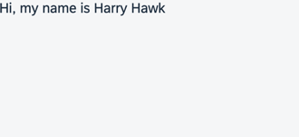

<nav class="tutorial-breadcrumb"><a href="../../../index.html">UI5 Tutorials</a> <span class="tutorial-breadcrumb-sep">&rsaquo;</span> <a href="../../index.html">Data Binding Tutorial</a></nav>


## Step 3: Create Property Binding

Although there is no visible difference, the text on the screen is now derived from model data.

### Preview



You can view this step live: [🔗 Live Preview of Step 3](https://ui5.github.io/tutorials/databinding/build/03/index-cdn.html).

### Coding

You can download the solution for this step here: <span class="ts-only">[📥 Download step 3](https://ui5.github.io/tutorials/databinding/databinding-step-03.zip)<span class="lang-suffix"> (TS)</span></span><span class="js-only">[📥 Download step 3](https://ui5.github.io/tutorials/databinding/databinding-step-03-js.zip)<span class="lang-suffix"> (JS)</span></span>.

#### Folder structure for this step


```text
webapp/
├── model/
│   └── data.json
├── view/
│   └── App.view.xml
├── Component.ts/.js
├── index.html
└── manifest.json
```


Assign the `text` property of the `sap.m.Text` control to the value `{/greetingText}`. The curly brackets enclosing a binding path \(binding syntax\) are automatically interpreted as a binding. These binding instances are called property bindings. In this scenario, the control's `text` property is bound to the `greetingText` property at the root of the default model. The slash \(`/`\) at the beginning of the binding path signifies an absolute binding path.

### webapp/view/App.view.xml


```xml
<mvc:View
    xmlns="sap.m"
    xmlns:mvc="sap.ui.core.mvc">
    <Text text="{/greetingText}"/>
</mvc:View>
```


***

**Next:** [Step 4: Two-Way Data Binding](../04/index.html)

**Previous:** [Step 2: Creating a Model](../02/index.html)

***

**Related Information**

[Binding Types](https://sdk.openui5.org/topic/91f0d8ab6f4d1014b6dd926db0e91070.html "Depending on the different use cases, you can use different binding types: Propety binding, context binding, and list binding.")

[Property Binding](https://sdk.openui5.org/topic/91f0652b6f4d1014b6dd926db0e91070.html "With property binding, you can initialize properties of a control automatically and update them based on the data of the model.")
