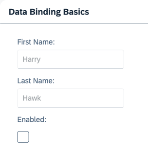

<nav class="tutorial-breadcrumb"><a href="../../../index.html">UI5 Tutorials</a> <span class="tutorial-breadcrumb-sep">&rsaquo;</span> <a href="../../index.html">Data Binding Tutorial</a></nav>


## Step 4: Two-Way Data Binding

In the examples we've looked at so far, we've displayed the value of a model property using a read-only field. We'll now change the user interface to display first and last name fields using `sap.m.Input` fields. We're also adding a check box control to enable or disable both input fields. This setup illustrates a feature known as "two-way data binding". As the view now contains more controls, we're also moving the view definition into an XML file.

### Preview

#### Two input fields and a checkbox to enable or disable them


You can view this step live: [🔗 Live Preview of Step 4](https://ui5.github.io/tutorials/databinding/build/04/index-cdn.html).

### Coding

You can download the solution for this step here: <span class="ts-only">[📥 Download step 4](https://ui5.github.io/tutorials/databinding/databinding-step-04.zip)<span class="lang-suffix"> (TS)</span></span><span class="js-only">[📥 Download step 4](https://ui5.github.io/tutorials/databinding/databinding-step-04-js.zip)<span class="lang-suffix"> (JS)</span></span>.

#### Folder structure for this step


```text
webapp/
├── model/
│   └── data.json
├── view/
│   └── App.view.xml
├── Component.ts/.js
├── index.html
└── manifest.json
```


Replace the content of the `App.view.xml` file with the following content:

### webapp/view/App.view.xml


```xml
<mvc:View
    xmlns="sap.m"
    xmlns:form="sap.ui.layout.form"
    xmlns:core="sap.ui.core"
    xmlns:mvc="sap.ui.core.mvc"
    core:require="{ColumnLayout:'sap/ui/layout/form/ColumnLayout'}">
    <Panel
        headerText="{/panelHeaderText}"
        class="sapUiResponsiveMargin"
        width="auto">
        <form:SimpleForm
            editable="true"
            layout="ColumnLayout">
            <Label
                text="First Name"/>
            <Input
                value="{/firstName}"
                valueLiveUpdate="true"
                width="200px"
                enabled="{/enabled}"/>
            <Label
                text="Last Name"/>
            <Input
                value="{/lastName}"
                valueLiveUpdate="true"
                width="200px"
                enabled="{/enabled}"/>
            <Label
                text="Enabled"/>
            <CheckBox
                selected="{/enabled}"/>
        </form:SimpleForm>
    </Panel>
</mvc:View>
```


> 📝
> Requiring `sap/ui/layout/form/ColumnLayout` is needed because we use the `ColumnLayout` as `layout` for the `sap/ui/layout/form/SimpleForm`.
> The `sap/ui/layout/form/SimpleForm` requires the configured layout, in case it's not done by the consumer but this may cause an additional rendering cycle if rendering starts before the layout finished loading.

Replace the content of the `data.json` file in the `model` folder with the following content:

### webapp/model/data.json


```json
{
    "firstName": "Harry",
    "lastName": "Hawk",
    "enabled": true,
    "panelHeaderText": "Data Binding Basics"
}
```


After these changes, refresh the application preview and select or deselect the checkbox. You'll notice that the input fields are automatically enabled or disabled in response to the state of the checkbox.



It is clear that we haven't written any code to transfer data between the user interface and the model, yet the `Input` controls are enabled or disabled according to the state of the checkbox. This behavior results from the fact that OData models and JSON models implement two-way data binding. For JSON models, two-way binding is the default behavior. For more information, see [Binding Modes](https://sdk.openui5.org/topic/68b9644a253741e8a4b9e4279a35c247.html#loio68b9644a253741e8a4b9e4279a35c247/section_BindingModes).

Two things are happening here:

- Data binding allows the property of a control to derive its value from any suitable property in a model.

- OpenUI5 automatically handles the transport of data from the model to the controls and back from the controls to the model. This is called two-way binding.

***

**Next:** [Step 5: One-Way Data Binding](../05/index.html)

**Previous:** [Step 3: Create Property Binding](../03/index.html)

***

**Related Information**

[Data Binding](https://sdk.openui5.org/topic/68b9644a253741e8a4b9e4279a35c247.html "You use data binding to bind UI elements to data sources to keep the data in sync and allow data editing on the UI.")
