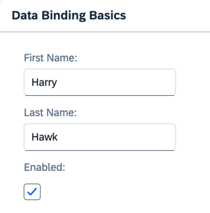

<nav class="tutorial-breadcrumb"><a href="../../../index.html">UI5 Tutorials</a> <span class="tutorial-breadcrumb-sep">&rsaquo;</span> <a href="../../index.html">Data Binding Tutorial</a></nav>


## Step 5: One-Way Data Binding

Unlike the two-way binding behavior we've seen, one-way data binding is also possible. In this case, data travels in one direction only: from the model, through the binding instance, to the consumer \(usually the property of a control\), but never in the other direction. Let's modify the previous example to use one-way data binding. This shows how you can switch off the flow of data from the user interface back to the model if needed.

### Preview

#### Two input fields and a checkbox



You can view this step live: [🔗 Live Preview of Step 5](https://ui5.github.io/tutorials/databinding/build/05/index-cdn.html).

### Coding

You can download the solution for this step here: <span class="ts-only">[📥 Download step 5](https://ui5.github.io/tutorials/databinding/databinding-step-05.zip)<span class="lang-suffix"> (TS)</span></span><span class="js-only">[📥 Download step 5](https://ui5.github.io/tutorials/databinding/databinding-step-05-js.zip)<span class="lang-suffix"> (JS)</span></span>.

#### Folder structure for this step


```text
webapp/
├── model/
│   └── data.json
├── view/
│   └── App.view.xml
├── Component.ts/.js
├── index.html
└── manifest.json
```


Insert the highlighted code into the `Component.ts/.js` file. The `init` function calls the init function of its parent, retrieves the default model instance bound to the component, and sets the default binding mode to one-way data binding.

### webapp/Component.ts/.js


```ts
// webapp/Component.ts
import UIComponent from "sap/ui/core/UIComponent";
import BindingMode from "sap/ui/model/BindingMode";

/**
 * @namespace ui5.tutorial.databinding
 */
export default class Component extends UIComponent {
    public static metadata = {
        interfaces: ["sap.ui.core.IAsyncContentCreation"],
        manifest: "json"
    };

    public init(): void {
        super.init();
        this.getModel().setDefaultBindingMode(BindingMode.OneWay);
    }
}
```



```js
// webapp/Component.js
sap.ui.define(["sap/ui/core/UIComponent", "sap/ui/model/BindingMode"], function (UIComponent, BindingMode) {
	"use strict";

	return UIComponent.extend("ui5.tutorial.databinding.Component", {
		metadata: {
			interfaces: ["sap.ui.core.IAsyncContentCreation"],
			manifest: "json"
		},
		init: function () {
			UIComponent.prototype.init.call(this);
			this.getModel().setDefaultBindingMode(BindingMode.OneWay);
		}
	});
});
```


Now, regardless of the state the checkbox is in, the input fields remain open for input, because one-way data binding ensures that data flows only from the model to the UI, but never in the other direction.

The binding mode \(one-way or two-way\) is set on the model itself. Therefore, unless you specifically alter it, a binding instance will always be created using the model's default binding mode.

If you wish to alter the binding mode, you've got two options:

- Alter the model's default binding mode. This is the approach we used above.

- Specify the data binding mode for a specific binding instance by using the `oBindingInfo.mode` parameter. This change only applies to this data binding instance. Any other binding instances will continue to use the model's default binding mode.For more information, see [API Reference: `sap.ui.base.ManagedObject.bindProperty`](https://sdk.openui5.org/#/api/sap.ui.base.ManagedObject/methods/bindProperty).

> 📝
> There are two important points to understand about alterations to a model object's data binding mode:
>
> - If you alter the default binding mode of a model \(as in the example above\), **all** binding instances created after that point in time will use the altered binding mode, unless you explicitly say otherwise.
>
> - Altering a model's default binding mode doesn't affect already existing binding instances.

***

**Next:** [Step 6: Resource Models](../06/index.html)

**Previous:** [Step 4: Two-Way Data Binding](../04/index.html)
