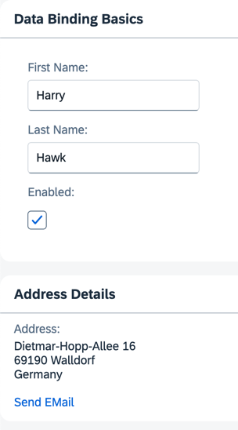

<nav class="tutorial-breadcrumb"><a href="../../../index.html">UI5 Tutorials</a> <span class="tutorial-breadcrumb-sep">&rsaquo;</span> <a href="../../index.html">Data Binding Tutorial</a></nav>


## Step 9: Formatting Values

We'd also like to provide our users with a way of contacting Harry Hawk, so we're adding a link that sends an e-mail to Harry. To do this, we convert our data in the model to match the `sap.m.URLHelper.normalizeEmail` API. As soon as the user changes the name, the e-mail also changes. We need a custom formatter function for this.

### Preview

#### An e-mail link is added to the address panel



You can view this step live: [🔗 Live Preview of Step 9](https://ui5.github.io/tutorials/databinding/build/09/index-cdn.html).

### Coding

You can download the solution for this step here: <span class="ts-only">[📥 Download step 9](https://ui5.github.io/tutorials/databinding/databinding-step-09.zip)<span class="lang-suffix"> (TS)</span></span><span class="js-only">[📥 Download step 9](https://ui5.github.io/tutorials/databinding/databinding-step-09-js.zip)<span class="lang-suffix"> (JS)</span></span>.

#### Folder structure for this step


```text
webapp/
├── controller/
│   └── App.controller.ts/.js
├── i18n/
│   ├── i18n.properties
│   └── i18n_de.properties
├── model/
│   └── data.json
├── view/
│   └── App.view.xml
├── Component.ts/.js
├── index.html
└── manifest.json
```


Create a new folder named `controller` within your `webapp` folder as a general location for all controller files for this app. Next, create a new file named `App.controller.ts/.js` with the following content:

### webapp/controller/App.controller.ts/.js \(New\)


```ts
// webapp/controller/App.controller.ts
import ResourceBundle from "sap/base/i18n/ResourceBundle";
import { URLHelper } from "sap/m/library";
import Controller from "sap/ui/core/mvc/Controller";
import ResourceModel from "sap/ui/model/resource/ResourceModel";

/**
 * @namespace ui5.tutorial.databinding.controller
 */
export default class App extends Controller {
	public async formatMail(firstName: string, lastName: string): Promise<string> {
		const bundle: ResourceBundle = await (this.getView().getModel("i18n") as ResourceModel).getResourceBundle() as ResourceBundle;

		return URLHelper.normalizeEmail(
			`${firstName}.${lastName}@example.com`,
			bundle.getText("mailSubject", [firstName]),
			bundle.getText("mailBody")
		);
	}
}
```



```js
// webapp/controller/App.controller.js
sap.ui.define(["sap/ui/core/mvc/Controller", "sap/m/library"], function (Controller, mobileLibrary) {
	"use strict";

	return Controller.extend("ui5.tutorial.databinding.controller.App", {
		async formatMail(firstName, lastName) {
			const bundle = await this.getView().getModel("i18n").getResourceBundle();

			return mobileLibrary.URLHelper.normalizeEmail(
				`${firstName}.${lastName}@example.com`,
				bundle.getText("mailSubject", [firstName]),
				bundle.getText("mailBody")
			);
		}
	});
});
```


In our custom formatter, we set the first and last name currently in the model as function parameters. When a user changes the data in the model by entering a different name in the input fields, our formatter will be invoked automatically by the framework. This ensures that the UI stays in sync with the data model.

In the `formatMail` function, we use the `sap.m.URLHelper.normalizeEmail` function that expects an e-mail address, a mail subject, and a text body. When a user follows the link, their default email client will open with these parameters. For more information, see [API Reference: `sap.m.URLHelper.normalizeEmail`](https://sdk.openui5.org/#/api/sap.m.URLHelper/methods/normalizeEmail). The `mailSubject` resource bundle text contains a placeholder for the recipient's first name \(see below\). Therefore, we provide the name with `[firstName]`.

> 📝
> For a detailed description of the e-mail link format, see [MDN - Creating hyperlinks: Email links](https://developer.mozilla.org/de/docs/Web/Guide/HTML/Email_links).

Enhance the `App.view.xml` file as shown below:

### webapp/view/App.view.xml


```xml
<mvc:View
	controllerName="ui5.tutorial.databinding.controller.App"
	xmlns="sap.m"
	xmlns:form="sap.ui.layout.form"
	xmlns:l="sap.ui.layout"
	xmlns:core="sap.ui.core"
	xmlns:mvc="sap.ui.core.mvc"
	core:require="{ColumnLayout:'sap/ui/layout/form/ColumnLayout'}">
	...
	<Panel
		headerText="{i18n>panel2HeaderText}"
		class="sapUiResponsiveMargin"
		width="auto">
		<content>
			<l:VerticalLayout>
				...
				<Link
					href="{
						parts: [
							'/firstName',
							'/lastName'
						],
						formatter: '.formatMail'
					}"
					text="{i18n>sendEmail}"/>
			</l:VerticalLayout>
		</content>
	</Panel>
</mvc:View>
```


For more complex bindings, we can't use the simple binding syntax with the curly braces anymore. The `href` property of the `Link` element now contains an entire object inside the string value. In this case, the object has two properties:

- `parts`

	This is a JavaScript array in which each element is a string representing a `path` property. The number and order of the elements in this array correspond directly to the number and order of parameters expected by the `formatMail` function.

- `formatter`

	This is a reference to the function that receives the parameters listed in the `parts` array. Whatever value the formatter function returns becomes the value set for the `href` property. The dot `formatMail`\) at the beginning of the formatter tells OpenUI5 to look for a `formatMail` function on the controller instance of the view. If you don't use the dot, the function will be resolved by looking into the global namespace.

> 📝
> When using formatter functions, the binding automatically switches to "one-way". Therefore, you can’t use a formatter function for "two-way" scenarios. However, you can use data types \(which we explain in the following steps\).

Add the `# E-mail` section to the `i18n.properties` and `i18n_de.properties` files as shown below.

### webapp/i18n/i18n.properties


```properties
...

# E-mail
sendEmail=Send Mail
mailSubject=Hi {0}!
mailBody=How are you?
```


### webapp/i18n/i18n\_de.properties


```properties
...

# E-mail
sendEmail=E-mail versenden
mailSubject=Hallo {0}!
mailBody=Wie geht es dir?
```


***

**Next:** [Step 10: Property Formatting Using Data Types](../10/index.html)

**Previous:** [Step 8: Binding Paths: Accessing Properties in Hierarchically Structured Models](../08/index.html)

***

**Related Information**

[Formatting, Parsing, and Validating Data](https://sdk.openui5.org/topic/07e4b920f5734fd78fdaa236f26236d8.html "Data that is presented on the UI often has to be converted so that is human readable and fits to the locale of the user. On the other hand, data entered by the user has to be parsed and validated to be understood by the data source. For this purpose, you use formatters and data types.")
