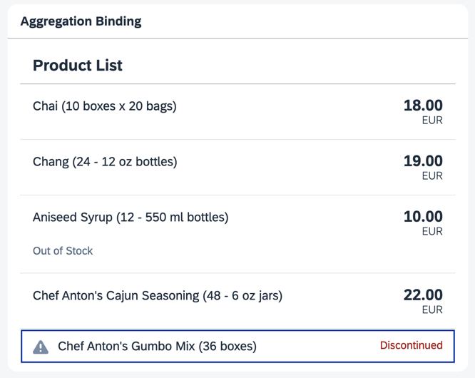

<nav class="tutorial-breadcrumb"><a href="../../../index.html">UI5 Tutorials</a> <span class="tutorial-breadcrumb-sep">&rsaquo;</span> <a href="../../index.html">Data Binding Tutorial</a></nav>


## Step 15: Aggregation Binding Using a Factory Function

Instead of using a single hard-coded template control, we now opt for a factory function to generate different controls based on the data received at runtime. This approach is much more flexible and allows for the display of complex or heterogeneous data.

### Preview

#### A different type of list item is displayed for a discontinued product



You can view this step live: [🔗 Live Preview of Step 15](https://ui5.github.io/tutorials/databinding/build/15/index-cdn.html).

### Coding

You can download the solution for this step here: <span class="ts-only">[📥 Download step 15](https://ui5.github.io/tutorials/databinding/databinding-step-15.zip)<span class="lang-suffix"> (TS)</span></span><span class="js-only">[📥 Download step 15](https://ui5.github.io/tutorials/databinding/databinding-step-15-js.zip)<span class="lang-suffix"> (JS)</span></span>.

#### Folder structure for this step


```text
webapp/
├── controller/
│   └── App.controller.ts/.js
├── i18n/
│   ├── i18n.properties
│   └── i18n_de.properties
├── model/
│   ├── Products.json
│   └── data.json
├── view/
│   ├── App.view.xml
│   ├── ProductExtended.fragment.xml
│   └── ProductSimple.fragment.xml
├── Component.ts/.js
├── index.html
└── manifest.json
```


Create a `ProductSimple.fragment.xml` file in the `view` folder. Here, define an `sap.m.StandardListItem` that is used when the stock level is zero and the product is discontinued. In this simple use case, you only need to define a warning icon and a "Product Discontinued" message in the `info` property.

### webapp/view/ProductSimple.fragment.xml \(New\)


```xml
<core:FragmentDefinition
	xmlns="sap.m"
	xmlns:core="sap.ui.core">
	<StandardListItem
		id="productSimple"
		icon="sap-icon://warning"
		title="{products>ProductName} ({products>QuantityPerUnit})"
		info="{i18n>Discontinued}"
		type="Active"
		infoState="Error"
		press=".onItemSelected">
	</StandardListItem>
</core:FragmentDefinition>
```


Create a new `ProductExtended.fragment.xml` file in the `view` folder. In this extended use case, you create an `ObjectListItem` to display more product details. The properties are bound to the fields of the current data binding context. This allows the use of types, formatters, and all handlers defined in the assigned controller. However, you can't define more complex logic declaratively in XML. Therefore, we add a single `sap.m.ObjectAttribute` in a factory function of the controller using JavaScript, which displays an "Out of Stock" message when the stock level is zero.

### webapp/view/ProductExtended.fragment.xml \(New\)


```xml
<core:FragmentDefinition
	xmlns="sap.m"
	xmlns:core="sap.ui.core">
	<ObjectListItem
		id="productExtended"
		title="{products>ProductName} ({products>QuantityPerUnit})"
		number="{
			parts: [
				{path: 'products>UnitPrice'},
				{path: '/currencyCode'}
			],
			type: 'sap.ui.model.type.Currency',
			formatOptions : {
				showMeasure : false
			}
		}"
		type="Active"
		numberUnit="{/currencyCode}"
		press=".onItemSelected">
	</ObjectListItem>
</core:FragmentDefinition>
```


In the `App.view.xml` file, add an XML namespace for `sap.ui.core`. Then, remove the `items` aggregation from the `sap.m.List` XML element. Add an `id` attribute to the `sap.m.List` and include the factory function in the items' binding definition. Lastly, add the two newly created fragments as dependents to the `sap.m.List`.

### webapp/view/App.view.xml


```xml
<mvc:View
	controllerName="ui5.tutorial.databinding.controller.App"
	xmlns="sap.m"
	xmlns:form="sap.ui.layout.form"
	xmlns:l="sap.ui.layout"
	xmlns:core="sap.ui.core"
	xmlns:mvc="sap.ui.core.mvc"
	core:require="{ColumnLayout:'sap/ui/layout/form/ColumnLayout'}">
	...
	<Panel
		headerText="{i18n>panel3HeaderText}"
		class="sapUiResponsiveMargin"
		width="auto">
		<List
			id="ProductList"
			headerText="{i18n>productListTitle}"
			items="{
				path: 'products>/Products',
				factory: '.productListFactory'
			}">
			<dependents>
				<core:Fragment fragmentName="ui5.tutorial.databinding.view.ProductSimple" type="XML"/>
				<core:Fragment fragmentName="ui5.tutorial.databinding.view.ProductExtended" type="XML"/>
			</dependents>
		</List>
	</Panel>
	...
</mvc:View>
```


The `sap.m.List` that previously held the product list is now just a named, but otherwise empty placeholder. Without a factory function to populate it, this `List` would always remain empty. As the fragments are declared as dependents, they also inherit the controller of the view. This means that the `onItemSelect` function of the `App.controller.ts/.js` can still be used in the `ProductExtended.fragment.xml`.

In the `App.controller.ts/.js` file, add a new import for the `sap.m.ObjectAttribute` class and create a new function called `productListFactory`. This factory function returns a control for the associated binding context, similar to the XML templates we've defined in the previous steps. The controls returned by this factory function must suit the items aggregation of the `sap.m.List` object. In this case, it returns either an `sap.m.StandardListItem` or an `sap.m.ObjectListItem` based on the data stored in the context of the item to be created.

### webapp/controller/App.controller.ts/.js


```ts
// webapp/controller/App.controller.ts
import ResourceBundle from "sap/base/i18n/ResourceBundle";
import { URLHelper } from "sap/m/library";
import { ListItemBase$DetailPressEvent } from "sap/m/ListItemBase";
import ObjectAttribute from "sap/m/ObjectAttribute";
import ObjectListItem from "sap/m/ObjectListItem";
import StandardListItem from "sap/m/StandardListItem";
import Control from "sap/ui/core/Control";
import Controller from "sap/ui/core/mvc/Controller";
import Context from "sap/ui/model/Context";
import ResourceModel from "sap/ui/model/resource/ResourceModel";
import Currency from "sap/ui/model/type/Currency";

/**
 * @namespace ui5.tutorial.databinding.controller
 */
export default class App extends Controller {
	...

	public productListFactory(id: string, context: Context): Control {
		let uiControl;
		// Decide based on the data which dependent to clone
		if (context.getProperty("UnitsInStock") === 0 && context.getProperty("Discontinued")) {
			// The item is discontinued, so use a StandardListItem
			uiControl = (this.byId("productSimple") as StandardListItem).clone(id);
		} else {
			// The item is available, so we will create an ObjectListItem
			uiControl = (this.byId("productExtended") as ObjectListItem).clone(id);

			// The item is temporarily out of stock, so we will add a status
			if (context.getProperty("UnitsInStock") < 1) {
				uiControl.addAttribute(new ObjectAttribute({
					text : {
						path: "i18n>outOfStock"
					}
				}));
			}
		}

		return uiControl;
	}
}
```



```js
// webapp/controller/App.controller.js
sap.ui.define(["sap/ui/core/mvc/Controller", "sap/m/library", "sap/m/ObjectAttribute", "sap/ui/model/type/Currency"], function (Controller, mobileLibrary, ObjectAttribute, Currency) {
	"use strict";

	return Controller.extend("ui5.tutorial.databinding.controller.App", {
		...

		productListFactory(id, context) {
			let uiControl;
			// Decide based on the data which dependent to clone
			if (context.getProperty("UnitsInStock") === 0 && context.getProperty("Discontinued")) {
				// The item is discontinued, so use a StandardListItem
				uiControl = this.byId("productSimple").clone(id);
			} else {
				// The item is available, so we will create an ObjectListItem
				uiControl = this.byId("productExtended").clone(id);

				// The item is temporarily out of stock, so we will add a status
				if (context.getProperty("UnitsInStock") < 1) {
					uiControl.addAttribute(new ObjectAttribute({
						text : {
							path: "i18n>outOfStock"
						}
					}));
				}
			}

			return uiControl;
		}
	});
});
```


The function decides which type of control to return by checking the current stock level and whether the product is discontinued. For both options, it loads and clones the respective XML fragment, which allows the view logic to be defined dynamically. If the stock level is zero and the product is discontinued, the `ProductSimple` XML fragment is used. Otherwise, the `ProductExtended` XML fragment is used.

For each item of the list, the corresponding control is cloned. This method creates a fresh copy of a control that can be bound to the context of the list item. Remember, in a factory function you are responsible for the life cycle of the control you create.

If the product is not discontinued but the stock level is zero, we're temporarily out of stock. In this case, a single `sap.m.ObjectAttribute` is added to the cloned control. The "Out of Stock" message is bound to the `sap.m.ObjectAttribute`'s `text` property using JavaScript. Like declarative definitions in the XML view or fragments, you can bind properties using data binding syntax. Here, the text is bound to an entry in the resource bundle. Since the `sap.m.ObjectAttribute` is a child of the list item, it has access to all assigned models and the current binding context.

Finally, the function returns the control that is then displayed inside the list.

Lastly, add the new texts to the `i18n.properties` and `i18n_de.properties` files.

### webapp/i18n/i18n.properties


```properties
...
# Product Details
...
outOfStock=Out of Stock
```


### webapp/i18n/i18n\_de.properties


```properties
...
# Product Details
...
outOfStock=Nicht vorr\u00e4tig
```


Congratulations! You've completed the Data Binding tutorial.

***

**Previous:** [Step 14: Expression Binding](../14/index.html)

***

**Related Information**

[List Binding \(Aggregation Binding\)](https://sdk.openui5.org/topic/91f057786f4d1014b6dd926db0e91070.html "List binding (or aggregation binding) is used to automatically create child controls according to model data.")

[XML Fragments](https://sdk.openui5.org/topic/2c677b574ea2486a8d5f5414d15e21c5.html "XML fragments are similar to XML view, but have no <View> tag as root element. Instead, there is an OpenUI5 control.")

[Using Factory Functions](https://sdk.openui5.org/topic/335848ac1174435c901baaa55f6d7819.html)
