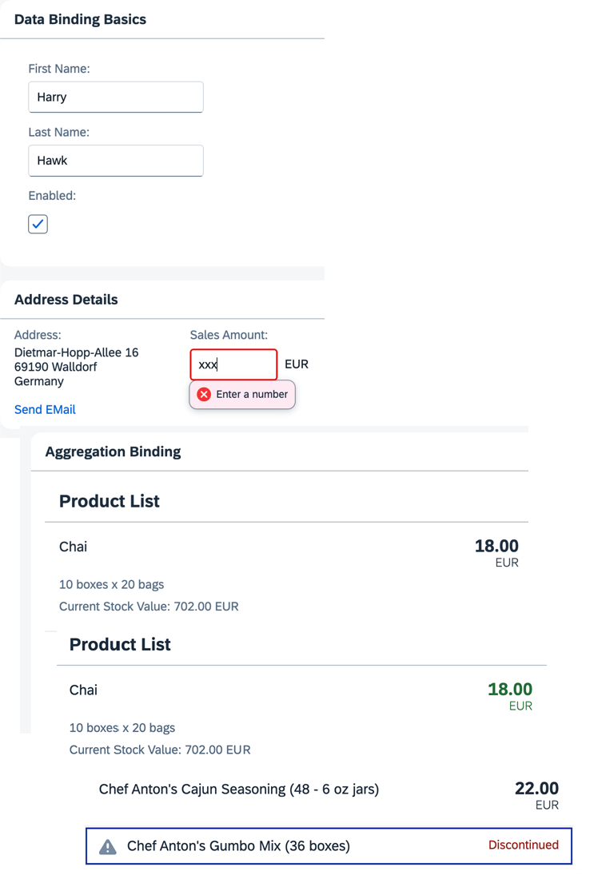

<!-- Data Binding Tutorial overview -->

# Data Binding Tutorial

In this tutorial, we explain the concepts of data binding in OpenUI5.

Data binding is used to bind UI elements to data sources. This keeps the data in sync and allows data editing on the UI.

For data binding, you need a model and a binding instance: The model holds the data and provides methods to set the data or retrieve it from a server. It also provides a method for creating bindings to the data. When you call this method, a binding instance is created, which contains the binding information and provides an event, which is fired whenever the bound data changes. An element can listen to this event and update its visualization according to the new data.

The UI uses data binding to bind controls to the model which holds the application data, so that the controls are updated automatically whenever application data changes. Data binding is also used in reverse, when changes in the control, for example data entered by the user, cause updates in the underlying application data. This is called two-way binding.

## Preview

> 💡
> You don't have to do all tutorial steps sequentially, you can also jump directly to any step you want. Just download the code from the previous step, copy it to your workspace, and ensure that the application runs by calling the `webapp/index.html` file.

***

### In this Tutorial

The tutorial consists of the following steps. To start, just open the first link — you'll be guided from there.

- **[Step 1: No Data Binding](./steps/01/index.html)** — In this step, we create a basic application and simply place some text on the screen using a standard sap.m.Text control. ([🔗 Live Preview](https://ui5.github.io/tutorials/databinding/build/01/index-cdn.html) \| [📥 Download Solution](https://ui5.github.io/tutorials/databinding/databinding-step-01.zip) (TS)[📥 Download Solution](https://ui5.github.io/tutorials/databinding/databinding-step-01-js.zip) (JS))
- **[Step 2: Creating a Model](./steps/02/index.html)** — In this step, we create a model. It serves as a container for the data your application operates on. ([🔗 Live Preview](https://ui5.github.io/tutorials/databinding/build/02/index-cdn.html) \| [📥 Download Solution](https://ui5.github.io/tutorials/databinding/databinding-step-02.zip) (TS)[📥 Download Solution](https://ui5.github.io/tutorials/databinding/databinding-step-02-js.zip) (JS))
- **[Step 3: Create Property Binding](./steps/03/index.html)** — Although there is no visible difference, the text on the screen is now derived from model data. ([🔗 Live Preview](https://ui5.github.io/tutorials/databinding/build/03/index-cdn.html) \| [📥 Download Solution](https://ui5.github.io/tutorials/databinding/databinding-step-03.zip) (TS)[📥 Download Solution](https://ui5.github.io/tutorials/databinding/databinding-step-03-js.zip) (JS))
- **[Step 4: Two-Way Data Binding](./steps/04/index.html)** — We change the user interface to display first and last name fields using sap.m.Input fields and add a check box to enable or disable them. ([🔗 Live Preview](https://ui5.github.io/tutorials/databinding/build/04/index-cdn.html) \| [📥 Download Solution](https://ui5.github.io/tutorials/databinding/databinding-step-04.zip) (TS)[📥 Download Solution](https://ui5.github.io/tutorials/databinding/databinding-step-04-js.zip) (JS))
- **[Step 5: One-Way Data Binding](./steps/05/index.html)** — Unlike two-way binding, one-way data binding lets data travel in one direction only: from the model to the consumer, but never back. ([🔗 Live Preview](https://ui5.github.io/tutorials/databinding/build/05/index-cdn.html) \| [📥 Download Solution](https://ui5.github.io/tutorials/databinding/databinding-step-05.zip) (TS)[📥 Download Solution](https://ui5.github.io/tutorials/databinding/databinding-step-05-js.zip) (JS))
- **[Step 6: Resource Models](./steps/06/index.html)** — Business applications often require language-specific (translatable) text. We place all translatable texts into a resource bundle. ([🔗 Live Preview](https://ui5.github.io/tutorials/databinding/build/06/index-cdn.html) \| [📥 Download Solution](https://ui5.github.io/tutorials/databinding/databinding-step-06.zip) (TS)[📥 Download Solution](https://ui5.github.io/tutorials/databinding/databinding-step-06-js.zip) (JS))
- **[Step 7: \(Optional\) Resource Bundles and Multiple Languages](./steps/07/index.html)** — Resource bundles enable an app to run in multiple languages without changing any code. We create a German version of the app. ([🔗 Live Preview](https://ui5.github.io/tutorials/databinding/build/07/index-cdn.html) \| [📥 Download Solution](https://ui5.github.io/tutorials/databinding/databinding-step-07.zip) (TS)[📥 Download Solution](https://ui5.github.io/tutorials/databinding/databinding-step-07-js.zip) (JS))
- **[Step 8: Binding Paths: Accessing Properties in Hierarchically Structured Models](./steps/08/index.html)** — We explore how to reference fields in a hierarchically structured model object by adding a second panel with address data. ([🔗 Live Preview](https://ui5.github.io/tutorials/databinding/build/08/index-cdn.html) \| [📥 Download Solution](https://ui5.github.io/tutorials/databinding/databinding-step-08.zip) (TS)[📥 Download Solution](https://ui5.github.io/tutorials/databinding/databinding-step-08-js.zip) (JS))
- **[Step 9: Formatting Values](./steps/09/index.html)** — We add a link that sends an e-mail to Harry Hawk, using a custom formatter function to convert the model data. ([🔗 Live Preview](https://ui5.github.io/tutorials/databinding/build/09/index-cdn.html) \| [📥 Download Solution](https://ui5.github.io/tutorials/databinding/databinding-step-09.zip) (TS)[📥 Download Solution](https://ui5.github.io/tutorials/databinding/databinding-step-09-js.zip) (JS))
- **[Step 10: Property Formatting Using Data Types](./steps/10/index.html)** — We apply data types such as Currency to controls to ensure the value displayed on the screen is formatted correctly. ([🔗 Live Preview](https://ui5.github.io/tutorials/databinding/build/10/index-cdn.html) \| [📥 Download Solution](https://ui5.github.io/tutorials/databinding/databinding-step-10.zip) (TS)[📥 Download Solution](https://ui5.github.io/tutorials/databinding/databinding-step-10-js.zip) (JS))
- **[Step 11: Validation Using `sap/ui/core/Messaging`](./steps/11/index.html)** — We enable validation for the entire app so that validation error messages are passed to Messaging and connected to the offending control. ([🔗 Live Preview](https://ui5.github.io/tutorials/databinding/build/11/index-cdn.html) \| [📥 Download Solution](https://ui5.github.io/tutorials/databinding/databinding-step-11.zip) (TS)[📥 Download Solution](https://ui5.github.io/tutorials/databinding/databinding-step-11-js.zip) (JS))
- **[Step 12: Aggregation Binding Using Templates](./steps/12/index.html)** — Aggregation binding lets a control bind to a list within the model data. We add a third panel with a list of products. ([🔗 Live Preview](https://ui5.github.io/tutorials/databinding/build/12/index-cdn.html) \| [📥 Download Solution](https://ui5.github.io/tutorials/databinding/databinding-step-12.zip) (TS)[📥 Download Solution](https://ui5.github.io/tutorials/databinding/databinding-step-12-js.zip) (JS))
- **[Step 13: Element Binding](./steps/13/index.html)** — We use a form with relatively bound controls and bind it to the selected list entity via element binding. ([🔗 Live Preview](https://ui5.github.io/tutorials/databinding/build/13/index-cdn.html) \| [📥 Download Solution](https://ui5.github.io/tutorials/databinding/databinding-step-13.zip) (TS)[📥 Download Solution](https://ui5.github.io/tutorials/databinding/databinding-step-13-js.zip) (JS))
- **[Step 14: Expression Binding](./steps/14/index.html)** — An expression binding lets you display a calculated value on the screen, derived from values found in a model object. ([🔗 Live Preview](https://ui5.github.io/tutorials/databinding/build/14/index-cdn.html) \| [📥 Download Solution](https://ui5.github.io/tutorials/databinding/databinding-step-14.zip) (TS)[📥 Download Solution](https://ui5.github.io/tutorials/databinding/databinding-step-14-js.zip) (JS))
- **[Step 15: Aggregation Binding Using a Factory Function](./steps/15/index.html)** — We use a factory function to generate different controls based on the data received at runtime. ([🔗 Live Preview](https://ui5.github.io/tutorials/databinding/build/15/index-cdn.html) \| [📥 Download Solution](https://ui5.github.io/tutorials/databinding/databinding-step-15.zip) (TS)[📥 Download Solution](https://ui5.github.io/tutorials/databinding/databinding-step-15-js.zip) (JS))

***

## Related Information

[Data Binding](https://sdk.openui5.org/topic/68b9644a253741e8a4b9e4279a35c247.html "You use data binding to bind UI elements to data sources to keep the data in sync and allow data editing on the UI.")

[Model View Controller \(MVC\)](https://sdk.openui5.org/topic/91f233476f4d1014b6dd926db0e91070.html "The Model View Controller (MVC) concept is used in OpenUI5 to separate the representation of information from the user interaction. This separation facilitates development and the changing of parts independently.")

***

## License

Copyright (c) 2026 SAP SE or an SAP affiliate company. All rights reserved. This project is licensed under the Apache Software License, version 2.0 except as noted otherwise in the [LICENSE](https://github.com/UI5/tutorials/blob/-/LICENSE) file.
