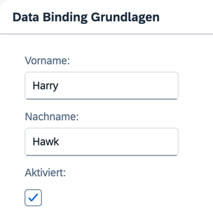

## Step 7: \(Optional\) Resource Bundles and Multiple Languages

Resource bundles exist to enable an app to run in multiple languages without the need to change any code. To demonstrate this feature, let's create a German version of the app – in fact, all we need to do is create a German version of the resource bundle file. In our code, we activate the German locale for the ResourceModel.

### Preview

#### The texts are now adapted for the German locale



You can view this step live: [🔗 Live Preview of Step 7](https://ui5.github.io/tutorials/databinding/build/07/index-cdn.html).

### Coding

You can download the solution for this step here: <span class="ts-only">[📥 Download step 7](https://ui5.github.io/tutorials/databinding/databinding-step-07.zip)<span class="lang-suffix"> (TS)</span></span><span class="js-only">[📥 Download step 7](https://ui5.github.io/tutorials/databinding/databinding-step-07-js.zip)<span class="lang-suffix"> (JS)</span></span>.

#### Folder structure for this step


```text
webapp/
├── i18n/
│   ├── i18n.properties
│   └── i18n_de.properties
├── model/
│   └── data.json
├── view/
│   └── App.view.xml
├── Component.ts/.js
├── index.html
└── manifest.json
```


### webapp/i18n/i18n\_de.properties \(New\)

In the `i18n` folder, duplicate the `i18n.properties` file and rename its copy to `i18n`**`_de`**`.properties`. Replace the English text with the German text provided below. The suffix `de` represents the locale for the German language. Since the `de` locale is already set in the `supportedLocales` configuration of the `manifest.json`, it will be taken into account.


```properties
# App Descriptor
appTitle=Data Binding Tutorial
appDescription=Eine einfache Anwendung zur Erkl\u00e4rung der UI5 Data Binding Funktionen

# Field labels
firstName=Vorname
lastName=Nachname
enabled=Aktiviert

# Screen titles
panelHeaderText=Data Binding Grundlagen
```


To check the result, append the `sap-language=DE` URL parameter to the URL in your browser, for example `http://localhost:port/index.html?sap-language=DE`. Once you remove this parameter, your app reverts to your browser's default language.

***

**Next:** [Step 8: Binding Paths: Accessing Properties in Hierarchically Structured Models](../08/README.md)

**Previous:** [Step 6: Resource Models](../06/README.md)

***

**Related Information**

[Localization](https://sdk.openui5.org/topic/91f217c46f4d1014b6dd926db0e91070.html "The framework concepts for text localization in OpenUI5 are aligned with the general concepts of the Java platform.")
</content>
