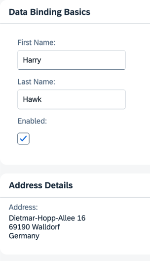

## Step 8: Binding Paths: Accessing Properties in Hierarchically Structured Models

In Step 6 , we stated that the fields in a resource model are arranged in a flat structure; in other words, there is no hierarchy of properties. However, this is only true for resource models. The properties within JSON and OData models are usually arranged in a hierarchical structure. So, let's explore how to reference fields in a hierarchically structured model object.

### Preview

#### A second panel with address data is added



You can view this step live: [🔗 Live Preview of Step 8](https://ui5.github.io/tutorials/databinding/build/08/index-cdn.html).

### Coding

You can download the solution for this step here: <span class="ts-only">[📥 Download step 8](https://ui5.github.io/tutorials/databinding/databinding-step-08.zip)<span class="lang-suffix"> (TS)</span></span><span class="js-only">[📥 Download step 8](https://ui5.github.io/tutorials/databinding/databinding-step-08-js.zip)<span class="lang-suffix"> (JS)</span></span>.

#### Folder structure for this step


```text
webapp/
├── i18n/
│   ├── i18n.properties
│   └── i18n_de.properties
├── model/
│   └── data.json
├── view/
│   └── App.view.xml
├── Component.ts/.js
├── index.html
└── manifest.json
```


In the `data.json` file, add an additional sub-object named `address`. This object has four properties: `street`, `city`, `zip`, and `country`.

### webapp/model/data.json


```json
{
    "firstName": "Harry",
    "lastName": "Hawk",
    "enabled": true,
    "address": {
        "street": "Dietmar-Hopp-Allee 16",
        "city": "Walldorf",
        "zip": "69190",
        "country": "Germany"
    }
}
```


Add a new panel to the `App.view.xml` with a new `Label` and `FormattedText` pair of elements.

The `text` property of the `Label` element is bound to the i18n resource bundle field `address`.

The `htmlText` property of the `FormattedText` element is bound to four JSON model properties: `/address/street`, `/address/zip`, `/address/city`, and `/address/country`. You can achieve the resulting address format by separating each one of these JSON model property references with a hard-coded newline character. Note that `zip` and `city` are separated by a space.

### webapp/view/App.view.xml


```xml
<mvc:View
    xmlns="sap.m"
    xmlns:form="sap.ui.layout.form"
    xmlns:l="sap.ui.layout"
    xmlns:core="sap.ui.core"
    xmlns:mvc="sap.ui.core.mvc"
    core:require="{ColumnLayout:'sap/ui/layout/form/ColumnLayout'}">
    <Panel
        headerText="{i18n>panel1HeaderText}"
        class="sapUiResponsiveMargin"
        width="auto">
        ...
    </Panel>
    <Panel
        headerText="{i18n>panel2HeaderText}"
        class="sapUiResponsiveMargin"
        width="auto">
        <content>
            <l:VerticalLayout>
                <Label
                    labelFor="address"
                    text="{i18n>address}"
                    showColon="true"/>
                <FormattedText
                    class="sapUiSmallMarginBottom"
                    htmlText="{/address/street}&lt;br&gt;{/address/zip} {/address/city}&lt;br&gt;{/address/country}"
                    id="address"
                    width="200px"/>
            </l:VerticalLayout>
        </content>
    </Panel>
</mvc:View>
```


Update the `i18n.properties` and `i18n_de.properties` files as shown below.

### webapp/i18n/i18n.properties


```properties
...

# Screen titles
panel1HeaderText=Data Binding Basics
panel2HeaderText=Address Details
```


### webapp/i18n/i18n\_de.properties


```properties
...

# Screen titles
panel1HeaderText=Data Binding Grundlagen
panel2HeaderText=Adressdetails
```


> 📝
> The resource bundle files now contain new properties for the address and a new panel header text. Both panel properties are numbered.
>
> In the XML view, inside the curly brackets for the binding path of the `htmlText` element, you'll notice that the first character is a forward slash. This is necessary for binding paths that make absolute references to properties in JSON and OData models, but you must not use it for resource models. After the first forward slash character, the binding path syntax uses the object name and the property names separated by forward slash characters \(`{/address/street}`\).
>
> Remember, all binding path names are case-sensitive.

***

**Next:** [Step 9: Formatting Values](../09/README.md)

**Previous:** [Step 7: \(Optional\) Resource Bundles and Multiple Languages](../07/README.md)

***

**Related Information**

[JSON Model](https://sdk.openui5.org/topic/96804e3315ff440aa0a50fd290805116.html#loio96804e3315ff440aa0a50fd290805116 "The JSON model can be used to bind controls to JavaScript object data, which is usually serialized in the JSON format.")
</content>
