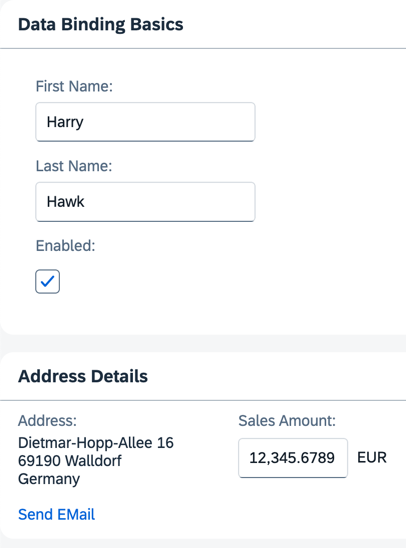

## Step 10: Property Formatting Using Data Types

OpenUI5 offers a set of simple data types, including `Boolean`, `Currency`, `Date` and `Float`. You can apply these data types to controls to ensure that the value displayed on the screen is formatted correctly. If the field is open for input, this also ensures that the user input meets the requirements of that data type. Let's add a new field called *Sales Amount* of type `Currency`.

### Preview

#### An input field for a currency amount is added to the second panel



You can view this step live: [🔗 Live Preview of Step 10](https://ui5.github.io/tutorials/databinding/build/10/index-cdn.html).

### Coding

You can download the solution for this step here: <span class="ts-only">[📥 Download step 10](https://ui5.github.io/tutorials/databinding/databinding-step-10.zip)<span class="lang-suffix"> (TS)</span></span><span class="js-only">[📥 Download step 10](https://ui5.github.io/tutorials/databinding/databinding-step-10-js.zip)<span class="lang-suffix"> (JS)</span></span>.

#### Folder structure for this step


```text
webapp/
├── controller/
│   └── App.controller.ts/.js
├── i18n/
│   ├── i18n.properties
│   └── i18n_de.properties
├── model/
│   └── data.json
├── view/
│   └── App.view.xml
├── Component.ts/.js
├── index.html
└── manifest.json
```


Add two new JSON model properties, `salesAmount` and `currencyCode`, to the `data.json` file.

### webapp/model/data.json


```json
{
	"firstName": "Harry",
	"lastName": "Hawk",
	"enabled": true,
	"address": {
		"street": "Dietmar-Hopp-Allee 16",
		"city": "Walldorf",
		"zip": "69190",
		"country": "Germany"
	},
	"salesAmount": 12345.6789,
	"currencyCode": "EUR"
}
```


Add a `sap.ui.layout.HorizontalLayout` to the content of the second `sap.m.Panel` within `App.view.xml` file. Move the existing `sap.ui.layout.VerticalLayout` to the default aggregation of the new `sap.ui.layout.HorizontalLayout`. Finally, add a second `sap.ui.layout.VerticalLayout`, containing a `sap.m.Label` and a `sap.m.Input` control, to the `sap.ui.layout.HorizontalLayout`.

### webapp/view/App.view.xml


```xml
<mvc:View
	controllerName="ui5.tutorial.databinding.controller.App"
	xmlns="sap.m"
	xmlns:form="sap.ui.layout.form"
	xmlns:l="sap.ui.layout"
	xmlns:core="sap.ui.core"
	xmlns:mvc="sap.ui.core.mvc"
	core:require="{ColumnLayout:'sap/ui/layout/form/ColumnLayout'}">
	...
	<Panel
		headerText="{i18n>panel2HeaderText}"
		class="sapUiResponsiveMargin"
		width="auto">
		<content>
			<l:HorizontalLayout>
				<l:VerticalLayout>
					...
				</l:VerticalLayout>
				<l:VerticalLayout>
					<Label
						labelFor="salesAmount"
						text="{i18n>salesAmount}"
						showColon="true"/>
					<Input
						description="{/currencyCode}"
						enabled="{/enabled}"
						id="salesAmount"
						value="{
							parts: [
								{path: '/salesAmount'},
								{path: '/currencyCode'}
							],
							type: 'sap.ui.model.type.Currency',
							formatOptions: {showMeasure: false}
						}"
						width="200px"/>
				</l:VerticalLayout>
			</l:HorizontalLayout>
		</content>
	</Panel>
</mvc:View>
```


We've created a new pair of `Label` and `Input` elements for the `salesAmount` model property. The description property of the `Input` element is bound to the `currencyCode` model property. The value property of the `Input` element is bound to the model properties `salesAmount` and `currencyCode`. The `{showMeasure: false}` parameter switches off the display of the currency symbol within the input field itself. This isn't necessary because the currency symbol is displayed using the `Input` element's description property.

Add the highlighted texts to the `properties` files. Remember, you need to enter special characters \(non-Latin-1\) using Unicode escape characters.

### webapp/i18n/i18n.properties


```properties
...
# Field labels
firstName=Vorname
lastName=Nachname
enabled=Enabled
address=Address
salesAmount=Sales Amount
...
```


### webapp/i18n/i18n\_de.properties


```properties
...
# Field labels
firstName=Vorname
lastName=Nachname
enabled=Aktiviert
address=Adresse
salesAmount=Verk\u00e4ufe bis zum heutigen Datum
...
```


***

**Next:** [Step 11: Validation Using `sap/ui/core/Messaging`](../11/README.md)

**Previous:** [Step 9: Formatting Values](../09/README.md)

***

**Related Information**

[Formatting, Parsing, and Validating Data](https://sdk.openui5.org/topic/07e4b920f5734fd78fdaa236f26236d8.html "Data that is presented on the UI often has to be converted so that is human readable and fits to the locale of the user. On the other hand, data entered by the user has to be parsed and validated to be understood by the data source. For this purpose, you use formatters and data types.")
