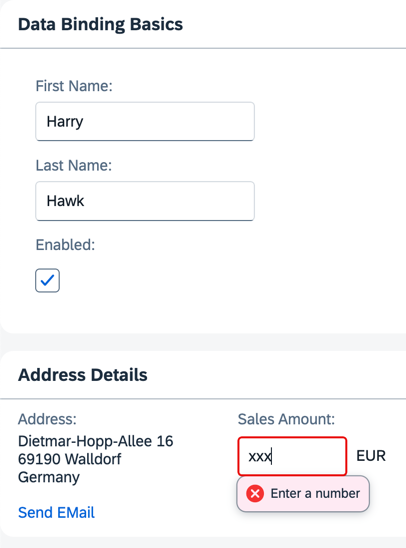
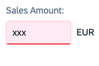

## Step 11: Validation Using `sap/ui/core/Messaging`

Up to this point, we've created a currency field that formats itself correctly. The *currency* data type can also validate user input to ensure it meets currency requirements. However, OpenUI5 manages data type validation functions and doesn't have a built-in mechanism for reporting error messages back to the UI. We therefore need a way to report error messages from validation functions back to the user. In this step, we're enabling validation for the entire app with a feature known as "Messaging". Once this is set up, any validation error messages based on user input get passed to `Messaging`, which then connects them to the appropriate view and control that caused the error.

### Preview

#### An error message is displayed upon entering text into the currency amount input field



You can view this step live: [🔗 Live Preview of Step 11](https://ui5.github.io/tutorials/databinding/build/11/index-cdn.html).

### Coding

You can download the solution for this step here: <span class="ts-only">[📥 Download step 11](https://ui5.github.io/tutorials/databinding/databinding-step-11.zip)<span class="lang-suffix"> (TS)</span></span><span class="js-only">[📥 Download step 11](https://ui5.github.io/tutorials/databinding/databinding-step-11-js.zip)<span class="lang-suffix"> (JS)</span></span>.

#### Folder structure for this step


```text
webapp/
├── controller/
│   └── App.controller.ts/.js
├── i18n/
│   ├── i18n.properties
│   └── i18n_de.properties
├── model/
│   └── data.json
├── view/
│   └── App.view.xml
├── Component.ts/.js
├── index.html
└── manifest.json
```


### webapp/manifest.json

To generally enable validation in the app, add the `handleValidation` property into the `sap.ui5` section of the `manifest.json` file as shown below.


```json
...
    "sap.ui5": {
        "handleValidation": true,
        ...
    }
...
```


Now, try entering a non-numeric value into the *Sales Amount* field and either press [Enter\] or move the focus to a different UI control. This action triggers either the `onenter` or `onchange` event. OpenUI5 then executes the validation function for the `sap.ui.model.type.Currency` data type.

With validation handling enabled in the manifest, any validation error messages will be picked up by `Messaging`. It checks its list of registered objects and passes the error message back to the correct view for display.

You'll notice that the field in error has a red border:



However, the error message only displays when that particular field is in focus:


***

**Next:** [Step 12: Aggregation Binding Using Templates](../12/README.md)

**Previous:** [Step 10: Property Formatting Using Data Types](../10/README.md)

***

**Related Information**

[Error, Warning, and Info Messages](https://sdk.openui5.org/topic/62b1481d3e084cb49dd30956d183c6a0.html "OpenUI5 provides a central place for storing and managing info, warning, and error messages.")
