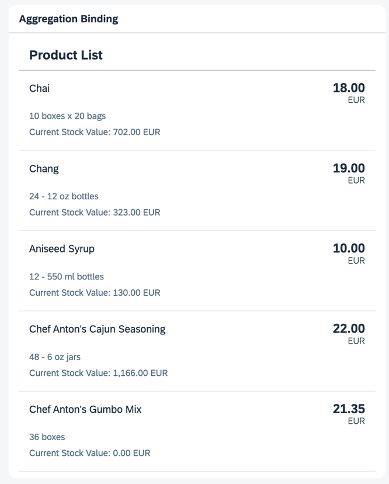

## Step 12: Aggregation Binding Using Templates

Aggregation binding, also known as "list binding", lets a control bind to a list within the model data. This binding allows relative binding to the list entries by its child controls.

The system automatically creates as many child controls as are needed to display the data in the model using one of two approaches:

- It clones a template control as many times as necessary to display the data.

- It uses a factory function to generate the correct control for each bound list entry, based on the data received at runtime.

### Preview

#### A third panel with a list of products is displayed



You can view this step live: [🔗 Live Preview of Step 12](https://ui5.github.io/tutorials/databinding/build/12/index-cdn.html).

### Coding

You can download the solution for this step here: <span class="ts-only">[📥 Download step 12](https://ui5.github.io/tutorials/databinding/databinding-step-12.zip)<span class="lang-suffix"> (TS)</span></span><span class="js-only">[📥 Download step 12](https://ui5.github.io/tutorials/databinding/databinding-step-12-js.zip)<span class="lang-suffix"> (JS)</span></span>.

#### Folder structure for this step


```text
webapp/
├── controller/
│   └── App.controller.ts/.js
├── i18n/
│   ├── i18n.properties
│   └── i18n_de.properties
├── model/
│   ├── Products.json
│   └── data.json
├── view/
│   └── App.view.xml
├── Component.ts/.js
├── index.html
└── manifest.json
```


Add a new entry named `products` to the `models` entry under `sap.ui5` in the `manifest.json` file:

### webapp/manifest.json


```json
{
  ...
    "sap.ui5": {
        ...
        "models": {
            "": {
                "type": "sap.ui.model.json.JSONModel",
                "uri": "./model/data.json"
            },
            "products" : {
                "type": "sap.ui.model.json.JSONModel",
                "uri": "./model/Products.json"
            },
            "i18n": {
                "type": "sap.ui.model.resource.ResourceModel",
                "settings": {
                    "bundleName": "ui5.tutorial.databinding.i18n.i18n",
                    "supportedLocales": [
                        "",
                        "de"
                    ],
                    "fallbackLocale": ""
                }
            }
        },
        ...
    }
  ...
}
```


Create a new file named `Products.json` in the `model` folder. Enter the data for the products:

### webapp/model/Products.json \(New\)


```json
{
	"Products": [
		{
			"ProductID": 1,
			"ProductName": "Chai",
			"SupplierID": 1,
			"CategoryID": 1,
			"QuantityPerUnit": "10 boxes x 20 bags",
			"UnitPrice": "18.0000",
			"UnitsInStock": 39,
			"UnitsOnOrder": 0,
			"ReorderLevel": 10,
			"Discontinued": false
		},
		{
			"ProductID": 2,
			"ProductName": "Chang",
			"SupplierID": 1,
			"CategoryID": 1,
			"QuantityPerUnit": "24 - 12 oz bottles",
			"UnitPrice": "19.0000",
			"UnitsInStock": 17,
			"UnitsOnOrder": 40,
			"ReorderLevel": 25,
			"Discontinued": false
		},
		{
			"ProductID": 3,
			"ProductName": "Aniseed Syrup",
			"SupplierID": 1,
			"CategoryID": 2,
			"QuantityPerUnit": "12 - 550 ml bottles",
			"UnitPrice": "10.0000",
			"UnitsInStock": 13,
			"UnitsOnOrder": 70,
			"ReorderLevel": 25,
			"Discontinued": false
		},
		{
			"ProductID": 4,
			"ProductName": "Chef Anton's Cajun Seasoning",
			"SupplierID": 2,
			"CategoryID": 2,
			"QuantityPerUnit": "48 - 6 oz jars",
			"UnitPrice": "22.0000",
			"UnitsInStock": 53,
			"UnitsOnOrder": 0,
			"ReorderLevel": 0,
			"Discontinued": false
		},
		{
			"ProductID": 5,
			"ProductName": "Chef Anton's Gumbo Mix",
			"SupplierID": 2,
			"CategoryID": 2,
			"QuantityPerUnit": "36 boxes",
			"UnitPrice": "21.3500",
			"UnitsInStock": 0,
			"UnitsOnOrder": 0,
			"ReorderLevel": 0,
			"Discontinued": true
		}
	]
}
```


In the `App.view.xml` file, add a new panel with an `sap.m.List` control containing the `sap.m.ObjectListItem` template control as shown below. Note that the template control is only present once in the XML view. It's automatically cloned for each entry in the products' JSON model.

### webapp/view/App.view.xml


```xml
<mvc:View
	controllerName="ui5.tutorial.databinding.controller.App"
	xmlns="sap.m"
	xmlns:form="sap.ui.layout.form"
	xmlns:l="sap.ui.layout"
	xmlns:core="sap.ui.core"
	xmlns:mvc="sap.ui.core.mvc"
	core:require="{ColumnLayout:'sap/ui/layout/form/ColumnLayout'}">
	...
	<Panel
		headerText="{i18n>panel3HeaderText}"
		class="sapUiResponsiveMargin"
		width="auto">
		<List
			headerText="{i18n>productListTitle}"
			items="{products>/Products}">
			<items>
				<ObjectListItem
					title="{products>ProductName}"
					number="{
						parts: [
							{path: 'products>UnitPrice'},
							{path: '/currencyCode'}
						],
						type: 'sap.ui.model.type.Currency',
						formatOptions: { showMeasure: false }
					}"
					numberUnit="{/currencyCode}">
					<attributes>
						<ObjectAttribute
							text="{products>QuantityPerUnit}"/>
						<ObjectAttribute
							title="{i18n>stockValue}"
							text="{
								parts: [
									{path: 'products>UnitPrice'},
									{path: 'products>UnitsInStock'},
									{path: '/currencyCode'}
								],
								formatter: '.formatStockValue'
							}"/>
					</attributes>
				</ObjectListItem>
			</items>
		</List>
	</Panel>
</mvc:View>
```


Also, add another formatter to the `App.controller.ts/.js` file to calculate the value of the stock of each product.

### webapp/controller/App.controller.ts/.js


```ts
// webapp/controller/App.controller.ts
import ResourceBundle from "sap/base/i18n/ResourceBundle";
import { URLHelper } from "sap/m/library";
import Controller from "sap/ui/core/mvc/Controller";
import ResourceModel from "sap/ui/model/resource/ResourceModel";
import Currency from "sap/ui/model/type/Currency";

/**
 * @namespace ui5.tutorial.databinding.controller
 */
export default class App extends Controller {
	public async formatMail(firstName: string, lastName: string): Promise<string> {
		const bundle: ResourceBundle = await (this.getView().getModel("i18n") as ResourceModel).getResourceBundle() as ResourceBundle;

		return URLHelper.normalizeEmail(
			`${firstName}.${lastName}@example.com`,
			bundle.getText("mailSubject", [firstName]),
			bundle.getText("mailBody")
		);
	}

	public formatStockValue(unitPrice: number, stockLevel: number, currencyCode: string): string {
		const currency: Currency = new Currency();
		return currency.formatValue([unitPrice * stockLevel, currencyCode], "string");
	}
}
```



```js
// webapp/controller/App.controller.js
sap.ui.define(["sap/ui/core/mvc/Controller", "sap/m/library", "sap/ui/model/type/Currency"], function (Controller, mobileLibrary, Currency) {
	"use strict";

	return Controller.extend("ui5.tutorial.databinding.controller.App", {
		async formatMail(firstName, lastName) {
			const bundle = await this.getView().getModel("i18n").getResourceBundle();

			return mobileLibrary.URLHelper.normalizeEmail(
				`${firstName}.${lastName}@example.com`,
				bundle.getText("mailSubject", [firstName]),
				bundle.getText("mailBody")
			);
		},

		formatStockValue(unitPrice, stockLevel, currencyCode) {
			const currency = new Currency();
			return currency.formatValue([unitPrice * stockLevel, currencyCode], "string");
		}
	});
});
```


Lastly, add the missing texts to the `i18n.properties` and `i18n_de.properties` files. These texts are used in the newly added UI elements.

### webapp/i18n/i18n.properties


```properties
...
# Screen titles
panel1HeaderText=Data Binding Basics
panel2HeaderText=Address Details
panel3HeaderText=Aggregation Binding

...

# Product list
productListTitle=Product List
stockValue=Current Stock Value
```


### webapp/i18n/i18n\_de.properties


```properties
...
# Screen titles
panel1HeaderText=Data Binding Grundlagen
panel2HeaderText=Adressdetails
panel3HeaderText=Aggregation Binding

...

# Product list
productListTitle=Artikelliste
stockValue=Lagerbestand Wert
```


***

**Next:** [Step 13: Element Binding](../13/README.md)

**Previous:** [Step 11: Validation Using `sap/ui/core/Messaging`](../11/README.md)

***

**Related Information**

[List Binding \(Aggregation Binding\)](https://sdk.openui5.org/topic/91f057786f4d1014b6dd926db0e91070.html "List binding (or aggregation binding) is used to automatically create child controls according to model data.")
