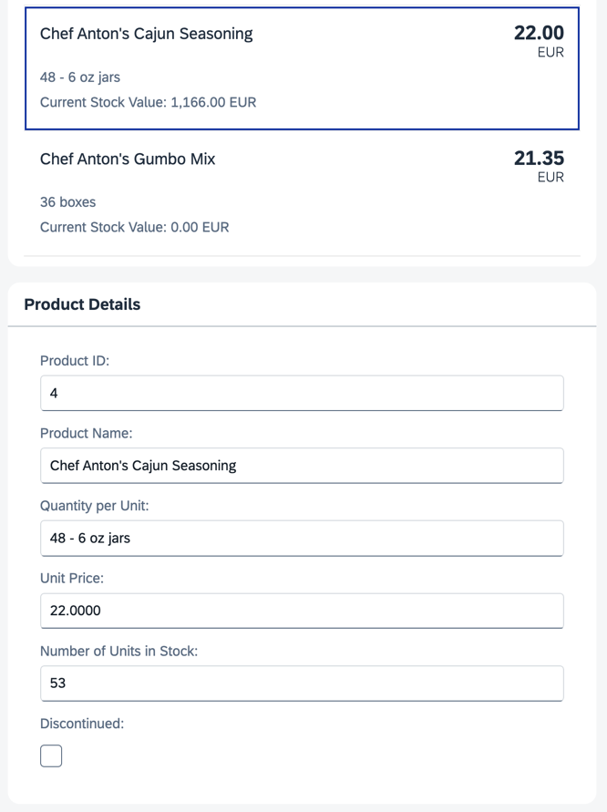

## Step 13: Element Binding

Now, let's do something with that newly generated list. Typically, you use a list to allow selection of an item and then display the details of that item elsewhere. To accomplish this, we use a form with relatively bound controls and bind it to the selected entity via element binding.

### Preview

#### A fourth panel with details for a selected product is displayed



You can view this step live: [🔗 Live Preview of Step 13](https://ui5.github.io/tutorials/databinding/build/13/index-cdn.html).

### Coding

You can download the solution for this step here: <span class="ts-only">[📥 Download step 13](https://ui5.github.io/tutorials/databinding/databinding-step-13.zip)<span class="lang-suffix"> (TS)</span></span><span class="js-only">[📥 Download step 13](https://ui5.github.io/tutorials/databinding/databinding-step-13-js.zip)<span class="lang-suffix"> (JS)</span></span>.

#### Folder structure for this step


```text
webapp/
├── controller/
│   └── App.controller.ts/.js
├── i18n/
│   ├── i18n.properties
│   └── i18n_de.properties
├── model/
│   ├── Products.json
│   └── data.json
├── view/
│   └── App.view.xml
├── Component.ts/.js
├── index.html
└── manifest.json
```


In the `App.view.xml` file, add a `press` event handler to the items in the list. Below the panel with the list, add a new panel with an `sap.m.SimpleForm`. To populate the form with data, we bind the entire panel to the path of the element you clicked in the list.

### webapp/view/App.view.xml


```xml
...
<mvc:View
	controllerName="ui5.tutorial.databinding.controller.App"
	xmlns="sap.m"
	xmlns:form="sap.ui.layout.form"
	xmlns:l="sap.ui.layout"
	xmlns:core="sap.ui.core"
	xmlns:mvc="sap.ui.core.mvc"
	core:require="{ColumnLayout:'sap/ui/layout/form/ColumnLayout'}">
	...
	<Panel
		headerText="{i18n>panel3HeaderText}"
		class="sapUiResponsiveMargin"
		width="auto">
		<List
			headerText="{i18n>productListTitle}"
			items="{products>/Products}">
			<items>
				<ObjectListItem
					press=".onItemSelected"
					type="Active"
					title="{products>ProductName}"
					number="{
						parts: [
							{path: 'products>UnitPrice'},
							{path: '/currencyCode'}
						],
						type: 'sap.ui.model.type.Currency',
						formatOptions: { showMeasure: false }
					}"
					numberUnit="{/currencyCode}">
					<attributes>
						...
					</attributes>
				</ObjectListItem>
			</items>
		</List>
	</Panel>
	<Panel
		id="productDetailsPanel"
		headerText="{i18n>panel4HeaderText}"
		class="sapUiResponsiveMargin"
		width="auto">
		<form:SimpleForm
			editable="true"
			layout="ColumnLayout">
			<Label text="{i18n>ProductID}"/>
			<Input value="{products>ProductID}"/>

			<Label text="{i18n>ProductName}"/>
			<Input value="{products>ProductName}"/>

			<Label text="{i18n>QuantityPerUnit}"/>
			<Input value="{products>QuantityPerUnit}"/>

			<Label text="{i18n>UnitPrice}"/>
			<Input value="{products>UnitPrice}"/>

			<Label text="{i18n>UnitsInStock}"/>
			<Input value="{products>UnitsInStock}"/>

			<Label text="{i18n>Discontinued}"/>
			<CheckBox selected="{products>Discontinued}"/>
		</form:SimpleForm>
	</Panel>
</mvc:View>
```


In the controller, add a new function `onItemSelected`, which binds the newly created panel to the correct item whenever it's pressed.

### webapp/controller/App.controller.ts/.js


```ts
// webapp/controller/App.controller.ts
import ResourceBundle from "sap/base/i18n/ResourceBundle";
import { URLHelper } from "sap/m/library";
import { ListItemBase$DetailPressEvent } from "sap/m/ListItemBase";
import ObjectListItem from "sap/m/ObjectListItem";
import Controller from "sap/ui/core/mvc/Controller";
import ResourceModel from "sap/ui/model/resource/ResourceModel";
import Currency from "sap/ui/model/type/Currency";

/**
 * @namespace ui5.tutorial.databinding.controller
 */
export default class App extends Controller {
	...

	public onItemSelected(event: ListItemBase$DetailPressEvent): void {
		const bindingPath: string = (event.getSource() as ObjectListItem).getBindingContext("products").getPath();
		this.byId("productDetailsPanel")?.bindElement({ path: bindingPath, model: "products" });
	}
}
```



```js
// webapp/controller/App.controller.js
sap.ui.define(["sap/ui/core/mvc/Controller", "sap/m/library", "sap/ui/model/type/Currency"], function (Controller, mobileLibrary, Currency) {
	"use strict";

	return Controller.extend("ui5.tutorial.databinding.controller.App", {
		...

		onItemSelected(event) {
			const bindingPath = event.getSource().getBindingContext("products").getPath();
			this.byId("productDetailsPanel")?.bindElement({ path: bindingPath, model: "products" });
		}
	});
});
```


Lastly, add the new texts to the `i18n.properties` and `i18n_de.properties` files.

### webapp/i18n/i18n.properties


```properties
...
# Screen titles
panel1HeaderText=Data Binding Basics
panel2HeaderText=Address Details
panel3HeaderText=Aggregation Binding
panel4HeaderText=Product Details

...

# Product Details
ProductID=Product ID
ProductName=Product Name
QuantityPerUnit=Quantity per Unit
UnitPrice=Unit Price
UnitsInStock=Number of Units in Stock
Discontinued=Discontinued

```


### webapp/i18n/i18n\_de.properties


```properties
# Screen titles
panel1HeaderText=Data Binding Grundlagen
panel2HeaderText=Adressdetails
panel3HeaderText=Aggregation Binding
panel4HeaderText=Produktdetails

...

# Product Details
ProductID=Produkt-ID
ProductName=Produktname
QuantityPerUnit=Menge pro Einheit
UnitPrice=Preis pro Einheit
UnitsInStock=Lagerbestand
Discontinued=Eingestellt
```


Now, you can click on an element in the list and view its details in the panel below. You can even edit these details, and the changes are directly reflected in the list because we use two-way binding.

> 📝
> Element bindings can also be relative to their parent context.

***

**Next:** [Step 14: Expression Binding](../14/README.md)

**Previous:** [Step 12: Aggregation Binding Using Templates](../12/README.md)

***

**Related Information**

[Context Binding \(Element Binding\)](https://sdk.openui5.org/topic/91f05e8b6f4d1014b6dd926db0e91070.html "Context binding (or element binding) allows you to bind elements to a specific object in the model data, which will create a binding context and allow relative binding within the control and all of its children. This is especially helpful in list-detail scenarios.")
