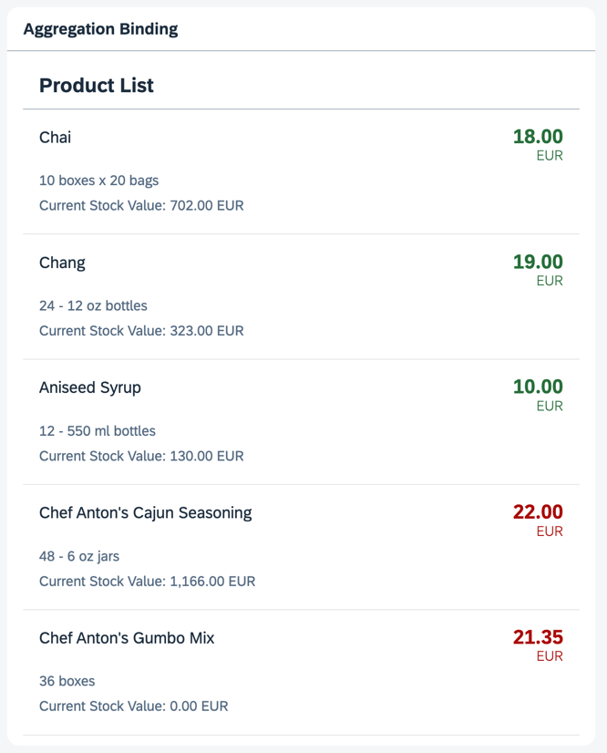

## Step 14: Expression Binding

An expression binding lets you display a calculated value on the screen, which is derived from values found in a model object. This feature allows you to insert simple formatting or calculations directly into the data binding string. In this example, we're changing the color of the price depending on whether it's above or below a certain threshold. The threshold value is stored in the JSON model.

### Preview

#### Prices are color-coded depending on a selected threshold



You can view this step live: [🔗 Live Preview of Step 14](https://ui5.github.io/tutorials/databinding/build/14/index-cdn.html).

### Coding

You can download the solution for this step here: <span class="ts-only">[📥 Download step 14](https://ui5.github.io/tutorials/databinding/databinding-step-14.zip)<span class="lang-suffix"> (TS)</span></span><span class="js-only">[📥 Download step 14](https://ui5.github.io/tutorials/databinding/databinding-step-14-js.zip)<span class="lang-suffix"> (JS)</span></span>.

#### Folder structure for this step


```text
webapp/
├── controller/
│   └── App.controller.ts/.js
├── i18n/
│   ├── i18n.properties
│   └── i18n_de.properties
├── model/
│   ├── Products.json
│   └── data.json
├── view/
│   └── App.view.xml
├── Component.ts/.js
├── index.html
└── manifest.json
```


Add a new property called `priceThreshold` with a value of 20 to the `data.json` file.

### webapp/model/data.json


```json
{
	"firstName": "Harry",
	"lastName": "Hawk",
	"enabled": true,
	"address": {
		"street": "Dietmar-Hopp-Allee 16",
		"city": "Walldorf",
		"zip": "69190",
		"country": "Germany"
	},
	"salesAmount": 12345.6789,
	"priceThreshold": 20,
	"currencyCode": "EUR"
}
```


In the `App.view.xml` file, add a new `numberState` property to the `ObjectListItem` element within the `List`. The value of this property is an expression that gets evaluated for each item. The expression compares each invoice value against the price threshold and returns a number state based on the result.

### webapp/view/App.view.xml


```xml
...
<mvc:View
	controllerName="ui5.tutorial.databinding.controller.App"
	xmlns="sap.m"
	xmlns:form="sap.ui.layout.form"
	xmlns:l="sap.ui.layout"
	xmlns:core="sap.ui.core"
	xmlns:mvc="sap.ui.core.mvc"
	core:require="{ColumnLayout:'sap/ui/layout/form/ColumnLayout'}">
	...
	<Panel
		headerText="{i18n>panel3HeaderText}"
		class="sapUiResponsiveMargin"
		width="auto">
		<List
			headerText="{i18n>productListTitle}"
			items="{products>/Products}">
			<items>
				<ObjectListItem
					press=".onItemSelected"
					type="Active"
					title="{products>ProductName}"
					number="{
						parts: [
							{path: 'products>UnitPrice'},
							{path: '/currencyCode'}
						],
						type: 'sap.ui.model.type.Currency',
						formatOptions: { showMeasure: false }
					}"
					numberUnit="{/currencyCode}"
					numberState="{= ${products>UnitPrice} > ${/priceThreshold} ? 'Error' : 'Success' }">
					<attributes>
						...
					</attributes>
				</ObjectListItem>
			</items>
		</List>
	</Panel>
	...
</mvc:View>
...
```


By binding an expression to the `numberState` property, the error status \(color\) of the price field changes depending on the invoice value.

Consider the following two expressions:

- `numberState="{= ${products>UnitPrice} > ${/priceThreshold} ? 'Error' : 'Success' }"`

- `numberState="{= ${products>UnitPrice} <= ${/priceThreshold} ? 'Success' : 'Error' }"`

Can you see why one of these expressions works, and the other doesn't?

Logically, both expressions are identical. However, the first one works, and the second one doesn't: it only produces an empty screen and an "Invalid XML" message in the browser's console. So, what's happening here?

To understand the situation, you need to know how XML files are parsed.

When an XML file is parsed, certain characters have a special \(high-priority\) meaning to the XML parser. When these characters are encountered, they're **always** interpreted to be part of the XML definition itself, and not as part of any other content within the XML document.

The XML parser always interprets one of these high-priority characters \(in this case, a less-than \(`<`\) character\) as the start of a new XML tag. This happens regardless of any other meaning that character might have within the context of the expression. This is known as a **syntax collision**.

In our case, the collision occurs between the syntax of XML and the syntax of the JavaScript-like expression language used by OpenUI5.

Therefore, this statement fails because the less-than character is interpreted as the start of an XML tag: `numberState="{= ${products>UnitPrice} <= ${/priceThreshold} ? 'Success' : 'Error' }"`

You can avoid this problem in one of two ways:

- Reverse the logic of the condition \(use "greater than or equal to" instead of "less than"\)

- Use the escaped value for the less-than character: `numberState="{= ${products>UnitPrice} &lt;= ${/priceThreshold} ? 'Success' : 'Error' }"`

Since using an escaped character is not so easy to read, we recommend reversing the logic of the condition and using a greater-than character instead.

The ampersand \(`&`\) character also has a high-priority meaning to the XML parser. This character always means "The start of an escaped character". So, if you'd like to use the Boolean `AND` operator \(`&&`\) in a condition, you must escape both ampersand characters \(`&amp;&amp;`\).

***

**Next:** [Step 15: Aggregation Binding Using a Factory Function](../15/README.md)

**Previous:** [Step 13: Element Binding](../13/README.md)

***

**Related Information**

[Expression Binding](https://sdk.openui5.org/topic/daf6852a04b44d118963968a1239d2c0.html "Expression binding is an enhancement of the OpenUI5 binding syntax, which allows for providing expressions instead of custom formatter functions.")
