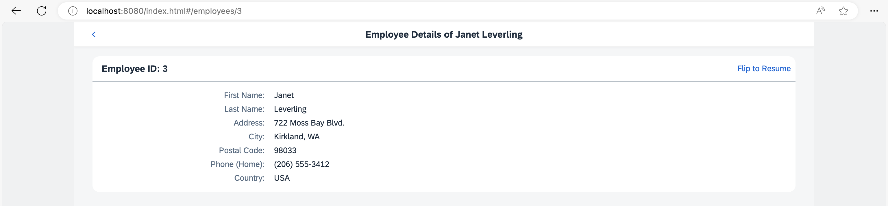
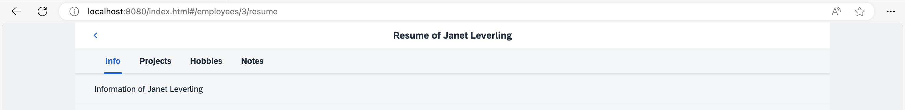
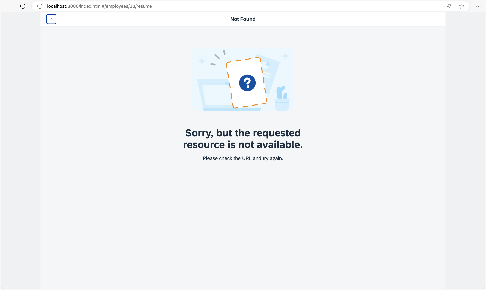

<nav class="tutorial-breadcrumb"><a href="../../../index.html">UI5 Tutorials</a> <span class="tutorial-breadcrumb-sep">&rsaquo;</span> <a href="../../index.html">Navigation and Routing Tutorial</a></nav>

## Step 8: Navigate with Flip Transition

In this step, we want to illustrate how to navigate to a page with a custom transition animation. Both forward and backward navigation will use the “flip” transition but with a different direction. We will create a simple link on the `Employee` view that triggers a flip navigation to a page that displays the resume data of a certain employee. Pressing the *Back* button will navigate back to the `Employee` view with a reversed flip transition.

### Preview

#### Employee Details page with Flip to Resume link



#### Resume page with multiple tabs



#### Not Found page for resume



You can view this step live: [🔗 Live Preview of Step 8](https://ui5.github.io/tutorials/navigation/build/08/index-cdn.html).

### Coding

You can download the solution for this step here: <span class="ts-only">[📥 Download step 8](https://ui5.github.io/tutorials/navigation/navigation-step-08.zip)<span class="lang-suffix"> (TS)</span></span><span class="js-only">[📥 Download step 8](https://ui5.github.io/tutorials/navigation/navigation-step-08-js.zip)<span class="lang-suffix"> (JS)</span></span>.

#### Folder structure for this step


```text
webapp/
├── controller/
│   ├── employee/
│   │   ├── Employee.controller.ts/.js
│   │   ├── EmployeeList.controller.ts/.js
│   │   └── Resume.controller.ts/.js
│   ├── App.controller.ts/.js
│   ├── BaseController.ts/.js
│   ├── Home.controller.ts/.js
│   └── NotFound.controller.ts/.js
├── i18n/
│   └── i18n.properties
├── localService/
│   ├── mockdata/
│   │   ├── Employees.json
│   │   └── Resumes.json
│   ├── metadata.xml
│   └── mockserver.ts/.js
├── view/
│   ├── employee/
│   │   ├── Employee.view.xml
│   │   ├── EmployeeList.view.xml
│   │   ├── Resume.view.xml
│   │   └── ResumeProjects.view.xml
│   ├── App.view.xml
│   ├── Home.view.xml
│   └── NotFound.view.xml
├── Component.ts/.js
├── index.html
├── initMockServer.ts/.js
└── manifest.json
```


### webapp/view/employee/Employee.view.xml


```xml
<mvc:View
  controllerName="ui5.tutorial.navigation.controller.employee.Employee"
  xmlns="sap.m"
  xmlns:mvc="sap.ui.core.mvc"
  xmlns:f="sap.ui.layout.form"
  xmlns:core="sap.ui.core"
  core:require="{ColumnLayout:'sap/ui/layout/form/ResponsiveGridLayout'}"
  busyIndicatorDelay="0">
  <Page
    id="employeePage"
    title="{i18n>EmployeeDetailsOf} {FirstName} {LastName}"
    titleAlignment="Center"
    showNavButton="true"
    navButtonPress=".onNavBack"
    class="sapUiResponsiveContentPadding">
    <content>
      <Panel
        id="employeePanel"
        width="auto"
        class="sapUiNoContentPadding">
        <headerToolbar>
          <Toolbar>
            <Title text="{i18n>EmployeeIDColon} {EmployeeID}" level="H2"/>
            <ToolbarSpacer />
            <Link text="{i18n>FlipToResume}" tooltip="{i18n>FlipToResume.tooltip}" press=".onShowResume"/>
          </Toolbar>
        </headerToolbar>
        <content>
          ...
        </content>
      </Panel>
    </content>
  </Page>
</mvc:View>
```


First we add the *Flip to Resume* link to the *Employee Details* view to trigger the navigation to the resume of the employee that is currently displayed.

### webapp/controller/employee/Employee.controller.ts/.js


```ts
// webapp/controller/employee/Employee.controller.ts
import BaseController from "ui5/tutorial/navigation/controller/BaseController";
import { Route$MatchedEvent } from "sap/ui/core/routing/Route";

/**
 * @namespace ui5.tutorial.navigation.controller.employee
 */
export default class Employee extends BaseController {
	...
	private _onBindingChange(): void {
		// No data for the binding
		if (!this.getView().getBindingContext()) {
			this.getRouter().getTargets().display("notFound");
		}
	}

	public onShowResume(): void {
		const context = this.getView().getBindingContext();

		this.getRouter().navTo("employeeResume", {
			employeeId: context.getProperty("EmployeeID")
		});
	}
}
```



```js
// webapp/controller/employee/Employee.controller.js
sap.ui.define(["ui5/tutorial/navigation/controller/BaseController"], function (BaseController) {
	"use strict";

	const Employee = BaseController.extend("ui5.tutorial.navigation.controller.employee.Employee", {
		onInit() {
			const router = this.getRouter();
			router.getRoute("employee").attachMatched(this._onRouteMatched, this);
		},
		_onRouteMatched(event) {
			const eventArguments = event.getParameter("arguments");
			const view = this.getView();
			view.bindElement({
				path: "/Employees(" + eventArguments.employeeId + ")",
				events: {
					change: this._onBindingChange.bind(this),
					dataRequested: () => {
						view.setBusy(true);
					},
					dataReceived: () => {
						view.setBusy(false);
					}
				}
			});
		},
		_onBindingChange() {
			// No data for the binding
			if (!this.getView().getBindingContext()) {
				this.getRouter().getTargets().display("notFound");
			}
		},
		onShowResume() {
			const context = this.getView().getBindingContext();
			this.getRouter().navTo("employeeResume", {
				employeeId: context.getProperty("EmployeeID")
			});
		}
	});
	return Employee;
});
```


Then we change the `Employee.controller.ts` file by adding the press handler `onShowResume` for the *Flip to Resume* link. The handler simply navigates to a new route `employeeResume` and fills the mandatory parameter `employeeId` with the property `EmployeeID` from the view’s bound context. The route `employeeResume` is not available yet, so we will have to add it to our routing configuration.

### webapp/manifest.json


```json
{
  "_version": "2.8.0",
  "sap.app": {
    ...
  },
  "sap.ui": {
    ...
  },
  "sap.ui5": {
    ...
    "routing": {
      "config": {
        "routerClass": "sap.m.routing.Router",
        "type": "View",
        "viewType": "XML",
        "path": "ui5.tutorial.navigation.view",
        "controlId": "app",
        "controlAggregation": "pages",
        "transition": "slide",
        "bypassed": {
          "target": "notFound"
        }
      },
      "routes": [{
        "pattern": "",
        "name": "appHome",
        "target": "home"
      }, {
        "pattern": "employees",
        "name": "employeeList",
        "target": "employees"
      }, {
        "pattern": "employees/{employeeId}",
        "name": "employee",
        "target": "employee"
      }, {
        "pattern": "employees/{employeeId}/resume",
        "name": "employeeResume",
        "target": "employeeResume"
      }],
      "targets": {
        "home": {
          "id": "home",
          "name": "Home",
          "level": 1
        },
        "notFound": {
          "id": "notFound",
          "name": "NotFound",
          "transition": "show"
        },
        "employees": {
          "id": "employees",
          "path": "ui5.tutorial.navigation.view.employee",
          "name": "EmployeeList",
          "level": 2
        },
        "employee": {
          "id": "employee",
          "path": "ui5.tutorial.navigation.view.employee",
          "name": "Employee",
          "level": 3
        },
        "employeeResume": {
          "id": "resume",
          "path": "ui5.tutorial.navigation.view.employee",
          "name": "Resume",
          "level": 4,
          "transition": "flip"
        }
      }
    }
  }
}
```


In the routing configuration, we add a new route `employeeResume` which references a target with the same name. The route’s pattern expects an `{employeeId}` as a mandatory parameter and ends with the static string `/resume`.

The target `employeeResume` references the view `employee.Resume` that we are about to create. The target’s `level` is `4`; compared to the employee target this is one level lower again. To configure a flip navigation, we simply set the transition of our target to `flip`. Together with the correct `level` configuration this will trigger the correct forward and backward flip navigation whenever the target is displayed.

> 📝
> Possible values for the `transition` parameter are:
>
> - `slide` \(default\)
>
> - `flip`
>
> - `show`
>
> - `fade`
>
>
> You can also implement your own transitions and add it to a control that extends `sap.m.NavContainer` \(for example, `sap.m.App` or `sap.m.SplitApp`\). For more information, see the [API Reference: `NavContainer`](https://sdk.openui5.org/#/api/sap.m.NavContainer).

### webapp/view/employee/Resume.view.xml \(New\)


```xml
<mvc:View
  controllerName="ui5.tutorial.navigation.controller.employee.Resume"
  xmlns="sap.m"
  xmlns:mvc="sap.ui.core.mvc">
  <Page
    title="{i18n>ResumeOf} {FirstName} {LastName}"
    titleAlignment="Center"
    id="employeeResumePage"
    showNavButton="true"
    navButtonPress=".onNavBack">
    <content>
      <IconTabBar
        id="iconTabBar"
        headerBackgroundDesign="Transparent"
        class="sapUiResponsiveContentPadding"
        binding="{Resume}">
        <items>
          <IconTabFilter id="infoTab" text="{i18n>tabInfo}" key="Info">
            <Text text="{Information}"/>
          </IconTabFilter>
          <IconTabFilter id="projectsTab" text="{i18n>tabProjects}" key="Projects">
            <mvc:XMLView viewName="ui5.tutorial.navigation.view.employee.ResumeProjects"></mvc:XMLView>
          </IconTabFilter>
          <IconTabFilter id="hobbiesTab" text="{i18n>tabHobbies}" key="Hobbies">
            <Text text="{Hobbies}"/>
          </IconTabFilter>
          <IconTabFilter id="notesTab" text="{i18n>tabNotes}" key="Notes">
            <Text text="{Notes}"/>
          </IconTabFilter>
        </items>
      </IconTabBar>
    </content>
  </Page>
</mvc:View>
```


Create a file `Resume.view.xml` inside the `webapp/view/employee` folder. The view uses an `IconTabBar` to display the resume data. Therefore, its binding attribute is set to `{Resume}`.

In the `IconTabBar` we display four tabs. Three of them simply use a `Text` control to display the data from the service. The *Projects* tab uses a nested XML view to display the projects of the employee. OpenUI5 takes care of loading the XML view automatically when the user navigates to the *Resume* page.

### webapp/controller/employee/Resume.controller.ts/.js \(New\)


```ts
// webapp/controller/employee/Resume.controller.ts
import BaseController from "ui5/tutorial/navigation/controller/BaseController";
import { Route$MatchedEvent } from "sap/ui/core/routing/Route";

/**
 * @namespace ui5.tutorial.navigation.controller.employee
 */
export default class Resume extends BaseController {

	public onInit(): void {
		const router = this.getRouter();

		router.getRoute("employeeResume").attachMatched(this._onRouteMatched, this);
	}

	private _onRouteMatched(event: Route$MatchedEvent): void {
		const eventArguments = (<any> event.getParameter("arguments"));
		const view = this.getView();

		view.bindElement({
			path: "/Employees(" + eventArguments.employeeId + ")",
			events: {
				change: this._onBindingChange.bind(this),
				dataRequested: () => {
					view.setBusy(true);
				},
				dataReceived: () => {
					view.setBusy(false);
				}
			}
		});
	}

	private _onBindingChange(): void {
		// No data for the binding
		if (!this.getView().getBindingContext()) {
			this.getRouter().getTargets().display("notFound");
		}
	}
}
```



```js
// webapp/controller/employee/Resume.controller.js
sap.ui.define(["ui5/tutorial/navigation/controller/BaseController"], function (BaseController) {
	"use strict";

	const Resume = BaseController.extend("ui5.tutorial.navigation.controller.employee.Resume", {
		onInit() {
			const router = this.getRouter();
			router.getRoute("employeeResume").attachMatched(this._onRouteMatched, this);
		},
		_onRouteMatched(event) {
			const eventArguments = event.getParameter("arguments");
			const view = this.getView();
			view.bindElement({
				path: "/Employees(" + eventArguments.employeeId + ")",
				events: {
					change: this._onBindingChange.bind(this),
					dataRequested: () => {
						view.setBusy(true);
					},
					dataReceived: () => {
						view.setBusy(false);
					}
				}
			});
		},
		_onBindingChange() {
			// No data for the binding
			if (!this.getView().getBindingContext()) {
				this.getRouter().getTargets().display("notFound");
			}
		}
	});
	return Resume;
});
```


Create a file `Resume.controller.ts` in the `webapp/controller/employee` folder. In this controller, we make sure to bind the view to the correct employee whenever the `employeeResume` route has matched. We have already used this approach in the previous step so you should be able to recognize the building blocks in the code above. Again, in case the user cannot be found we display the `notFound` target.

### webapp/view/employee/ResumeProjects.view.xml \(New\)


```xml
<mvc:View xmlns="sap.m" xmlns:mvc="sap.ui.core.mvc">
  <Text text="{Projects}"/>
</mvc:View>
```


Create a file `ResumeProjects.view.xml` in the `webapp/view/employee` folder. This view does not have a controller as we don’t need it. It just displays a `Text` control with the projects text of the selected employee. It illustrates that using nested views works just fine in combination with navigation and routing in OpenUI5.

> 📝
> For more complex applications, the performance is significantly increased if parts of the UI are only loaded when the user is actively selecting it. In this example, the view is always loaded even though the user never decided to display the project information. In the next steps, we will extend the UI so that the content is loaded “lazy” by OpenUI5 only when the filter item is clicked. The back-end service will fetch the data only on request and the UI will only have to be updated with the selected data instead of loading all data.

### webapp/i18n/i18n.properties


```properties
...
ResumeOf=Resume of
tabInfo=Info
tabProjects=Projects
tabHobbies=Hobbies
tabNotes=Notes
FlipToResume=Flip to Resume
FlipToResume.tooltip=See the resume of this employee
```


Add the new texts to the `i18n.properties` file.

You can go to `webapp/index.html#/employees/3` and click on the *Flip to Resume* link to be redirected with a nice flip transition to the employee’s resume. The back navigation uses a reverse flip navigation to get back to the *Employee Details* page. You can also directly navigate to `webapp/index.html#/employees/3/resume` or `webapp/index.html#/employees/33/resume` to see what happens.

***

**Next:** [Step 9: Allow Bookmarkable Tabs with Optional Query Parameters](../09/index.html)

**Previous:** [Step 7: Navigate to Routes with Mandatory Parameters](../07/index.html)
