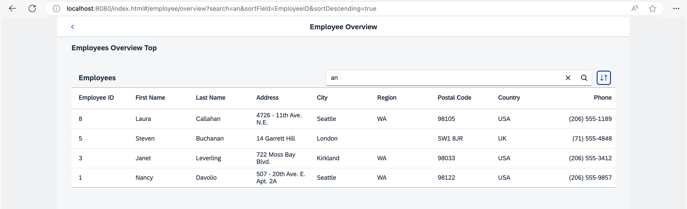

<nav class="tutorial-breadcrumb"><a href="../../../index.html">UI5 Tutorials</a> <span class="tutorial-breadcrumb-sep">&rsaquo;</span> <a href="../../index.html">Navigation and Routing Tutorial</a></nav>

## Step 13: Make Table Sorting Bookmarkable

In this step, we will create a button at the top of the table which will change the sorting of the table. When the current sorting state of the table is changed, the sorting state will be reflected in the URL. This illustrates how to make the table sorting bookmarkable.

### Preview

#### Bookmarkable search and sorting



You can view this step live: [🔗 Live Preview of Step 13](https://ui5.github.io/tutorials/navigation/build/13/index-cdn.html).

### Coding

You can download the solution for this step here: <span class="ts-only">[📥 Download step 13](https://ui5.github.io/tutorials/navigation/navigation-step-13.zip)<span class="lang-suffix"> (TS)</span></span><span class="js-only">[📥 Download step 13](https://ui5.github.io/tutorials/navigation/navigation-step-13-js.zip)<span class="lang-suffix"> (JS)</span></span>.

### webapp/controller/employee/overview/EmployeeOverviewContent.controller.ts/.js


```ts
// webapp/controller/employee/overview/EmployeeOverviewContent.controller.ts
import SearchField, { SearchField$SearchEvent } from "sap/m/SearchField";
import Table from "sap/m/Table";
import ViewSettingsDialog, { ViewSettingsDialog$ConfirmEvent } from "sap/m/ViewSettingsDialog";
import ViewSettingsItem from "sap/m/ViewSettingsItem";
import BaseController from "ui5/tutorial/navigation/controller/BaseController";
import Filter from "sap/ui/model/Filter";
import FilterOperator from "sap/ui/model/FilterOperator";
import ListBinding from "sap/ui/model/ListBinding";
import Sorter from "sap/ui/model/Sorter";
import { Route$MatchedEvent } from "sap/ui/core/routing/Route";

/**
 * @namespace ui5.tutorial.navigation.controller.employee.overview
 */
export default class EmployeeOverviewContent extends BaseController {
	...
	private _onRouteMatched(event: Route$MatchedEvent): void {
		// save the current query state
		this.routerArgs = event.getParameter("arguments");
		this.routerArgs["?query"] ||= {};
		const queryParameter = this.routerArgs["?query"];

		// search/filter via URL hash
		this._applySearchFilter(queryParameter.search);

		// sorting via URL hash
		this._applySorter(queryParameter.sortField, queryParameter.sortDescending);
	}
	...
	private _initViewSettingsDialog(): void {
		const oRouter = this.getRouter();

		this.viewSettingsDialog = new ViewSettingsDialog("vsd", {
			confirm: (event: ViewSettingsDialog$ConfirmEvent) => {
				const sortItem = event.getParameter("sortItem");

				this._applySorter(sortItem.getKey(), event.getParameter("sortDescending"));
				this.routerArgs["?query"].sortField = sortItem.getKey();
				this.routerArgs["?query"].sortDescending = event.getParameter("sortDescending");
				oRouter.navTo("employeeOverview", this.routerArgs, true /*without history*/);
			}
		});
		...
	}
	...
}
```



```js
// webapp/controller/employee/overview/EmployeeOverviewContent.controller.js
sap.ui.define(["sap/m/ViewSettingsDialog", "sap/m/ViewSettingsItem", "ui5/tutorial/navigation/controller/BaseController", "sap/ui/model/Filter", "sap/ui/model/FilterOperator", "sap/ui/model/Sorter"], function (ViewSettingsDialog, ViewSettingsItem, BaseController, Filter, FilterOperator, Sorter) {
	"use strict";

	const EmployeeOverviewContent = BaseController.extend("ui5.tutorial.navigation.controller.employee.overview.EmployeeOverviewContent", {
		constructor() {
			BaseController.prototype.constructor.apply(this, arguments);
			this.sortField = null;
			this.sortDescending = false;
			this.validSortFields = ["EmployeeID", "FirstName", "LastName"];
			this.searchQuery = null;
			this.routerArgs = null;
		},
		onInit() {
			const router = this.getRouter();
			this.table = this.byId("employeesTable");
			this._initViewSettingsDialog();

			// make the search bookmarkable
			router.getRoute("employeeOverview").attachMatched(this._onRouteMatched, this);
		},
		_onRouteMatched(event) {
			// save the current query state
			this.routerArgs = event.getParameter("arguments");
			this.routerArgs["?query"] ||= {};
			const queryParameter = this.routerArgs["?query"];

			// search/filter via URL hash
			this._applySearchFilter(queryParameter.search);

			// sorting via URL hash
			this._applySorter(queryParameter.sortField, queryParameter.sortDescending);
		},
		onSortButtonPressed() {
			this.viewSettingsDialog.open();
		},
		onSearchEmployeesTable(event) {
			const router = this.getRouter();

			// update the hash with the current search term
			this.routerArgs["?query"].search = event.getSource().getValue();
			router.navTo("employeeOverview", this.routerArgs, true /*no history*/);
		},
		_initViewSettingsDialog() {
			const router = this.getRouter();
			this.viewSettingsDialog = new ViewSettingsDialog("vsd", {
				confirm: event => {
					const sortItem = event.getParameter("sortItem");
					this._applySorter(sortItem.getKey(), event.getParameter("sortDescending"));
					this.routerArgs["?query"].sortField = sortItem.getKey();
					this.routerArgs["?query"].sortDescending = event.getParameter("sortDescending");
					router.navTo("employeeOverview", this.routerArgs, true /*without history*/);
				}
			});

			// init sorting (with simple sorters as custom data for all fields)
			this.viewSettingsDialog.addSortItem(new ViewSettingsItem({
				key: "EmployeeID",
				text: "Employee ID",
				selected: true // by default the MockData is sorted by EmployeeID
			}));
			this.viewSettingsDialog.addSortItem(new ViewSettingsItem({
				key: "FirstName",
				text: "First Name",
				selected: false
			}));
			this.viewSettingsDialog.addSortItem(new ViewSettingsItem({
				key: "LastName",
				text: "Last Name",
				selected: false
			}));
		},
		_applySearchFilter(searchQuery) {
			// first check if we already have this search value
			if (this.searchQuery === searchQuery) {
				return;
			}
			this.searchQuery = searchQuery;
			this.byId("searchField").setValue(searchQuery);
			let filter = null;

			// add filters for search
			if (searchQuery?.length > 0) {
				const filters = [];
				filters.push(new Filter("FirstName", FilterOperator.Contains, searchQuery));
				filters.push(new Filter("LastName", FilterOperator.Contains, searchQuery));
				filter = new Filter({
					filters: filters,
					and: false
				}); // OR filter
			}

			// update list binding
			const binding = this.table.getBinding("items");
			binding.filter(filter, "Application");
		},
		/**
		 * Applies sorting on our table control.
		 * @param {string} fieldName the name of the field used for sorting
		 * @param {boolean} sortDescending whether to sort descending
		 * @private
		 */
		_applySorter(fieldName, sortDescending) {
			// only continue if we have a valid sort field
			if (fieldName && this.validSortFields.includes(fieldName)) {
				// sort only if the sorter has changed
				if (this.sortField && this.sortField === fieldName && this.sortDescending === sortDescending) {
					return;
				}
				this.sortField = fieldName;
				this.sortDescending = sortDescending;
				const sorter = new Sorter(fieldName, sortDescending);

				// sync with View Settings Dialog
				this._syncViewSettingsDialogSorter(fieldName, sortDescending);
				const binding = this.table.getBinding("items");
				binding.sort(sorter);
			}
		},
		_syncViewSettingsDialogSorter(sortField, sortDescending) {
			// the possible keys are: "EmployeeID" | "FirstName" | "LastName"
			// Note: no input validation is implemented here
			this.viewSettingsDialog.setSelectedSortItem(sortField);
			this.viewSettingsDialog.setSortDescending(sortDescending);
		}
	});
	return EmployeeOverviewContent;
});
```


We enhance the `EmployeeOverviewContent` controller further to add support for bookmarking the table’s sorting options. We expect two query parameters `sortField` and `sortDescending` from the URL for configuring the sorting of the table. In the matched handler of the route `employeeOverview`, we store the query parameter in the `queryParameter` variable and add an additional call to `this._applySorter(queryParameter.sortField, queryParameter.sortDescending)` . This triggers the sorting action based on the two query parameters `sortField` and `sortDescending` from the URL.

Next we change the `confirm` event handlers of our `ViewSettingsDialog`. The `confirm` handler updates the current router arguments with the parameters from the event accordingly. Then we call `oRouter.navTo("employeeOverview", this.routerArgs, true)` with the updated router arguments to persist the new sorting parameters in the URL. Both the previous arguments \(i.e. `search`\) and the new arguments for the sorting will then be handled by the matched event handler for the `employeeOverview` route.

Congratulations! Even the sorting options of the table can now be bookmarked. Try to access the following pages:

- `webapp/index.html#/employees/overview?sortField=EmployeeID&sortDescending=true`

- `webapp/index.html#/employees/overview?search=an&sortField=EmployeeID&sortDescending=true`

When changing the table’s sorting options, you will see that the hash updates accordingly.

***

**Next:** [Step 14: Make Dialogs Bookmarkable](../14/index.html)

**Previous:** [Step 12: Make a Search Bookmarkable](../12/index.html)
