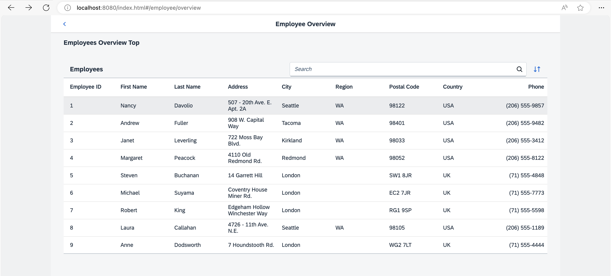

<nav class="tutorial-breadcrumb"><a href="../../../index.html">UI5 Tutorials</a> <span class="tutorial-breadcrumb-sep">&rsaquo;</span> <a href="../../index.html">Navigation and Routing Tutorial</a></nav>

## Step 15: Reuse an Existing Route

The *Employees* table displays employee data. However, the resumes of the employees are not accessible from this view yet. We could create a new route and a new view to visualize the resume again, but we could also simply reuse an existing route to cross-link the resume of a certain employee. In this step, we will add a feature that allows users to directly navigate to the resume of a certain employee. We will reuse the *Resume* page that we have created in an earlier step. This example illustrates that there can be multiple navigation paths that direct to the same page.

### Preview

#### Navigation to an existing route from a table item



You can view this step live: [🔗 Live Preview of Step 15](https://ui5.github.io/tutorials/navigation/build/15/index-cdn.html).

### Coding

You can download the solution for this step here: <span class="ts-only">[📥 Download step 15](https://ui5.github.io/tutorials/navigation/navigation-step-15.zip)<span class="lang-suffix"> (TS)</span></span><span class="js-only">[📥 Download step 15](https://ui5.github.io/tutorials/navigation/navigation-step-15-js.zip)<span class="lang-suffix"> (JS)</span></span>.

### webapp/view/employee/overview/EmployeeOverviewContent.view.xml


```xml
<mvc:View
  controllerName="ui5.tutorial.navigation.controller.employee.overview.EmployeeOverviewContent"
  xmlns="sap.m"
  xmlns:mvc="sap.ui.core.mvc">
  <Table id="employeesTable"
    items="{/Employees}"
    itemPress=".onItemPressed">
    <headerToolbar>
      ...
    </headerToolbar>
    <columns>
      ...
    </columns>
    <items>
      <ColumnListItem type="Active">
        <cells>
          ...
        </cells>
      </ColumnListItem>
    </items>
  </Table>
</mvc:View>
```


In the `EmployeeOverviewContent` view we register an event handler for the `itemPress` event and set the type attribute of the `ColumnListItem` to `Active` so that we can choose an item and trigger the navigation.

### webapp/controller/employee/overview/EmployeeOverviewContent.controller.ts/.js


```ts
// webapp/controller/employee/overview/EmployeeOverviewContent.controller.ts
import { ListBase$ItemPressEvent } from "sap/m/ListBase";
import SearchField, { SearchField$SearchEvent } from "sap/m/SearchField";
import Table from "sap/m/Table";
import ViewSettingsDialog, { ViewSettingsDialog$ConfirmEvent, ViewSettingsDialog$CancelEvent } from "sap/m/ViewSettingsDialog";
import ViewSettingsItem from "sap/m/ViewSettingsItem";
import BaseController from "ui5/tutorial/navigation/controller/BaseController";
import Filter from "sap/ui/model/Filter";
import FilterOperator from "sap/ui/model/FilterOperator";
import ListBinding from "sap/ui/model/ListBinding";
import Sorter from "sap/ui/model/Sorter";
import { Route$MatchedEvent } from "sap/ui/core/routing/Route";

/**
 * @namespace ui5.tutorial.navigation.controller.employee.overview
 */
export default class EmployeeOverviewContent extends BaseController {
	...
	public onItemPressed(event: ListBase$ItemPressEvent): void {
		const listItem = event.getParameter("listItem");
		const context = listItem.getBindingContext();

		this.getRouter().navTo("employeeResume",{
		employeeId : context.getProperty("EmployeeID"),
			"?query" : {
				tab : "Info"
			}
		});
	}
	...
}
```



```js
// webapp/controller/employee/overview/EmployeeOverviewContent.controller.js
sap.ui.define(["sap/m/ViewSettingsDialog", "sap/m/ViewSettingsItem", "ui5/tutorial/navigation/controller/BaseController", "sap/ui/model/Filter", "sap/ui/model/FilterOperator", "sap/ui/model/Sorter"], function (ViewSettingsDialog, ViewSettingsItem, BaseController, Filter, FilterOperator, Sorter) {
	"use strict";

	const EmployeeOverviewContent = BaseController.extend("ui5.tutorial.navigation.controller.employee.overview.EmployeeOverviewContent", {
		constructor() {
			BaseController.prototype.constructor.apply(this, arguments);
			this.sortField = null;
			this.sortDescending = false;
			this.validSortFields = ["EmployeeID", "FirstName", "LastName"];
			this.searchQuery = null;
			this.routerArgs = null;
		},
		onInit() {
			const router = this.getRouter();
			this.table = this.byId("employeesTable");
			this._initViewSettingsDialog();

			// make the search bookmarkable
			router.getRoute("employeeOverview").attachMatched(this._onRouteMatched, this);
		},
		_onRouteMatched(event) {
			// save the current query state
			this.routerArgs = event.getParameter("arguments");
			this.routerArgs["?query"] ||= {};
			const queryParameter = this.routerArgs["?query"];

			// search/filter via URL hash
			this._applySearchFilter(queryParameter.search);

			// sorting via URL hash
			this._applySorter(queryParameter.sortField, queryParameter.sortDescending);

			// show dialog via URL hash
			if (queryParameter.showDialog) {
				this.viewSettingsDialog.open();
			}
		},
		onSortButtonPressed() {
			const router = this.getRouter();
			this.routerArgs["?query"].showDialog = 1;
			router.navTo("employeeOverview", this.routerArgs);
		},
		onSearchEmployeesTable(event) {
			const router = this.getRouter();

			// update the hash with the current search term
			this.routerArgs["?query"].search = event.getSource().getValue();
			router.navTo("employeeOverview", this.routerArgs, true /*no history*/);
		},
		onItemPressed(event) {
			const listItem = event.getParameter("listItem");
			const context = listItem.getBindingContext();
			this.getRouter().navTo("employeeResume", {
				employeeId: context.getProperty("EmployeeID"),
				"?query": {
					tab: "Info"
				}
			});
		},
		_initViewSettingsDialog() {
			const router = this.getRouter();
			this.viewSettingsDialog = new ViewSettingsDialog("vsd", {
				confirm: event => {
					const sortItem = event.getParameter("sortItem");
					this._applySorter(sortItem.getKey(), event.getParameter("sortDescending"));
					this.routerArgs["?query"].sortField = sortItem.getKey();
					this.routerArgs["?query"].sortDescending = event.getParameter("sortDescending");
					delete this.routerArgs["?query"].showDialog;
					router.navTo("employeeOverview", this.routerArgs, true /*without history*/);
				},
				cancel: event => {
					delete this.routerArgs["?query"].showDialog;
					router.navTo("employeeOverview", this.routerArgs, true /*without history*/);
				}
			});

			// init sorting (with simple sorters as custom data for all fields)
			this.viewSettingsDialog.addSortItem(new ViewSettingsItem({
				key: "EmployeeID",
				text: "Employee ID",
				selected: true // by default the MockData is sorted by EmployeeID
			}));
			this.viewSettingsDialog.addSortItem(new ViewSettingsItem({
				key: "FirstName",
				text: "First Name",
				selected: false
			}));
			this.viewSettingsDialog.addSortItem(new ViewSettingsItem({
				key: "LastName",
				text: "Last Name",
				selected: false
			}));
		},
		_applySearchFilter(searchQuery) {
			// first check if we already have this search value
			if (this.searchQuery === searchQuery) {
				return;
			}
			this.searchQuery = searchQuery;
			this.byId("searchField").setValue(searchQuery);
			let filter = null;

			// add filters for search
			if (searchQuery?.length > 0) {
				const filters = [];
				filters.push(new Filter("FirstName", FilterOperator.Contains, searchQuery));
				filters.push(new Filter("LastName", FilterOperator.Contains, searchQuery));
				filter = new Filter({
					filters: filters,
					and: false
				}); // OR filter
			}

			// update list binding
			const binding = this.table.getBinding("items");
			binding.filter(filter, "Application");
		},
		/**
		 * Applies sorting on our table control.
		 * @param {string} fieldName the name of the field used for sorting
		 * @param {boolean} sortDescending whether to sort descending
		 * @private
		 */
		_applySorter(fieldName, sortDescending) {
			// only continue if we have a valid sort field
			if (fieldName && this.validSortFields.includes(fieldName)) {
				// sort only if the sorter has changed
				if (this.sortField && this.sortField === fieldName && this.sortDescending === sortDescending) {
					return;
				}
				this.sortField = fieldName;
				this.sortDescending = sortDescending;
				const sorter = new Sorter(fieldName, sortDescending);

				// sync with View Settings Dialog
				this._syncViewSettingsDialogSorter(fieldName, sortDescending);
				const binding = this.table.getBinding("items");
				binding.sort(sorter);
			}
		},
		_syncViewSettingsDialogSorter(sortField, sortDescending) {
			// the possible keys are: "EmployeeID" | "FirstName" | "LastName"
			// Note: no input validation is implemented here
			this.viewSettingsDialog.setSelectedSortItem(sortField);
			this.viewSettingsDialog.setSortDescending(sortDescending);
		}
	});
	return EmployeeOverviewContent;
});
```


Next we add the `itemPress` handler `.onItemPressed` to the `EmployeeOverviewContent` controller. It reads from the binding context which item has been chosen and navigates to the `employeeResume` route. We have already added this route and the corresponding target in a previous step and can now reuse it. From now on it is possible to navigate to the `employeeResume` route from our employee table as well as from the employee detail page created in an earlier step \(the route name is `employee`\).

***

**Next:** [Step 16: Handle Invalid Hashes by Listening to Bypassed Events](../16/index.html)

**Previous:** [Step 14: Make Dialogs Bookmarkable](../14/index.html)
