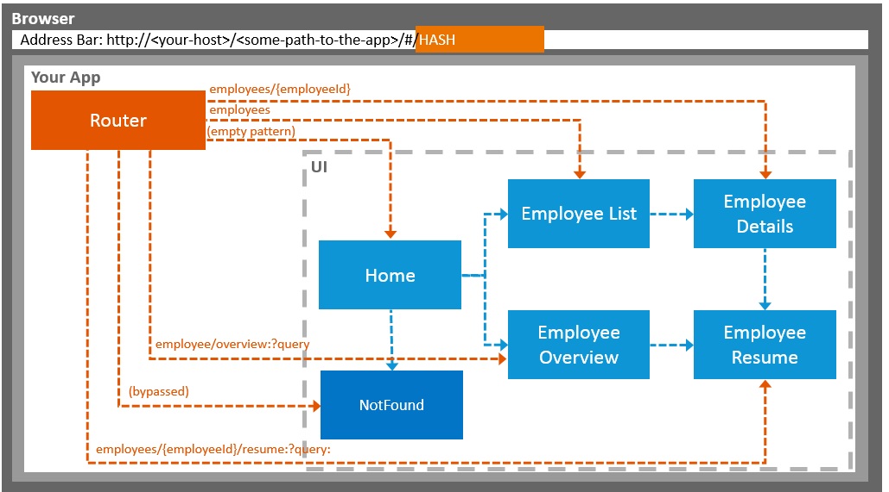

# Navigation and Routing Tutorial

OpenUI5 comes with a powerful routing API that helps you control the state of your application efficiently. This tutorial will illustrate all major features and APIs related to navigation and routing in OpenUI5 apps by creating a simple and easy to understand mobile app. It represents a set of best practices for applying the navigation and routing features of OpenUI5 to your applications.

In classical Web applications, the server determines which resource is requested based on the URL pattern of the request and serves it accordingly. The server-side logic controls how the requested resource or page is displayed in an appropriate way.

In single-page applications, only one page is initially requested from the server and additional resources are dynamically loaded using client-side logic. The user only navigates within this page. The navigation is persisted in the hash instead of the server path or URL parameters.

For example, a classical Web application might display the employee’s resume page when URL `http://<your-host>/<some-path-to-the-app>/employees/resume.html?id=3` or `http://<your-host>/<some-path-to-the-app>/employees/3/resume` is called. A single-page application instead would do the same thing by using a hash-based URL like `http://<your-host>/<some-path-to-the-app>/#/employees/3/resume`.

The information in the hash, namely everything that is following the `#` character, is interpreted by the router.

> 📝
> This tutorial does not handle cross-app navigation with the SAP Fiori launchpad. However, the concepts described in this tutorial are also fundamental for navigation and routing between apps in the SAP Fiori launchpad.

We will create a simple app displaying the data of a company’s employees to show typical navigation patterns and routing features. The complete flow of the application can be seen in the figure below. We'll start with the home page which lets users do the following:

- Display a *Not Found* page

- Navigate to a list of employees and drill further down to see a *Details* page for each employee

- Show an *Employee Overview* that they can search and sort

## Page flow of the final app

Throughout this tutorial we will add features for navigating to pages and bookmarking them. We will add backward and forward navigation with common transition animations \(slide, show, flip, etc.\). We will add more pages to the app and navigate between them to show typical use cases. We will even learn how to implement features for bookmarking a specific search, table sorting via filters, and dialogs.

> 💡
> You don't have to do all tutorial steps sequentially, you can also jump directly to any step you want. Just download the code from the previous step and make sure that the application runs as intended.
>
> You can view the samples for all steps here in this repository.

***

### In this Tutorial

The tutorial consists of the following steps. To start, just open the first link — you'll be guided from there.

- **[Step 1: Set Up the Initial App](./steps/01/index.html)** — We start by setting up a simple app for this tutorial. The app displays mock data only and mimics real OData back-end calls with the mock server as you have seen in the *Walkthrough* tutorial. ([🔗 Live Preview](https://ui5.github.io/tutorials/navigation/build/01/index-cdn.html) \| [📥 Download Solution](https://ui5.github.io/tutorials/navigation/navigation-step-01.zip) (TS)[📥 Download Solution](https://ui5.github.io/tutorials/navigation/navigation-step-01-js.zip) (JS))
- **[Step 2: Enable Routing](./steps/02/index.html)** — In this step we will modify the app and introduce routing. Instead of having the home page of the app hard coded we will configure a router to wire multiple views together when our app is called. ([🔗 Live Preview](https://ui5.github.io/tutorials/navigation/build/02/index-cdn.html) \| [📥 Download Solution](https://ui5.github.io/tutorials/navigation/navigation-step-02.zip) (TS)[📥 Download Solution](https://ui5.github.io/tutorials/navigation/navigation-step-02-js.zip) (JS))
- **[Step 3: Catch Invalid Hashes](./steps/03/index.html)** — Sometimes it is important to display an indication that the requested resource was not found. ([🔗 Live Preview](https://ui5.github.io/tutorials/navigation/build/03/index-cdn.html) \| [📥 Download Solution](https://ui5.github.io/tutorials/navigation/navigation-step-03.zip) (TS)[📥 Download Solution](https://ui5.github.io/tutorials/navigation/navigation-step-03-js.zip) (JS))
- **[Step 4: Add a *Back* Button to *Not Found* Page](./steps/04/index.html)** — When we are on the *Not Found* page because of an invalid hash, we want to get back to our app to select another page. ([🔗 Live Preview](https://ui5.github.io/tutorials/navigation/build/04/index-cdn.html) \| [📥 Download Solution](https://ui5.github.io/tutorials/navigation/navigation-step-04.zip) (TS)[📥 Download Solution](https://ui5.github.io/tutorials/navigation/navigation-step-04-js.zip) (JS))
- **[Step 5: Display a Target Without Changing the Hash](./steps/05/index.html)** — In this step, you will learn more about targets and how to display a target from the routing configuration manually. ([🔗 Live Preview](https://ui5.github.io/tutorials/navigation/build/05/index-cdn.html) \| [📥 Download Solution](https://ui5.github.io/tutorials/navigation/navigation-step-05.zip) (TS)[📥 Download Solution](https://ui5.github.io/tutorials/navigation/navigation-step-05-js.zip) (JS))
- **[Step 6: Navigate to Routes with Hard-Coded Patterns](./steps/06/index.html)** — In this step, we'll create a second button on the home page, with which we can navigate to a simple list of employees. ([🔗 Live Preview](https://ui5.github.io/tutorials/navigation/build/06/index-cdn.html) \| [📥 Download Solution](https://ui5.github.io/tutorials/navigation/navigation-step-06.zip) (TS)[📥 Download Solution](https://ui5.github.io/tutorials/navigation/navigation-step-06-js.zip) (JS))
- **[Step 7: Navigate to Routes with Mandatory Parameters](./steps/07/index.html)** — In this step, we implement a feature that allows the user to click on an employee in the list to see additional details of the employee. ([🔗 Live Preview](https://ui5.github.io/tutorials/navigation/build/07/index-cdn.html) \| [📥 Download Solution](https://ui5.github.io/tutorials/navigation/navigation-step-07.zip) (TS)[📥 Download Solution](https://ui5.github.io/tutorials/navigation/navigation-step-07-js.zip) (JS))
- **[Step 8: Navigate with Flip Transition](./steps/08/index.html)** — In this step, we want to illustrate how to navigate to a page with a custom transition animation. Both forward and backward navigation will use the “flip” transition but with a different direction. ([🔗 Live Preview](https://ui5.github.io/tutorials/navigation/build/08/index-cdn.html) \| [📥 Download Solution](https://ui5.github.io/tutorials/navigation/navigation-step-08.zip) (TS)[📥 Download Solution](https://ui5.github.io/tutorials/navigation/navigation-step-08-js.zip) (JS))
- **[Step 9: Allow Bookmarkable Tabs with Optional Query Parameters](./steps/09/index.html)** — The resume view contains four tabs as we have seen in the previous step of this tutorial. However, when the user navigates to the resume page, only the first tab is displayed initially. ([🔗 Live Preview](https://ui5.github.io/tutorials/navigation/build/09/index-cdn.html) \| [📥 Download Solution](https://ui5.github.io/tutorials/navigation/navigation-step-09.zip) (TS)[📥 Download Solution](https://ui5.github.io/tutorials/navigation/navigation-step-09-js.zip) (JS))
- **[Step 10: Implement “Lazy Loading”](./steps/10/index.html)** — In the previous steps, we have implemented a Resume view that uses tabs to display data. The complete content of all the tabs is loaded once, no matter which tab is currently displayed. ([🔗 Live Preview](https://ui5.github.io/tutorials/navigation/build/10/index-cdn.html) \| [📥 Download Solution](https://ui5.github.io/tutorials/navigation/navigation-step-10.zip) (TS)[📥 Download Solution](https://ui5.github.io/tutorials/navigation/navigation-step-10-js.zip) (JS))
- **[Step 11: Assign Multiple Targets](./steps/11/index.html)** — In this step, we will add a new button to the home page to illustrate the usage of multiple targets for a route. ([🔗 Live Preview](https://ui5.github.io/tutorials/navigation/build/11/index-cdn.html) \| [📥 Download Solution](https://ui5.github.io/tutorials/navigation/navigation-step-11.zip) (TS)[📥 Download Solution](https://ui5.github.io/tutorials/navigation/navigation-step-11-js.zip) (JS))
- **[Step 12: Make a Search Bookmarkable](./steps/12/index.html)** — In this step we will make the search bookmarkable. This allows users to search for employees in the *Employees* table and they can bookmark their search query or share the URL. ([🔗 Live Preview](https://ui5.github.io/tutorials/navigation/build/12/index-cdn.html) \| [📥 Download Solution](https://ui5.github.io/tutorials/navigation/navigation-step-12.zip) (TS)[📥 Download Solution](https://ui5.github.io/tutorials/navigation/navigation-step-12-js.zip) (JS))
- **[Step 13: Make Table Sorting Bookmarkable](./steps/13/index.html)** — In this step, we will create a button at the top of the table which will change the sorting of the table. ([🔗 Live Preview](https://ui5.github.io/tutorials/navigation/build/13/index-cdn.html) \| [📥 Download Solution](https://ui5.github.io/tutorials/navigation/navigation-step-13.zip) (TS)[📥 Download Solution](https://ui5.github.io/tutorials/navigation/navigation-step-13-js.zip) (JS))
- **[Step 14: Make Dialogs Bookmarkable](./steps/14/index.html)** — In this step, we want to allow bookmarking of the dialog box that is opened when the user clicks the *Sort* button. ([🔗 Live Preview](https://ui5.github.io/tutorials/navigation/build/14/index-cdn.html) \| [📥 Download Solution](https://ui5.github.io/tutorials/navigation/navigation-step-14.zip) (TS)[📥 Download Solution](https://ui5.github.io/tutorials/navigation/navigation-step-14-js.zip) (JS))
- **[Step 15: Reuse an Existing Route](./steps/15/index.html)** — The *Employees* table displays employee data. However, the resumes of the employees are not accessible from this view yet. ([🔗 Live Preview](https://ui5.github.io/tutorials/navigation/build/15/index-cdn.html) \| [📥 Download Solution](https://ui5.github.io/tutorials/navigation/navigation-step-15.zip) (TS)[📥 Download Solution](https://ui5.github.io/tutorials/navigation/navigation-step-15-js.zip) (JS))
- **[Step 16: Handle Invalid Hashes by Listening to Bypassed Events](./steps/16/index.html)** — So far we have created many useful routes in our app. In the very early steps we have also made sure that a *Not Found* page is displayed in case the app was called with an invalid hash. ([🔗 Live Preview](https://ui5.github.io/tutorials/navigation/build/16/index-cdn.html) \| [📥 Download Solution](https://ui5.github.io/tutorials/navigation/navigation-step-16.zip) (TS)[📥 Download Solution](https://ui5.github.io/tutorials/navigation/navigation-step-16-js.zip) (JS))
- **[Step 17: Listen to Matched Events of Any Route](./steps/17/index.html)** — In the previous step, we have listened for bypassed events to detect possible technical issues with our app. ([🔗 Live Preview](https://ui5.github.io/tutorials/navigation/build/17/index-cdn.html) \| [📥 Download Solution](https://ui5.github.io/tutorials/navigation/navigation-step-17.zip) (TS)[📥 Download Solution](https://ui5.github.io/tutorials/navigation/navigation-step-17-js.zip) (JS))

***

## License

Copyright (c) 2026 SAP SE or an SAP affiliate company. All rights reserved. This project is licensed under the Apache Software License, version 2.0 except as noted otherwise in the [LICENSE](https://github.com/UI5/tutorials/blob/-/LICENSE) file.
