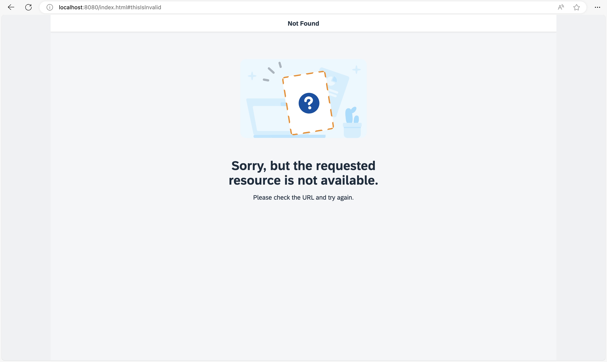

## Step 3: Catch Invalid Hashes

Sometimes it is important to display an indication that the requested resource was not found. To give you an example: If a user tries to access an invalid pattern which does not match any of the configured routes, the user is notified that something went wrong. You might also know this as a “404” or *Not Found Page* from traditional web pages. In this step, we will implement a feature that detects invalid hashes and visualizes this in a nice way.

### Preview

#### Not Found page



You can view this step live: [🔗 Live Preview of Step 3](https://ui5.github.io/tutorials/navigation/build/03/index-cdn.html).

### Coding

You can download the solution for this step here: <span class="ts-only">[📥 Download step 3](https://ui5.github.io/tutorials/navigation/navigation-step-03.zip)<span class="lang-suffix"> (TS)</span></span><span class="js-only">[📥 Download step 3](https://ui5.github.io/tutorials/navigation/navigation-step-03-js.zip)<span class="lang-suffix"> (JS)</span></span>.

#### Folder structure for this step


```text
webapp/
├── controller/
│   ├── App.controller.ts/.js
│   ├── Home.controller.ts/.js
│   └── NotFound.controller.ts/.js
├── i18n/
│   └── i18n.properties
├── localService/
│   ├── mockdata/
│   │   ├── Employees.json
│   │   └── Resumes.json
│   ├── metadata.xml
│   └── mockserver.ts/.js
├── view/
│   ├── App.view.xml
│   ├── Home.view.xml
│   └── NotFound.view.xml
├── Component.ts/.js
├── index.html
├── initMockServer.ts/.js
└── manifest.json
```


### webapp/manifest.json


```json
{
  ...
  "sap.ui5": {
    ...
    "routing": {
      "config": {
        "routerClass": "sap.m.routing.Router",
        "type": "View",
        "viewType": "XML",
        "path": "ui5.tutorial.navigation.view",
        "controlId": "app",
        "controlAggregation": "pages",
        "transition": "slide",
        "bypassed": {
          "target": "notFound"
        }
      },
      "routes": [{
        "pattern": "",
        "name": "appHome",
        "target": "home"
      }],
      "targets": {
        "home": {
          "id": "home",
          "name": "Home",
          "level": 1
        },
        "notFound": {
          "id": "notFound",
          "name": "NotFound",
          "transition": "show"
        }
      }
    }
  }
}
```


Let’s extend the routing configuration in the descriptor by adding a `bypassed` property and setting its `target` to `notFound`. This configuration tells the router to display the `notFound` target in case no route was matched to the current hash. Next, we add a `notFound` target to the `bypassed` section. The `notFound` target simply configures a `NotFound` view with a `show` transition.

### webapp/view/NotFound.view.xml \(New\)


```xml
<mvc:View
  controllerName="ui5.tutorial.navigation.controller.NotFound"
  xmlns="sap.m"
  xmlns:mvc="sap.ui.core.mvc"
  xmlns:core="sap.ui.core"
  core:require="{
    IllustratedMessageType: 'sap/m/IllustratedMessageType'
  }">
  <Page
    title="{i18n>NotFound}"
    titleAlignment="Center">
    <IllustratedMessage
      title="{i18n>NotFound.text}"
      description="{i18n>NotFound.description}"
      illustrationType="{= IllustratedMessageType.PageNotFound}"/>
  </Page>
</mvc:View>
```


Now we create the view referenced above in a new file `NotFound.view.xml` within the `webapp/view` folder. It uses a `sap.m.Page` containing a `sap.m.IllustratedMessage` control to display an error message to the user. In a real app you might use a dynamic message matching the current error situation. Here, we simply display a preconfigured text from our resource bundle.

### webapp/controller/NotFound.controller.ts/.js \(New\)


```ts
// webapp/controller/NotFound.controller.ts
import Controller from "sap/ui/core/mvc/Controller";

/**
 * @namespace ui5.tutorial.navigation.controller
 */
export default class NotFound extends Controller {

	public onInit(): void {

	}
}
```



```js
// webapp/controller/NotFound.controller.js
sap.ui.define(["sap/ui/core/mvc/Controller"], function (Controller) {
	"use strict";

	const NotFound = Controller.extend("ui5.tutorial.navigation.controller.NotFound", {
		onInit() {}
	});
	return NotFound;
});
```


Now we create the controller for the `NotFound` view and save it into the `webapp/controller` folder. This controller will be extended later.

### webapp/i18n/i18n.properties


```properties
...
NotFound=Not Found
NotFound.text=Sorry, but the requested resource is not available.
NotFound.description=Please check the URL and try again.
```


Add the new properties to the `i18n.properties` file.

Open the URL `index.html#/thisIsInvalid` in your browser. From now on the user will see a nice *Not Found* page if a hash could not be matched to one of our routes.

### Conventions

- Always configure the `bypassed` property and a corresponding target

- Use the `sap.m.IllustratedMessage` control to display routing related error messages

***

**Next:** [Step 4: Add a *Back* Button to *Not Found* Page](../04/README.md)

**Previous:** [Step 2: Enable Routing](../02/README.md)
