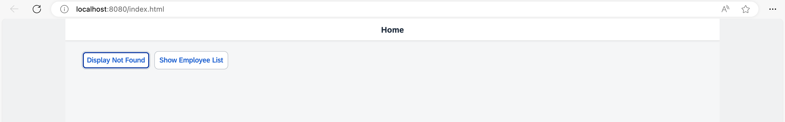
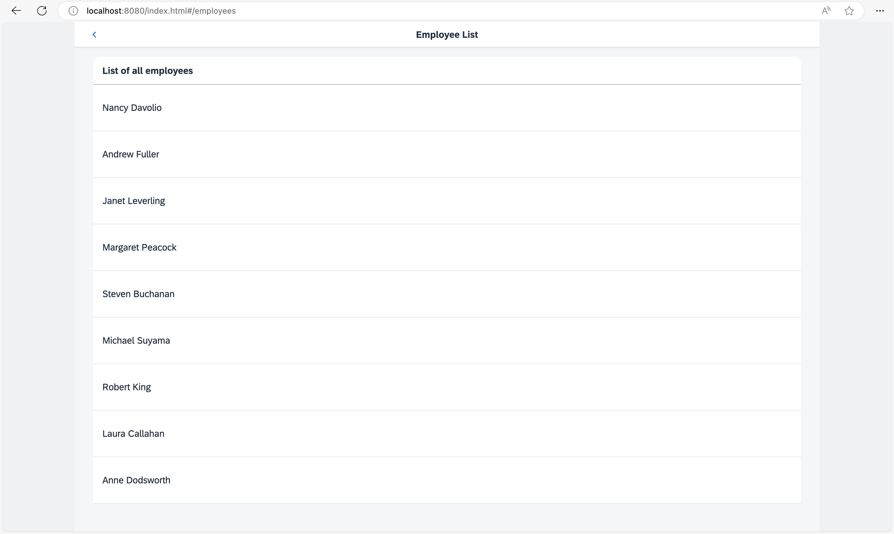

## Step 6: Navigate to Routes with Hard-Coded Patterns

In this step, we'll create a second button on the home page, with which we can navigate to a simple list of employees. This example illustrates how to navigate to a route that has a hard-coded pattern.

### Preview

#### Show Employee List button on the Home page



#### Employee list with Back button



You can view this step live: [🔗 Live Preview of Step 6](https://ui5.github.io/tutorials/navigation/build/06/index-cdn.html).

### Coding

You can download the solution for this step here: <span class="ts-only">[📥 Download step 6](https://ui5.github.io/tutorials/navigation/navigation-step-06.zip)<span class="lang-suffix"> (TS)</span></span><span class="js-only">[📥 Download step 6](https://ui5.github.io/tutorials/navigation/navigation-step-06-js.zip)<span class="lang-suffix"> (JS)</span></span>.

#### Folder structure for this step


```text
webapp/
├── controller/
│   ├── employee/
│   │   └── EmployeeList.controller.ts/.js
│   ├── App.controller.ts/.js
│   ├── BaseController.ts/.js
│   ├── Home.controller.ts/.js
│   └── NotFound.controller.ts/.js
├── i18n/
│   └── i18n.properties
├── localService/
│   ├── mockdata/
│   │   ├── Employees.json
│   │   └── Resumes.json
│   ├── metadata.xml
│   └── mockserver.ts/.js
├── view/
│   ├── employee/
│   │   └── EmployeeList.view.xml
│   ├── App.view.xml
│   ├── Home.view.xml
│   └── NotFound.view.xml
├── Component.ts/.js
├── index.html
├── initMockServer.ts/.js
└── manifest.json
```


### webapp/view/Home.view.xml


```xml
<mvc:View
  controllerName="ui5.tutorial.navigation.controller.Home"
  xmlns="sap.m"
  xmlns:mvc="sap.ui.core.mvc">
  <Page
    title="{i18n>homePageTitle}"
    titleAlignment="Center"
    class="sapUiResponsiveContentPadding">
    <content>
      <Button id="displayNotFoundBtn" text="{i18n>DisplayNotFound}" press=".onDisplayNotFound" class="sapUiTinyMarginEnd"/>
      <Button id="employeeListBtn" text="{i18n>ShowEmployeeList}" press=".onNavToEmployees" class="sapUiTinyMarginEnd"/>
    </content>
  </Page>
</mvc:View>
```


First, we change the `Home` view by adding the *Show Employee List* button. We register an event handler `onNavToEmployees` for the press event.

### webapp/controller/Home.controller.ts/.js


```ts
// webapp/controller/Home.controller.ts
import BaseController from "ui5/tutorial/navigation/controller/BaseController";

/**
 * @namespace ui5.tutorial.navigation.controller
 */
export default class Home extends BaseController {

	public onDisplayNotFound(): void {
		// display the "notFound" target without changing the hash
		this.getRouter().getTargets().display("notFound", {
			fromTarget: "home"
		});
	}

	public onNavToEmployees(): void {
		this.getRouter().navTo("employeeList");
	}
}
```



```js
// webapp/controller/Home.controller.js
sap.ui.define(["ui5/tutorial/navigation/controller/BaseController"], function (BaseController) {
	"use strict";

	const Home = BaseController.extend("ui5.tutorial.navigation.controller.Home", {
		onDisplayNotFound() {
			// display the "notFound" target without changing the hash
			this.getRouter().getTargets().display("notFound", {
				fromTarget: "home"
			});
		},
		onNavToEmployees() {
			this.getRouter().navTo("employeeList");
		}
	});
	return Home;
});
```


The new event handler `onNavToEmployees` calls `navTo("employeeList")` on the router instance. The parameter `employeeList` is the name of the route that we want to navigate to.

### webapp/manifest.json


```json
{
  "_version": "2.8.0",
  "sap.app": {
    ...
  },
  "sap.ui": {
    ...
  },
  "sap.ui5": {
    ...
    "routing": {
      "config": {
        "routerClass": "sap.m.routing.Router",
        "type": "View",
        "viewType": "XML",
        "path": "ui5.tutorial.navigation.view",
        "controlId": "app",
        "controlAggregation": "pages",
        "transition": "slide",
        "bypassed": {
          "target": "notFound"
        }
      },
      "routes": [{
        "pattern": "",
        "name": "appHome",
        "target": "home"
      }, {
        "pattern": "employees",
        "name": "employeeList",
        "target": "employees"
      }],
      "targets": {
        "home": {
          "id": "home",
          "name": "Home",
          "level": 1
        },
        "notFound": {
          "id": "notFound",
          "name": "NotFound",
          "transition": "show"
        },
        "employees": {
          "id": "employeeList",
          "path": "ui5.tutorial.navigation.view.employee",
          "name": "EmployeeList",
          "level": 2
        }

      }
    }
  }
}
```


To make the navigation work, we have to extend the routing configuration of the app in the descriptor file. We add a new pattern called `employeeList`; this is the name we used in the controller to trigger the navigation.

The pattern of the route is the hard-coded value `employees`, meaning the matching hash for this route is `/#/employees` in the address bar of the browser. The target `employees` should be displayed when this URL pattern is matched.

The `employees` entry in the `targets` section references the `ui5.tutorial.navigation.view.employee.EmployeeList` view. As you can see, we added a new namespace `employee` for all views related to employees with the property `path`. This overrides the default settings in the `config` section for this specific target.

The view that we are about to create has to be placed in the `webapp/view/employee` folder accordingly. This approach helps to structure the views of the app according to business objects and to better understand the navigation patterns of the app in larger projects.

> 📝
> We could also have left out the `path` property to use the default `path` defined in the `config` section. In that case, we would have to change the `name` to `employee.EmployeeList` to achieve the same effect.

Setting the `level` to `2` helps the router to determine how to animate the \(in our case\) `slide` transition. For us, this means that a navigation from the home page to the `employees` target will be animated with a “Slide to Left” animation. In contrast to that, the back navigation from the `employees` target to the home page will be animated with a “Slide to Right” animation. This behavior is due to the fact that the home page has a lower `level` than the `employees` target.

### webapp/view/employee/EmployeeList.view.xml \(New\)


```xml
<mvc:View
  controllerName="ui5.tutorial.navigation.controller.employee.EmployeeList"
  xmlns="sap.m"
  xmlns:mvc="sap.ui.core.mvc">
  <Page
    id="employeeListPage"
    title="{i18n>EmployeeList}"
    titleAlignment="Center"
    showNavButton="true"
    navButtonPress=".onNavBack"
    class="sapUiResponsiveContentPadding">
    <content>
      <List id="employeeList" headerText="{i18n>ListOfAllEmployees}" items="{/Employees}">
        <items>
          <StandardListItem
            title="{FirstName} {LastName}"
            iconDensityAware="false"
            iconInset="false"/>
        </items>
      </List>
    </content>
  </Page>
</mvc:View>
```


We now create a subfolder `employee` below `webapp/view` and a file `EmployeeList.view.xml`.

We name the folder after the business object, to make it obvious from looking at the hash \(included in the browser's address bar\) where a view file for a certain business object is located. For example, we can determine from the URL `/#/employee` that the corresponding view must be somewhere in the folder `./employee` \(in our case: `webapp/view/employee`\) just by looking at the URL.

In the view, we use a `sap.m.List` control and bind its items to the data from our simulated OData service. Note that we have also registered the `onNavBack` handler from the `BaseController` again to be able to navigate back to the overview.

This view can be referenced by `ui5.tutorial.navigation.view.employee.EmployeeList`.

### webapp/controller/employee/EmployeeList.controller.ts/.js \(New\)


```ts
// webapp/controller/employee/EmployeeList.controller.ts
import BaseController from "ui5/tutorial/navigation/controller/BaseController";

/**
 * @namespace ui5.tutorial.navigation.controller.employee
 */
export default class EmployeeList extends BaseController {

}
```



```js
// webapp/controller/employee/EmployeeList.controller.js
sap.ui.define(["ui5/tutorial/navigation/controller/BaseController"], function (BaseController) {
	"use strict";

	const EmployeeList = BaseController.extend("ui5.tutorial.navigation.controller.employee.EmployeeList", {});
	return EmployeeList;
});
```


Finally, we will add a new controller. Create a subfolder `employee` inside `webapp/controller` folder and place the file `EmployeeList.controller.ts` there. As you can see, the folder structure of the controllers is in sync with the folder structure of the views.

### webapp/i18n/i18n.properties


```properties
...
ShowEmployeeList=Show Employee List
EmployeeList=Employee List
ListOfAllEmployees=List of all employees
```


Add the new texts to the `i18n.properties` file.

Now you can open the app and press the *Show Employee List* button to navigate to the employee list. From there, you can press either the browser’s or the app’s *Back* button to get back to the home page.

***

**Next:** [Step 7: Navigate to Routes with Mandatory Parameters](../07/README.md)

**Previous:** [Step 5: Display a Target Without Changing the Hash](../05/README.md)
