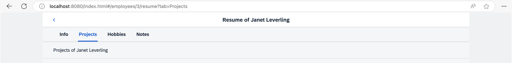

## Step 9: Allow Bookmarkable Tabs with Optional Query Parameters

The `resume` view contains four tabs as we have seen in the previous step of this tutorial. However, when the user navigates to the `resume` page, only the first tab is displayed initially. Navigating directly to a specific tab or bookmarking a tab is not yet supported in our current app.

In this step, we implement a bookmarking feature by enabling deep linking to tabs with optional query parameters. A deep link is basically a link that directly references a deeper structure and parameters of the app in the URL. It is often bookmarked or shared to have a convenient entry point into the app for a certain task or action. The selected tab should be reflected in the URL but the tab can also be omitted, for example, when we initially navigate to the resume page.

### Preview

#### Deep link to allow bookmarkable tabs



You can view this step live: [🔗 Live Preview of Step 9](https://ui5.github.io/tutorials/navigation/build/09/index-cdn.html).

### Coding

You can download the solution for this step here: <span class="ts-only">[📥 Download step 9](https://ui5.github.io/tutorials/navigation/navigation-step-09.zip)<span class="lang-suffix"> (TS)</span></span><span class="js-only">[📥 Download step 9](https://ui5.github.io/tutorials/navigation/navigation-step-09-js.zip)<span class="lang-suffix"> (JS)</span></span>.

### webapp/manifest.json


```json
{
  "_version": "2.8.0",
  "sap.app": {
    ...
  },
  "sap.ui": {
    ...
  },
  "sap.ui5": {
    ...
    "routing": {
      "config": {
        "routerClass": "sap.m.routing.Router",
        "type": "View",
        "viewType": "XML",
        "path": "ui5.tutorial.navigation.view",
        "controlId": "app",
        "controlAggregation": "pages",
        "transition": "slide",
        "bypassed": {
          "target": "notFound"
        }
      },
      "routes": [{
        "pattern": "",
        "name": "appHome",
        "target": "home"
      }, {
        "pattern": "employees",
        "name": "employeeList",
        "target": "employees"
      }, {
        "pattern": "employees/{employeeId}",
        "name": "employee",
        "target": "employee"
      }, {
        "pattern": "employees/{employeeId}/resume:?query:",
        "name": "employeeResume",
        "target": "employeeResume"
      }],
      "targets": {
        ...
      }
    }
  }
}
```


Up until now, you could only navigate to an employee’s resume with the deep link `webapp/index.html#/employees/3/resume`. This will always select the first tab as implemented by the `IconTabBar` control. In order to open the page directly with a specific tab selected and to make the tabs bookmarkable, we add the `?query` parameter to the URL pattern.

This allows URLs like `webapp/index.html#/employees/3/resume?tab=Projects` where the query parameter defines which tab shall be displayed. We change the pattern of the `employeeResume` route to `employees/{employeeId}/resume:?query:`. The new part `:?query:` allows to pass on queries with any parameters, for example, the hash `/#/employees/3/resume?tab=Projects` or `/#/employees/3/resume?tab=Projects&action=edit` matches the pattern and can be processed in the matched event.

The `:?query:` parameter starts and ends with `:`, which means that it is optional. If you want to make it mandatory, you can use the `{?query}` syntax \(everything in between `{}` is considered as being mandatory\).

### webapp/view/employee/Resume.view.xml


```xml
<mvc:View
  controllerName="ui5.tutorial.navigation.controller.employee.Resume"
  xmlns="sap.m"
  xmlns:mvc="sap.ui.core.mvc">
  <Page
    title="{i18n>ResumeOf} {FirstName} {LastName}"
    titleAlignment="Center"
    id="employeeResumePage"
    showNavButton="true"
    navButtonPress=".onNavBack">
    <content>
      <IconTabBar
        id="iconTabBar"
        headerBackgroundDesign="Transparent"
        class="sapUiResponsiveContentPadding"
        binding="{Resume}"
        select=".onTabSelect"
        selectedKey="{view>/selectedTabKey}">
        <items>
          <IconTabFilter id="infoTab" text="{i18n>tabInfo}" key="Info">
            <Text text="{Information}"/>
          </IconTabFilter>
          <IconTabFilter id="projectsTab" text="{i18n>tabProjects}" key="Projects">
            <mvc:XMLView viewName="ui5.tutorial.navigation.view.employee.ResumeProjects"></mvc:XMLView>
          </IconTabFilter>
          <IconTabFilter id="hobbiesTab" text="{i18n>tabHobbies}" key="Hobbies">
            <Text text="{Hobbies}"/>
          </IconTabFilter>
          <IconTabFilter id="notesTab" text="{i18n>tabNotes}" key="Notes">
            <Text text="{Notes}"/>
          </IconTabFilter>
        </items>
      </IconTabBar>
    </content>
  </Page>
</mvc:View>
```


To update the currently selected tab in the URL we listen to the select event of the `IconTabBar` by setting `select=".onTabSelect"` in the resume view. The `selectedKey` is bound to a view model. This allows to easily change the `selectedKey` according to the selected tab in the URL.

### webapp/controller/employee/Resume.controller.ts/.js


```ts
// webapp/controller/employee/Resume.controller.ts
import { IconTabBar$SelectEvent } from "sap/m/IconTabBar";
import BaseController from "ui5/tutorial/navigation/controller/BaseController";
import { Route$MatchedEvent } from "sap/ui/core/routing/Route";
import JSONModel from "sap/ui/model/json/JSONModel";

const validTabKeys = ["Info", "Projects", "Hobbies", "Notes"];

/**
 * @namespace ui5.tutorial.navigation.controller.employee
 */
export default class Resume extends BaseController {

	public onInit(): void {
		const router = this.getRouter();

		this.getView().setModel(new JSONModel(), "view");
		router.getRoute("employeeResume").attachMatched(this._onRouteMatched, this);
	}

	private _onRouteMatched(event: Route$MatchedEvent): void {
		const eventArguments = (<any> event.getParameter("arguments"));
		const view = this.getView();

		view.bindElement({
			path: "/Employees(" + eventArguments.employeeId + ")",
			events: {
				change: this._onBindingChange.bind(this),
				dataRequested: () => {
					view.setBusy(true);
				},
				dataReceived: () => {
					view.setBusy(false);
				}
			}
		});

		const query = eventArguments["?query"];

		if (query && validTabKeys.includes(query.tab)) {
			(<JSONModel> view.getModel("view")).setProperty("/selectedTabKey", query.tab);
		} else {
			// the default query param should be visible at all time
			this.getRouter().navTo("employeeResume", {
				employeeId: eventArguments.employeeId,
				"?query": {
					tab: validTabKeys[0]
				}
			}, true /*no history*/);
		}
	}

	private _onBindingChange(): void {
		// No data for the binding
		if (!this.getView().getBindingContext()) {
			this.getRouter().getTargets().display("notFound");
		}
	}

	/**
	 * We use this event handler to update the hash in case a new tab is selected.
	 * @param event
	 */
	public onTabSelect(event: IconTabBar$SelectEvent): void {
		const context = this.getView().getBindingContext();

		this.getRouter().navTo("employeeResume", {
			employeeId: context.getProperty("EmployeeID"),
			"?query": {
				tab: event.getParameter("selectedKey")
			}
		}, true /*without history*/);
	}
}
```



```js
// webapp/controller/employee/Resume.controller.js
sap.ui.define(["ui5/tutorial/navigation/controller/BaseController", "sap/ui/model/json/JSONModel"], function (BaseController, JSONModel) {
	"use strict";

	const validTabKeys = ["Info", "Projects", "Hobbies", "Notes"];

	const Resume = BaseController.extend("ui5.tutorial.navigation.controller.employee.Resume", {
		onInit() {
			const router = this.getRouter();
			this.getView().setModel(new JSONModel(), "view");
			router.getRoute("employeeResume").attachMatched(this._onRouteMatched, this);
		},
		_onRouteMatched(event) {
			const eventArguments = event.getParameter("arguments");
			const view = this.getView();
			view.bindElement({
				path: "/Employees(" + eventArguments.employeeId + ")",
				events: {
					change: this._onBindingChange.bind(this),
					dataRequested: () => {
						view.setBusy(true);
					},
					dataReceived: () => {
						view.setBusy(false);
					}
				}
			});
			const query = eventArguments["?query"];
			if (query && validTabKeys.includes(query.tab)) {
				view.getModel("view").setProperty("/selectedTabKey", query.tab);
			} else {
				// the default query param should be visible at all time
				this.getRouter().navTo("employeeResume", {
					employeeId: eventArguments.employeeId,
					"?query": {
						tab: validTabKeys[0]
					}
				}, true /*no history*/);
			}
		},
		_onBindingChange() {
			// No data for the binding
			if (!this.getView().getBindingContext()) {
				this.getRouter().getTargets().display("notFound");
			}
		},
		/**
		 * We use this event handler to update the hash in case a new tab is selected.
		 * @param event
		 */
		onTabSelect(event) {
			const context = this.getView().getBindingContext();
			this.getRouter().navTo("employeeResume", {
				employeeId: context.getProperty("EmployeeID"),
				"?query": {
					tab: event.getParameter("selectedKey")
				}
			}, true /*without history*/);
		}
	});
	return Resume;
});
```


When a tab is selected manually, its select handler is called. Therefore, let’s first have a look at the `onTabSelect` event handler that is added at the end of the `Resume` controller. It detects the `selectedKey` of the tab and navigates to the `employeeResume` route to update the URL in the address bar. Additionally to the mandatory parameter `employeeId`, we pass on a custom `query` object with a parameter `tab` and fill it with the `selectedKey` value that we receive from the `select` event of the `IconTabBar`. By passing on `true` as the third argument we replace the current history to make sure that manually clicked tabs won’t be added to the browser history.

A dependency to `sap/ui/model/json/JSONModel` is added to the controller. Now, we modify the `onInit` function to instantiate a JSONModel and use it as the `view` model. `validTabKeys` is added to the controller. We want to make sure that only valid tabs can be selected. Therefore, the `array validTabKeys` contains all allowed tab keys that we can check against to validate the tab parameter from the URL later. The keys are equal to the keys of our `IconTabFilters` in the `resume` view.

In the `_onRouteMatched` event handler, we add the `query` variable to store a reference to the query object from the router. This allows a more comfortable access to the query object.

In case a query object is passed on and the `tab` parameter has a valid value, we display the specific tab by updating the property `selectedTabKey` in the view model. As the `selectedKey` property of the `IconTabBar` is bound to `{view>/selectedTabKey}` the corresponding tab is selected.

The `else` case is called when either no or an invalid tab parameter is specified. We navigate to the *Info* tab to make sure that the tab parameter is reflected in the URL at all times. The actual requirements of your app might differ, feel free to change it accordingly...

From now on our tabs are bookmarkable. Try to access the following \(deep\) links directly:

- `webapp/index.html#/employees/3/resume`

- `webapp/index.html#/employees/3/resume?tab=Info`

- `webapp/index.html#/employees/3/resume?tab=Projects`

- `webapp/index.html#/employees/3/resume?tab=Hobbies`

- `webapp/index.html#/employees/3/resume?tab=Notes`

- `webapp/index.html#/employees/3/resume?tab=SomethingInvalid`

When you click on any tab you will see that the hash in the URL changes immediately, and when you change the hash in the URL parameter manually, you can see that the UI is also updated accordingly.

***

**Next:** [Step 10: Implement “Lazy Loading”](../10/README.md)

**Previous:** [Step 8: Navigate with Flip Transition](../08/README.md)
