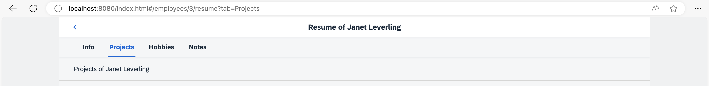
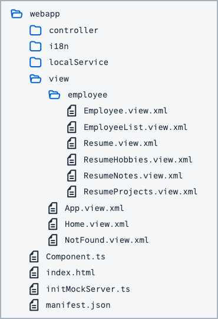

## Step 10: Implement “Lazy Loading”

In the previous steps, we have implemented a `Resume` view that uses tabs to display data. The complete content of all the tabs is loaded once, no matter which tab is currently displayed. We can increase the performance of our app by avoiding to load content that is not visible. Therefore, we implement a “lazy loading” feature that only loads the view and data when requested by the user.

### Preview

#### Tabs with lazy loading



You can view this step live: [🔗 Live Preview of Step 10](https://ui5.github.io/tutorials/navigation/build/10/index-cdn.html).

### Coding

You can download the solution for this step here: <span class="ts-only">[📥 Download step 10](https://ui5.github.io/tutorials/navigation/navigation-step-10.zip)<span class="lang-suffix"> (TS)</span></span><span class="js-only">[📥 Download step 10](https://ui5.github.io/tutorials/navigation/navigation-step-10-js.zip)<span class="lang-suffix"> (JS)</span></span>.

#### Folder Structure for this Step



### webapp/view/employee/Resume.view.xml


```xml
<mvc:View
  controllerName="ui5.tutorial.navigation.controller.employee.Resume"
  xmlns="sap.m"
  xmlns:mvc="sap.ui.core.mvc">
  <Page
    title="{i18n>ResumeOf} {FirstName} {LastName}"
    titleAlignment="Center"
    id="employeeResumePage"
    showNavButton="true"
    navButtonPress=".onNavBack">
    <content>
      <IconTabBar
        id="iconTabBar"
        headerBackgroundDesign="Transparent"
        class="sapUiResponsiveContentPadding"
        binding="{Resume}"
        select=".onTabSelect"
        selectedKey="{view>/selectedTabKey}">
        <items>
          <IconTabFilter id="infoTab" text="{i18n>tabInfo}" key="Info">
            <Text text="{Information}"/>
          </IconTabFilter>
          <IconTabFilter id="projectsTab" text="{i18n>tabProjects}" key="Projects">
            <mvc:XMLView viewName="ui5.tutorial.navigation.view.employee.ResumeProjects"></mvc:XMLView>
          </IconTabFilter>
          <IconTabFilter id="hobbiesTab" text="{i18n>tabHobbies}" key="Hobbies">
            <!-- place content via lazy loading -->
          </IconTabFilter>
          <IconTabFilter id="notesTab" text="{i18n>tabNotes}" key="Notes">
            <!-- place content via lazy loading -->
          </IconTabFilter>
        </items>
      </IconTabBar>
    </content>
  </Page>
</mvc:View>
```


To illustrate lazy loading, we implement that the content is loaded only when the user selects the corresponding tab for two of our tabs from the `IconTabBar`: *Hobbies* and *Notes*. The `IconTabFilter` controls each have a hard-coded ID so that we can address them later in our routing configuration. In real use cases, you would do this for tabs that contain a lot of content or trigger expensive service calls to a back-end service.

In the `resume` view we remove the content of the *Hobbies* and *Notes* tabs as we will now fill it dynamically with navigation features.

### webapp/view/employee/ResumeHobbies.view.xml \(New\)


```xml
<mvc:View xmlns="sap.m" xmlns:mvc="sap.ui.core.mvc">
  <Text text="{Hobbies}"/>
</mvc:View>
```


Create the file `ResumeHobbies.view.xml` in the `webapp/view/employee` folder. Move the content for the tab that was previously in the `Resume` view to the newly created view. We don’t need a controller for this view as there is no additional logic involved. This view will be lazy-loaded and placed into the content of the *Hobbies* tab with navigation features.

### webapp/view/employee/ResumeNotes.view.xml \(New\)


```xml
<mvc:View xmlns="sap.m" xmlns:mvc="sap.ui.core.mvc">
  <Text text="{Notes}"/>
</mvc:View>
```


Create the file `ResumeNotes.view.xml` in the `webapp/view/employee` folder similar to the *Hobbies* view to transform this tab to a separate view as well.

### webapp/controller/employee/Resume.controller.ts/.js


```ts
// webapp/controller/employee/Resume.controller.ts
import { IconTabBar$SelectEvent } from "sap/m/IconTabBar";
import BaseController from "ui5/tutorial/navigation/controller/BaseController";
import { Route$MatchedEvent } from "sap/ui/core/routing/Route";
import JSONModel from "sap/ui/model/json/JSONModel";

const validTabKeys = ["Info", "Projects", "Hobbies", "Notes"];

/**
 * @namespace ui5.tutorial.navigation.controller.employee
 */
export default class Resume extends BaseController {
	...
	private _onRouteMatched(event: Route$MatchedEvent): void {
		const eventArguments = (<any> event.getParameter("arguments"));
		const view = this.getView();

		view.bindElement({
			path: "/Employees(" + eventArguments.employeeId + ")",
			events: {
				change: this._onBindingChange.bind(this),
				dataRequested: function (): void {
					view.setBusy(true);
				},
				dataReceived: function (): void {
					view.setBusy(false);
				}
			}
		});

		const query = eventArguments["?query"];

		if (query && validTabKeys.includes(query.tab)) {
			(<JSONModel> view.getModel("view")).setProperty("/selectedTabKey", query.tab);
			// support lazy loading for the hobbies and notes tab
			if (query.tab === "Hobbies" || query.tab === "Notes") {
				// the target is either "resumeTabHobbies" or "resumeTabNotes"
				this.getRouter().getTargets().display("resumeTab" + query.tab);
			}
		} else {
			// the default query param should be visible at all time
			this.getRouter().navTo("employeeResume", {
				employeeId: eventArguments.employeeId,
				"?query": {
					tab: validTabKeys[0]
				}
			}, true /*no history*/);
		}
	}
	...
}
```



```js
// webapp/controller/employee/Resume.controller.js
sap.ui.define(["ui5/tutorial/navigation/controller/BaseController", "sap/ui/model/json/JSONModel"], function (BaseController, JSONModel) {
	"use strict";

	const validTabKeys = ["Info", "Projects", "Hobbies", "Notes"];

	const Resume = BaseController.extend("ui5.tutorial.navigation.controller.employee.Resume", {
		onInit() {
			const router = this.getRouter();
			this.getView().setModel(new JSONModel(), "view");
			router.getRoute("employeeResume").attachMatched(this._onRouteMatched, this);
		},
		_onRouteMatched(event) {
			const eventArguments = event.getParameter("arguments");
			const view = this.getView();
			view.bindElement({
				path: "/Employees(" + eventArguments.employeeId + ")",
				events: {
					change: this._onBindingChange.bind(this),
					dataRequested: function () {
						view.setBusy(true);
					},
					dataReceived: function () {
						view.setBusy(false);
					}
				}
			});
			const query = eventArguments["?query"];
			if (query && validTabKeys.includes(query.tab)) {
				view.getModel("view").setProperty("/selectedTabKey", query.tab);
				// support lazy loading for the hobbies and notes tab
				if (query.tab === "Hobbies" || query.tab === "Notes") {
					// the target is either "resumeTabHobbies" or "resumeTabNotes"
					this.getRouter().getTargets().display("resumeTab" + query.tab);
				}
			} else {
				// the default query param should be visible at all time
				this.getRouter().navTo("employeeResume", {
					employeeId: eventArguments.employeeId,
					"?query": {
						tab: validTabKeys[0]
					}
				}, true /*no history*/);
			}
		},
		_onBindingChange() {
			// No data for the binding
			if (!this.getView().getBindingContext()) {
				this.getRouter().getTargets().display("notFound");
			}
		},
		/**
		 * We use this event handler to update the hash in case a new tab is selected.
		 * @param event
		 */
		onTabSelect(event) {
			const context = this.getView().getBindingContext();
			this.getRouter().navTo("employeeResume", {
				employeeId: context.getProperty("EmployeeID"),
				"?query": {
					tab: event.getParameter("selectedKey")
				}
			}, true /*without history*/);
		}
	});
	return Resume;
});
```


Now we extend the `Resume` controller a little and add additional logic to the part of the `_onRouteMatched` function where a new tab has been selected and validated. In case the `selectedKey` matches `"Hobbies"` or `"Notes"` we call `this.getRouter().getTargets().display("resumeTab" + query.tab)` to display the corresponding target manually. Here the valid targets are `resumeTabHobbies` and `resumeTabNotes` as we have changed the behavior for these two tabs by creating separate views.

These lines of code make sure that the targets are only loaded when they are needed \(“lazy loading”\). But the router does not know the new targets yet, so let’s create them in our routing configuration.

### webapp/manifest.json


```json
{
  "_version": "2.8.0",
  "sap.app": {
    ...
  },
  "sap.ui": {
    ...
  },
  "sap.ui5": {
    ...
    "routing": {
      "config": {
        "routerClass": "sap.m.routing.Router",
        "type": "View",
        "viewType": "XML",
        "path": "ui5.tutorial.navigation.view",
        "controlId": "app",
        "controlAggregation": "pages",
        "transition": "slide",
        "bypassed": {
          "target": "notFound"
        }
      },
      "routes": [{
        ...
      }, {
        "pattern": "employees/{employeeId}/resume:?query:",
        "name": "employeeResume",
        "target": "employeeResume"
      }],
      "targets": {
        ...
        "employeeResume": {
          "id": "resume",
          "path": "ui5.tutorial.navigation.view.employee",
          "name": "Resume",
          "level": 4,
          "transition": "flip"
        },
        "resumeTabHobbies": {
          "id": "resumeHobbies",
          "parent": "employeeResume",
          "path": "ui5.tutorial.navigation.view.employee",
          "name": "ResumeHobbies",
          "controlId": "hobbiesTab",
          "controlAggregation": "content"
        },
        "resumeTabNotes": {
          "id": "resumeNotes",
          "parent": "employeeResume",
          "path": "ui5.tutorial.navigation.view.employee",
          "name": "ResumeNotes",
          "controlId": "notesTab",
          "controlAggregation": "content"
        }
      }
    }
  }
}
```


We add the `resumeTabHobbies` and `resumeTabNotes` targets to the descriptor file with additional fields that override the default configuration as we now want to display the targets locally inside the `IconTabBar` control and not as pages of the app.

The `resumeTabHobbies` target sets the parent property to `employeeResume`. The parent property expects the name of another target. In our case, this makes sure that the view from the parent target `employeeResume` is loaded before the target `resumeTabHobbies` is displayed. This can be considered as a “view dependency”. By setting the `controlId` and `controlAggregation` properties the router places the view `ResumeHobbies` into the `content` aggregation of the `IconTabFilter` control with ID `hobbiesTab`. We also set a parameter `id` to a custom ID to illustrate how you could overrule a hard-coded ID inside a view.

> 📝
> Each target can define only one parent with its parent property. This is similar to the OpenUI5 control tree where each control can have only one parent control \(accessed with the method `getParent()` of `sap.ui.base.ManagedObject`\). The `controlId` property always references a control inside the parent view that is specified with the `parent` target.

Now we add the `resumeTabNotes` target similar to the `Hobbies` target. The `resumeTabNotes` target defines the parent target `employeeResume` as well, because they share the same parent view. We place the `ResumeNotes` view into the `content` aggregation of the `IconTabFilter` control with ID `notesTab`.

We have now implemented lazy loading for the tabs *Hobbies* and *Notes*. These two tabs are now managed by the routing configuration and only loaded when we click on them the first time.

Try it out yourself: Open the *Network* tab of your browser's developer tools and click on the tabs of your app. In the network traffic you will see that `ResumeHobbies.view.xml` file is only loaded when the *Hobbies* tab is displayed the first time. The same applies for the *Notes* tab. Mission accomplished!

### Conventions

- Lazy-load content that is not initially displayed to the user

***

**Next:** [Step 11: Assign Multiple Targets](../11/README.md)

**Previous:** [Step 9: Allow Bookmarkable Tabs with Optional Query Parameters](../09/README.md)
