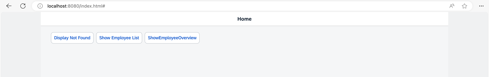
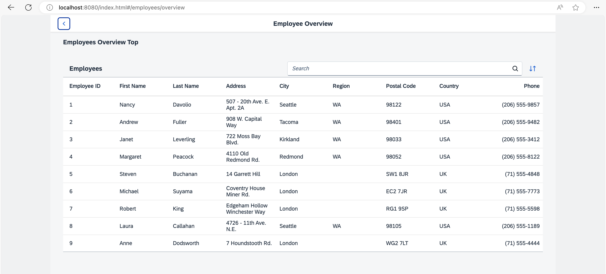
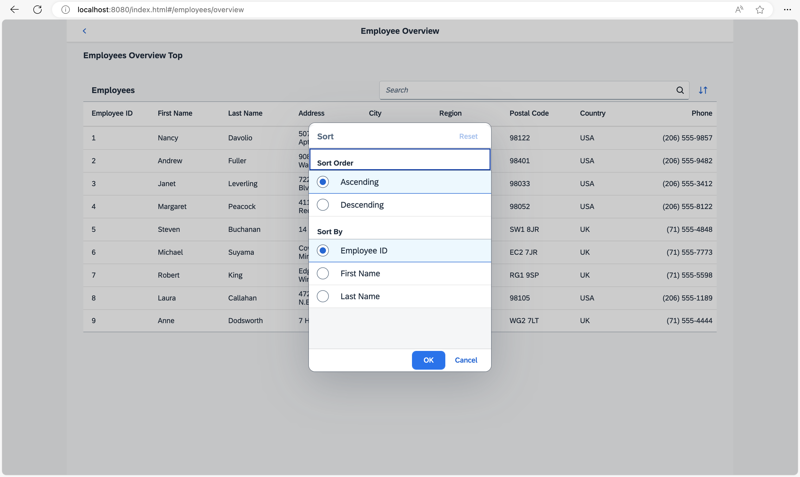
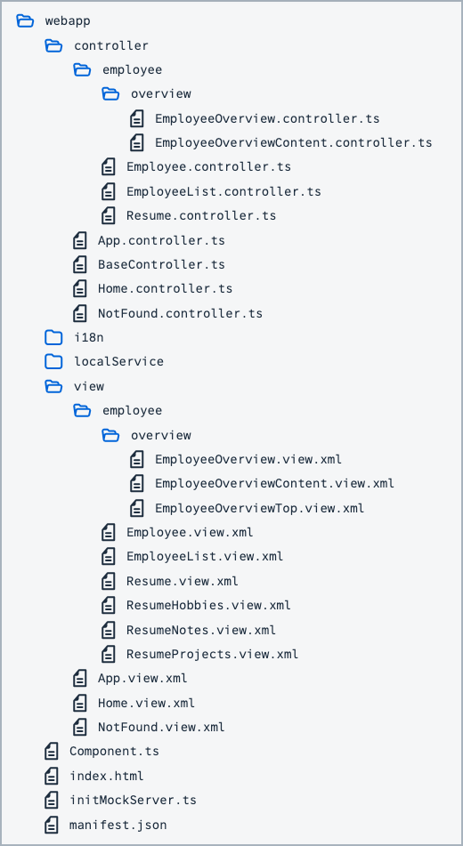

## Step 11: Assign Multiple Targets

In this step, we will add a new button to the home page to illustrate the usage of multiple targets for a route. When the button is pressed, a new page opens that contains two parts: a header part at the top and a content part. The content part displays a table of employees that can be sorted and searched. We will use the array notation in the routing configuration to assign multiple targets to a route - a feature that we have not yet introduced.

### Preview

#### New button Show Employee Overview



#### Employee Overview with search field



#### Sort options for the Employee Overview



You can view this step live: [🔗 Live Preview of Step 11](https://ui5.github.io/tutorials/navigation/build/11/index-cdn.html).

### Coding

You can download the solution for this step here: <span class="ts-only">[📥 Download step 11](https://ui5.github.io/tutorials/navigation/navigation-step-11.zip)<span class="lang-suffix"> (TS)</span></span><span class="js-only">[📥 Download step 11](https://ui5.github.io/tutorials/navigation/navigation-step-11-js.zip)<span class="lang-suffix"> (JS)</span></span>.

#### Folder Structure for this Step



### webapp/view/Home.view.xml


```xml
<mvc:View
  controllerName="ui5.tutorial.navigation.controller.Home"
  xmlns="sap.m"
  xmlns:mvc="sap.ui.core.mvc">
  <Page
    title="{i18n>homePageTitle}"
    titleAlignment="Center"
    class="sapUiResponsiveContentPadding">
    <content>
      <Button id="displayNotFoundBtn" text="{i18n>DisplayNotFound}" press=".onDisplayNotFound" class="sapUiTinyMarginEnd"/>
      <Button id="employeeListBtn" text="{i18n>ShowEmployeeList}" press=".onNavToEmployees" class="sapUiTinyMarginEnd"/>
      <Button id="employeeOverviewBtn" text="{i18n>ShowEmployeeOverview}" press=".onNavToEmployeeOverview" class="sapUiTinyMarginEnd"/>
    </content>
  </Page>
</mvc:View>
```


First we add a new button to the `Home` view and add an event handler for the `press` event.

### webapp/controller/Home.controller.ts/.js


```ts
// webapp/controller/Home.controller.ts
import BaseController from "ui5/tutorial/navigation/controller/BaseController";

/**
 * @namespace ui5.tutorial.navigation.controller
 */
export default class Home extends BaseController {
	...
	public onNavToEmployees(): void {
		this.getRouter().navTo("employeeList");
	}

	public onNavToEmployeeOverview(): void {
		this.getRouter().navTo("employeeOverview");
	}
}
```



```js
// webapp/controller/Home.controller.js
sap.ui.define(["ui5/tutorial/navigation/controller/BaseController"], function (BaseController) {
	"use strict";

	const Home = BaseController.extend("ui5.tutorial.navigation.controller.Home", {
		onDisplayNotFound() {
			// display the "notFound" target without changing the hash
			this.getRouter().getTargets().display("notFound", {
				fromTarget: "home"
			});
		},
		onNavToEmployees() {
			this.getRouter().navTo("employeeList");
		},
		onNavToEmployeeOverview() {
			this.getRouter().navTo("employeeOverview");
		}
	});
	return Home;
});
```


As you know already from the previous steps, we add the `press` event handler `onNavToEmployeeOverview`. It navigates to the route `employeeOverview` which does not exist yet, so let’s create it.

### webapp/manifest.json


```json
{
  "_version": "2.8.0",
  "sap.app": {
    ...
  },
  "sap.ui": {
    ...
  },
  "sap.ui5": {
    ...
    "routing": {
      "config": {
        "routerClass": "sap.m.routing.Router",
        "type": "View",
        "viewType": "XML",
        "path": "ui5.tutorial.navigation.view",
        "controlId": "app",
        "controlAggregation": "pages",
        "transition": "slide",
        "bypassed": {
          "target": "notFound"
        }
      },
      "routes": [{
        "pattern": "",
        "name": "appHome",
        "target": "home"
      }, {
        "pattern": "employees",
        "name": "employeeList",
        "target": "employees"
      }, {
        "pattern": "employees/overview",
        "name": "employeeOverview",
        "target": ["employeeOverviewTop", "employeeOverviewContent"]
      }, {
        "pattern": "employees/{employeeId}",
        "name": "employee",
        "target": "employee"
      }, {
        "pattern": "employees/{employeeId}/resume:?query:",
        "name": "employeeResume",
        "target": "employeeResume"
      }],
      "targets": {
        ...
        "resumeTabNotes": {
          "id": "resumeNotes",
          "parent": "employeeResume",
          "path": "ui5.tutorial.navigation.view.employee",
          "name": "ResumeNotes",
          "controlId": "notesTab",
          "controlAggregation": "content"
        },
        "employeeOverview": {
          "id": "employeeOverview",
          "path": "ui5.tutorial.navigation.view.employee.overview",
          "name": "EmployeeOverview",
          "level": 2
        },
        "employeeOverviewTop": {
          "id": "employeeOverviewTop",
          "parent": "employeeOverview",
          "path": "ui5.tutorial.navigation.view.employee.overview",
          "name": "EmployeeOverviewTop",
          "controlId": "EmployeeOverviewParent",
          "controlAggregation": "content"
        },
        "employeeOverviewContent": {
          "id": "employeeOverviewContent",
          "parent": "employeeOverview",
          "path": "ui5.tutorial.navigation.view.employee.overview",
          "name": "EmployeeOverviewContent",
          "controlId": "EmployeeOverviewParent",
          "controlAggregation": "content"
        }

      }
    }
  }
}
```


We extend our current routing configuration with a new route `employeeOverview`. Note that this route has to be configured before the `employee` route, else the `employee` route would be matched with a hash like `/#/employees/overview`. The new route `employeeOverview` references two targets at the same time with an array notation: `employeeOverviewTop` and `employeeOverviewContent`. As you can see here, a route can reference an arbitrary number of targets that will be displayed when the route is matched.

Both targets `employeeOverviewTop` and `employeeOverviewContent` reference the target `employeeOverview` as their parent target because we want to place them both inside the parent. Please also note that we also introduce a new layer `overview` in the `path` property.

> 📝
> The order of the routing configuration matters here, because the router stops matching additional routes when the first match is found. You can override this behavior if you set parameter `greedy` to `true` on the route. Then the route will always be matched when the pattern matches the current URL, even if another route has been matched before. The `greedy` option comes from the underlying `Crossroads.js` library, a popular routing library. A common use case for using `greedy` is configuring targets without views and then listening for route-matched events.

Now we create both targets `employeeOverviewTop` and `employeeOverviewContent` as well as their parent target `employeeOverview`. On the parent target we set `level` to `2` to ensure a correct transition animation. In the targets, we also configure where the corresponding views of the children shall be displayed by setting the parameters `controlId` and `controlAggregation` to a control ID of a `sap.ui.layout.HorizontalLayout` that we are about to create in a new view.

The router makes sure that the parent view is loaded in addition to the target view when a corresponding route has been matched and the targets are displayed. The referenced views are displayed automatically at the configured place in the parent’s view, in our case in the `content` aggregation of the `Page` control. We have mentioned three different views that we still need to add to the app to make the configuration work:

- `EmployeeOverview`

- `EmployeeOverviewTop`

- `EmployeeOverviewContent`

### webapp/view/employee/overview/EmployeeOverview.view.xml \(New\)


```xml
<mvc:View
  controllerName="ui5.tutorial.navigation.controller.employee.overview.EmployeeOverview"
  xmlns="sap.m"
  xmlns:mvc="sap.ui.core.mvc">
  <Page
    id="EmployeeOverviewParent"
    title="{i18n>EmployeeOverview}"
    titleAlignment="Center"
    showNavButton="true"
    navButtonPress=".onNavBack"
    class="sapUiResponsiveContentPadding">
    <content>
      <!-- inserted by routing -->
    </content>
  </Page>
</mvc:View>
```


First we create the parent view by creating the folder `overview` under `webapp/view/employee` and placing the file `EmployeeOverview.view.xml` into that folder. This view contains a `Page` control that is referenced from the targets in our `manifest.json` descriptor file. The content aggregation of the page will be filled by the router with the top and content part when the corresponding route has been hit.

### webapp/controller/employee/overview/EmployeeOverview.controller.ts/.js \(New\)


```ts
// webapp/controller/employee/overview/EmployeeOverview.controller.ts
import BaseController from "ui5/tutorial/navigation/controller/BaseController";

/**
 * @namespace ui5.tutorial.navigation.controller.employee.overview
 */
export default class EmployeeOverview extends BaseController {

}
```



```js
// webapp/controller/employee/overview/EmployeeOverview.controller.js
sap.ui.define(["ui5/tutorial/navigation/controller/BaseController"], function (BaseController) {
	"use strict";

	const EmployeeOverview = BaseController.extend("ui5.tutorial.navigation.controller.employee.overview.EmployeeOverview", {});
	return EmployeeOverview;
});
```


The controller does not contain any logic yet, but we will add back navigation features here in the next steps.

### webapp/view/employee/overview/EmployeeOverviewTop.view.xml \(New\)


```xml
<mvc:View xmlns="sap.m" xmlns:mvc="sap.ui.core.mvc" class="sapUiMediumMarginBottom">
  <Title text="{i18n>EmployeeOverviewTop}"/>
</mvc:View>
```


Create the file `EmployeeOverviewTop.view.xml` and place it in the `webapp/view/employee/overview` folder. This view displays a static text for illustration purposes. Change it according to your own requirements. We don’t need a controller for this view

### webapp/view/employee/overview/EmployeeOverviewContent.view.xml \(New\)


```xml
<mvc:View
  controllerName="ui5.tutorial.navigation.controller.employee.overview.EmployeeOverviewContent"
  xmlns="sap.m"
  xmlns:mvc="sap.ui.core.mvc">
  <Table id="employeesTable"
    items="{/Employees}">
    <headerToolbar>
      <Toolbar>
        <Title text="{i18n>Employees}" level="H2"/>
        <ToolbarSpacer />
        <SearchField id="searchField" search=".onSearchEmployeesTable" width="50%"/>
        <Button icon="sap-icon://sort" press=".onSortButtonPressed"/>
      </Toolbar>
    </headerToolbar>
    <columns>
      <Column id="employeeIDCol"><Text text="{i18n>EmployeeID}"/></Column>
      <Column id="firstNameCol" demandPopin="true"><Text text="{i18n>FirstName}"/></Column>
      <Column id="lastNameCol" demandPopin="true"><Text text="{i18n>LastName}"/></Column>
      <Column id="addressCol" minScreenWidth="Tablet" demandPopin="true"><Text text="{i18n>Address}"/></Column>
      <Column id="cityCol" minScreenWidth="Tablet" demandPopin="true"><Text text="{i18n>City}"/></Column>
      <Column id="regionCol" minScreenWidth="Tablet" demandPopin="true"><Text text="{i18n>Region}"/></Column>
      <Column id="postalCodeCol" minScreenWidth="Tablet" demandPopin="true"><Text text="{i18n>PostalCode}"/></Column>
      <Column id="countryCol" minScreenWidth="Tablet" demandPopin="true"><Text text="{i18n>Country}"/></Column>
      <Column id="homePhoneCol" minScreenWidth="Tablet" demandPopin="true" hAlign="Right"><Text text="{i18n>Phone}"/></Column>
    </columns>
    <items>
      <ColumnListItem>
        <cells>
          <Text text="{EmployeeID}"/>
          <Text text="{FirstName}"/>
          <Text text="{LastName}"/>
          <Text text="{Address}"/>
          <Text text="{City}"/>
          <Text text="{Region}"/>
          <Text text="{PostalCode}"/>
          <Text text="{Country}"/>
          <Text text="{HomePhone}"/>
        </cells>
      </ColumnListItem>
    </items>
  </Table>
</mvc:View>
```


Create the file EmployeeOverviewContent.view.xml in the `webapp/view/employee/overview` folder. This view displays a responsive table with several columns containing employee data like *Employee ID*, *First Name*, *Last Name* and so on. In the `headerToolbar`, we add the `SearchField` and a `Button`. The `SearchField` in the header area allows to search in the table. The `Button` next to it opens a dialog to adjust the sorting of the table.

### webapp/controller/employee/overview/EmployeeOverviewContent.controller.ts/.js \(New\)


```ts
// webapp/controller/employee/overview/EmployeeOverviewContent.controller.ts
import SearchField, { SearchField$SearchEvent } from "sap/m/SearchField";
import Table from "sap/m/Table";
import ViewSettingsDialog, { ViewSettingsDialog$ConfirmEvent } from "sap/m/ViewSettingsDialog";
import ViewSettingsItem from "sap/m/ViewSettingsItem";
import BaseController from "ui5/tutorial/navigation/controller/BaseController";
import Filter from "sap/ui/model/Filter";
import FilterOperator from "sap/ui/model/FilterOperator";
import ListBinding from "sap/ui/model/ListBinding";
import Sorter from "sap/ui/model/Sorter";

/**
 * @namespace ui5.tutorial.navigation.controller.employee.overview
 */
export default class EmployeeOverviewContent extends BaseController {

	private table: Table;
	private viewSettingsDialog: ViewSettingsDialog;
	private sortField: string | null = null;
	private sortDescending: boolean = false;
	private validSortFields: string[] = ["EmployeeID", "FirstName", "LastName"];
	private searchQuery: string | null = null;

	public onInit(): void {
		this.table = (<Table> this.byId("employeesTable"));
		this._initViewSettingsDialog();
	}

	public onSortButtonPressed(): void {
		this.viewSettingsDialog.open();
	}

	public onSearchEmployeesTable(event: SearchField$SearchEvent): void {
		this._applySearchFilter(event.getSource().getValue());
	}

	private _initViewSettingsDialog(): void {
		this.viewSettingsDialog = new ViewSettingsDialog("vsd", {
			confirm: (event: ViewSettingsDialog$ConfirmEvent) => {
				const sortItem = event.getParameter("sortItem");
				this._applySorter(sortItem.getKey(), event.getParameter("sortDescending"));
			}
		});

		// init sorting (with simple sorters as custom data for all fields)
		this.viewSettingsDialog.addSortItem(new ViewSettingsItem({
			key: "EmployeeID",
			text: "Employee ID",
			selected: true // by default the MockData is sorted by EmployeeID
		}));

		this.viewSettingsDialog.addSortItem(new ViewSettingsItem({
			key: "FirstName",
			text: "First Name",
			selected: false
		}));

		this.viewSettingsDialog.addSortItem(new ViewSettingsItem({
			key: "LastName",
			text: "Last Name",
			selected: false
		}));
	}

	private _applySearchFilter(searchQuery: string): void {
		// first check if we already have this search value
		if (this.searchQuery === searchQuery) {
			return;
		}
		this.searchQuery = searchQuery;
		(<SearchField> this.byId("searchField")).setValue(searchQuery);

		let filter: Filter | null = null;

		// add filters for search
		if (searchQuery?.length > 0) {
			const filters: Filter[] = [];

			filters.push(new Filter("FirstName", FilterOperator.Contains, searchQuery));
			filters.push(new Filter("LastName", FilterOperator.Contains, searchQuery));
			filter = new Filter({ filters: filters, and: false }); // OR filter
		}

		// update list binding
		const binding = (<ListBinding> this.table.getBinding("items"));
		binding.filter(filter, "Application");
	}

	/**
	 * Applies sorting on our table control.
	 * @param {string} fieldName the name of the field used for sorting
	 * @param {boolean} sortDescending whether to sort descending
	 * @private
	 */
	private _applySorter(fieldName: string, sortDescending: boolean): void {
		// only continue if we have a valid sort field
		if (fieldName && this.validSortFields.includes(fieldName)) {
			// sort only if the sorter has changed
			if (this.sortField && this.sortField === fieldName && this.sortDescending === sortDescending) {
				return;
			}

			this.sortField = fieldName;
			this.sortDescending = sortDescending;
			const sorter = new Sorter(fieldName, sortDescending);

			// sync with View Settings Dialog
			this._syncViewSettingsDialogSorter(fieldName, sortDescending);

			const binding = (<ListBinding> this.table.getBinding("items"));
			binding.sort(sorter);
		}
	}

	private _syncViewSettingsDialogSorter(sortField: string, sortDescending: boolean): void {
		// the possible keys are: "EmployeeID" | "FirstName" | "LastName"
		// Note: no input validation is implemented here
		this.viewSettingsDialog.setSelectedSortItem(sortField);
		this.viewSettingsDialog.setSortDescending(sortDescending);
	}
}
```



```js
// webapp/controller/employee/overview/EmployeeOverviewContent.controller.js
sap.ui.define(["sap/m/ViewSettingsDialog", "sap/m/ViewSettingsItem", "ui5/tutorial/navigation/controller/BaseController", "sap/ui/model/Filter", "sap/ui/model/FilterOperator", "sap/ui/model/Sorter"], function (ViewSettingsDialog, ViewSettingsItem, BaseController, Filter, FilterOperator, Sorter) {
  "use strict";

  const EmployeeOverviewContent = BaseController.extend("ui5.tutorial.navigation.controller.employee.overview.EmployeeOverviewContent", {
	constructor() {
	  BaseController.prototype.constructor.apply(this, arguments);
	  this.sortField = null;
	  this.sortDescending = false;
	  this.validSortFields = ["EmployeeID", "FirstName", "LastName"];
	  this.searchQuery = null;
	},
	onInit() {
	  this.table = this.byId("employeesTable");
	  this._initViewSettingsDialog();
	},
	onSortButtonPressed() {
	  this.viewSettingsDialog.open();
	},
	onSearchEmployeesTable(event) {
	  this._applySearchFilter(event.getSource().getValue());
	},
	_initViewSettingsDialog() {
	  this.viewSettingsDialog = new ViewSettingsDialog("vsd", {
		confirm: event => {
		  const sortItem = event.getParameter("sortItem");
		  this._applySorter(sortItem.getKey(), event.getParameter("sortDescending"));
		}
	  });

	  // init sorting (with simple sorters as custom data for all fields)
	  this.viewSettingsDialog.addSortItem(new ViewSettingsItem({
		key: "EmployeeID",
		text: "Employee ID",
		selected: true // by default the MockData is sorted by EmployeeID
	  }));
	  this.viewSettingsDialog.addSortItem(new ViewSettingsItem({
		key: "FirstName",
		text: "First Name",
		selected: false
	  }));
	  this.viewSettingsDialog.addSortItem(new ViewSettingsItem({
		key: "LastName",
		text: "Last Name",
		selected: false
	  }));
	},
	_applySearchFilter(searchQuery) {
	  // first check if we already have this search value
	  if (this.searchQuery === searchQuery) {
		return;
	  }
	  this.searchQuery = searchQuery;
	  this.byId("searchField").setValue(searchQuery);
	  let filter = null;

	  // add filters for search
	  if (searchQuery?.length > 0) {
		const filters = [];
		filters.push(new Filter("FirstName", FilterOperator.Contains, searchQuery));
		filters.push(new Filter("LastName", FilterOperator.Contains, searchQuery));
		filter = new Filter({
		  filters: filters,
		  and: false
		}); // OR filter
	  }

	  // update list binding
	  const binding = this.table.getBinding("items");
	  binding.filter(filter, "Application");
	},
	/**
	 * Applies sorting on our table control.
	 * @param {string} fieldName the name of the field used for sorting
	 * @param {boolean} sortDescending whether to sort descending
	 * @private
	 */
	_applySorter(fieldName, sortDescending) {
	  // only continue if we have a valid sort field
	  if (fieldName && this.validSortFields.includes(fieldName)) {
		// sort only if the sorter has changed
		if (this.sortField && this.sortField === fieldName && this.sortDescending === sortDescending) {
		  return;
		}
		this.sortField = fieldName;
		this.sortDescending = sortDescending;
		const sorter = new Sorter(fieldName, sortDescending);

		// sync with View Settings Dialog
		this._syncViewSettingsDialogSorter(fieldName, sortDescending);
		const binding = this.table.getBinding("items");
		binding.sort(sorter);
	  }
	},
	_syncViewSettingsDialogSorter(sortField, sortDescending) {
	  // the possible keys are: "EmployeeID" | "FirstName" | "LastName"
	  // Note: no input validation is implemented here
	  this.viewSettingsDialog.setSelectedSortItem(sortField);
	  this.viewSettingsDialog.setSortDescending(sortDescending);
	}
  });
  return EmployeeOverviewContent;
});
```


Finally create the controller for the *Employee Overview* page in the `webapp/controller/employee/overview` folder. It basically sets up a `ViewSettingsDialog` to sort and filter the table of employees and implements event handlers for the search field and for the sorting of the table.

There is nothing special about this implementation. If you are interested in how to set up a table with sorting and filtering you can check the corresponding steps of the *Walkthrough* tutorial or the examples in the Demo Kit. We will mainly make use of the UI and the functionality for showing additional navigation and routing features. Therefore, we suggest copying the code and trying it out.

Open `webapp/index.html#/employees/overview` and check the new views. As you can see, the three views are wired together automatically by the router based on our configuration in the descriptor. In the top area of the page, you see a static text and below you see the table filled with data from our test service. The whole routing functionality that we see in this example is implemented by referencing two targets from one route.

Of course, you can also search the table and change the sorting. When the sorting dialog opens, it creates a block layer so that the back button and other controls cannot be accessed. However, you can still use the back button of the browser. As you can see, the dialog is closed automatically by the router before navigating.

> 📝
> The default behavior of the `sap.m` router is that all dialogs are closed when the hash changes \(i.e. when calling `navTo`, `display` or pressing the back button of the browser\). You can change this default behavior by calling `getTargetHandler().setCloseDialogs(false)` on the router or on the `Targets` object.

However, we have one problem yet to solve: the search and table ordering are not bookmarkable. Fortunately, we have additional navigation features at hand and you will see how this works in the next steps

### webapp/i18n/i18n.properties


```properties
...
EmployeeOverview=Employee Overview
ShowEmployeeOverview=Show Employees Overview
EmployeeOverviewTop=Employees Overview Top
Region=Region
EmployeeID=Employee ID
Phone=Phone
Employees=Employees
```


Add the new texts to the `properties` file.

***

**Next:** [Step 12: Make a Search Bookmarkable](../12/README.md)

**Previous:** [Step 10: Implement “Lazy Loading”](../10/README.md)
