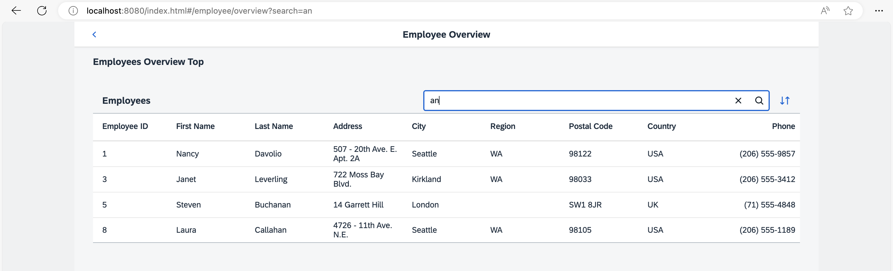

## Step 12: Make a Search Bookmarkable

In this step we will make the search bookmarkable. This allows users to search for employees in the *Employees* table and they can bookmark their search query or share the URL.

### Preview

#### Search and sorting bookmarkable



You can view this step live: [🔗 Live Preview of Step 12](https://ui5.github.io/tutorials/navigation/build/12/index-cdn.html).

### Coding

You can download the solution for this step here: <span class="ts-only">[📥 Download step 12](https://ui5.github.io/tutorials/navigation/navigation-step-12.zip)<span class="lang-suffix"> (TS)</span></span><span class="js-only">[📥 Download step 12](https://ui5.github.io/tutorials/navigation/navigation-step-12-js.zip)<span class="lang-suffix"> (JS)</span></span>.

### webapp/manifest.json


```json
{
  "_version": "2.8.0",
  "sap.app": {
    ...
  },
  "sap.ui": {
    ...
  },
  "sap.ui5": {
    ...
    "routing": {
      "config": {
        "routerClass": "sap.m.routing.Router",
        "type": "View",
        "viewType": "XML",
        "path": "ui5.tutorial.navigation.view",
        "controlId": "app",
        "controlAggregation": "pages",
        "transition": "slide",
        "bypassed": {
          "target": "notFound"
        }
      },
      "routes": [{
        "pattern": "",
        "name": "appHome",
        "target": "home"
      }, {
        "pattern": "employees",
        "name": "employeeList",
        "target": "employees"
      }, {
        "pattern": "employees/overview:?query:",
        "name": "employeeOverview",
        "target": ["employeeOverviewTop", "employeeOverviewContent"]

      }, {
        "pattern": "employees/{employeeId}",
        "name": "employee",
        "target": "employee"
      }, {
        "pattern": "employees/{employeeId}/resume:?query:",
        "name": "employeeResume",
        "target": "employeeResume"
      }],
      "targets": {
        ...
      }
    }
  }
}
```


In order to make the search bookmarkable we have to think about how the pattern of the corresponding route should match the bookmark. We decide to allow `/#/employees/overview?search=mySearchQueryString` in order to bookmark a search. Therefore, we simply extend our routing configuration a little. We add the optional `:?query:` parameter to the route `employeeOverview`. We keep in mind that we want to use `search` as the URL parameter for the search term that was entered in the search field.

### webapp/controller/employee/overview/EmployeeOverviewContent.controller.ts/.js


```ts
// webapp/controller/employee/overview/EmployeeOverviewContent.controller.ts
import SearchField, { SearchField$SearchEvent } from "sap/m/SearchField";
import Table from "sap/m/Table";
import ViewSettingsDialog, { ViewSettingsDialog$ConfirmEvent } from "sap/m/ViewSettingsDialog";
import ViewSettingsItem from "sap/m/ViewSettingsItem";
import BaseController from "ui5/tutorial/navigation/controller/BaseController";
import Filter from "sap/ui/model/Filter";
import FilterOperator from "sap/ui/model/FilterOperator";
import ListBinding from "sap/ui/model/ListBinding";
import Sorter from "sap/ui/model/Sorter";
import { Route$MatchedEvent } from "sap/ui/core/routing/Route";

/**
 * @namespace ui5.tutorial.navigation.controller.employee.overview
 */
export default class EmployeeOverviewContent extends BaseController {

	private table: Table;
	private viewSettingsDialog: ViewSettingsDialog;
	private sortField: string | null = null;
	private sortDescending: boolean = false;
	private validSortFields: string[] = ["EmployeeID", "FirstName", "LastName"];
	private searchQuery: string | null = null;
	private routerArgs: any = null;

	public onInit(): void {
		const router = this.getRouter();

		this.table = (<Table> this.byId("employeesTable"));
		this._initViewSettingsDialog();

		// make the search bookmarkable
		router.getRoute("employeeOverview").attachMatched(this._onRouteMatched, this);
	}

	private _onRouteMatched(event: Route$MatchedEvent): void {
		// save the current query state
		this.routerArgs = event.getParameter("arguments");
		this.routerArgs["?query"] ||= {};

		// search/filter via URL hash
		this._applySearchFilter(this.routerArgs["?query"].search);
	}

	public onSortButtonPressed(): void {
		this.viewSettingsDialog.open();
	}

	public onSearchEmployeesTable(event: SearchField$SearchEvent): void {
		const router = this.getRouter();

		// update the hash with the current search term
		this.routerArgs["?query"].search = event.getSource().getValue();
		router.navTo("employeeOverview", this.routerArgs, true /*no history*/);
	}
	...
}
```



```js
// webapp/controller/employee/overview/EmployeeOverviewContent.controller.js
sap.ui.define(["sap/m/ViewSettingsDialog", "sap/m/ViewSettingsItem", "ui5/tutorial/navigation/controller/BaseController", "sap/ui/model/Filter", "sap/ui/model/FilterOperator", "sap/ui/model/Sorter"], function (ViewSettingsDialog, ViewSettingsItem, BaseController, Filter, FilterOperator, Sorter) {
	"use strict";

	const EmployeeOverviewContent = BaseController.extend("ui5.tutorial.navigation.controller.employee.overview.EmployeeOverviewContent", {
		constructor() {
			BaseController.prototype.constructor.apply(this, arguments);
			this.sortField = null;
			this.sortDescending = false;
			this.validSortFields = ["EmployeeID", "FirstName", "LastName"];
			this.searchQuery = null;
			this.routerArgs = null;
		},
		onInit() {
			const router = this.getRouter();
			this.table = this.byId("employeesTable");
			this._initViewSettingsDialog();

			// make the search bookmarkable
			router.getRoute("employeeOverview").attachMatched(this._onRouteMatched, this);
		},
		_onRouteMatched(event) {
			// save the current query state
			this.routerArgs = event.getParameter("arguments");
			this.routerArgs["?query"] ||= {};

			// search/filter via URL hash
			this._applySearchFilter(this.routerArgs["?query"].search);
		},
		onSortButtonPressed() {
			this.viewSettingsDialog.open();
		},
		onSearchEmployeesTable(event) {
			const router = this.getRouter();

			// update the hash with the current search term
			this.routerArgs["?query"].search = event.getSource().getValue();
			router.navTo("employeeOverview", this.routerArgs, true /*no history*/);
		},
		_initViewSettingsDialog() {
			this.viewSettingsDialog = new ViewSettingsDialog("vsd", {
				confirm: event => {
					const sortItem = event.getParameter("sortItem");
					this._applySorter(sortItem.getKey(), event.getParameter("sortDescending"));
				}
			});

			// init sorting (with simple sorters as custom data for all fields)
			this.viewSettingsDialog.addSortItem(new ViewSettingsItem({
				key: "EmployeeID",
				text: "Employee ID",
				selected: true // by default the MockData is sorted by EmployeeID
			}));
			this.viewSettingsDialog.addSortItem(new ViewSettingsItem({
				key: "FirstName",
				text: "First Name",
				selected: false
			}));
			this.viewSettingsDialog.addSortItem(new ViewSettingsItem({
				key: "LastName",
				text: "Last Name",
				selected: false
			}));
		},
		_applySearchFilter(searchQuery) {
			// first check if we already have this search value
			if (this.searchQuery === searchQuery) {
				return;
			}
			this.searchQuery = searchQuery;
			this.byId("searchField").setValue(searchQuery);
			let filter = null;

			// add filters for search
			if (searchQuery?.length > 0) {
				const filters = [];
				filters.push(new Filter("FirstName", FilterOperator.Contains, searchQuery));
				filters.push(new Filter("LastName", FilterOperator.Contains, searchQuery));
				filter = new Filter({
					filters: filters,
					and: false
				}); // OR filter
			}

			// update list binding
			const binding = this.table.getBinding("items");
			binding.filter(filter, "Application");
		},
		/**
		 * Applies sorting on our table control.
		 * @param {string} fieldName the name of the field used for sorting
		 * @param {boolean} sortDescending whether to sort descending
		 * @private
		 */
		_applySorter(fieldName, sortDescending) {
			// only continue if we have a valid sort field
			if (fieldName && this.validSortFields.includes(fieldName)) {
				// sort only if the sorter has changed
				if (this.sortField && this.sortField === fieldName && this.sortDescending === sortDescending) {
					return;
				}
				this.sortField = fieldName;
				this.sortDescending = sortDescending;
				const sorter = new Sorter(fieldName, sortDescending);

				// sync with View Settings Dialog
				this._syncViewSettingsDialogSorter(fieldName, sortDescending);
				const binding = this.table.getBinding("items");
				binding.sort(sorter);
			}
		},
		_syncViewSettingsDialogSorter(sortField, sortDescending) {
			// the possible keys are: "EmployeeID" | "FirstName" | "LastName"
			// Note: no input validation is implemented here
			this.viewSettingsDialog.setSelectedSortItem(sortField);
			this.viewSettingsDialog.setSortDescending(sortDescending);
		}
	});
	return EmployeeOverviewContent;
});
```


Now we handle the optional query parameter from the `employeeOverview` route in our `EmployeeOverviewContent` controller. First we change the `onInit` function by adding an event listener for the matched event of the `employeeOverview` route. Then we buffer the current router arguments as received from the event. If a query is available, the result from `event.getParameter("arguments")` will contain a `?query` property with an object of all URL parameters specified, otherwise it is undefined. If no query parameter is defined, we always initialize the query and save it to `this.routerArgs["?query"]`. If we have a search term query at the `search` key we continue and call `this._applySearchFilter(this.routerArgs["?query"].search)` to trigger a search based on the search query parameter from the URL.

Storing the `arguments` objects internally in the controller is important, because we will use the current arguments when calling `navTo()` in the search event handler `onSearchEmployeesTable` and pass on the arguments with the updated search term. We keep the URL and the UI in sync by navigating to the current target again with the current value of the search field from the event’s source. The search value is stored in `this.routerArgs["?query"].search` together with the other query parameters and it is passed directly to the router again

That’s it, now our search is bookmarkable and reflected in the URL. Try to access the following pages in your browser:

- `webapp/index.html#/employees/overview`

- `webapp/index.html#/employees/overview?search=`

- `webapp/index.html#/employees/overview?search=an`

When you change the value in the search field, you see that the hash updates accordingly.

***

**Next:** [Step 13: Make Table Sorting Bookmarkable](../13/README.md)

**Previous:** [Step 11: Assign Multiple Targets](../11/README.md)
