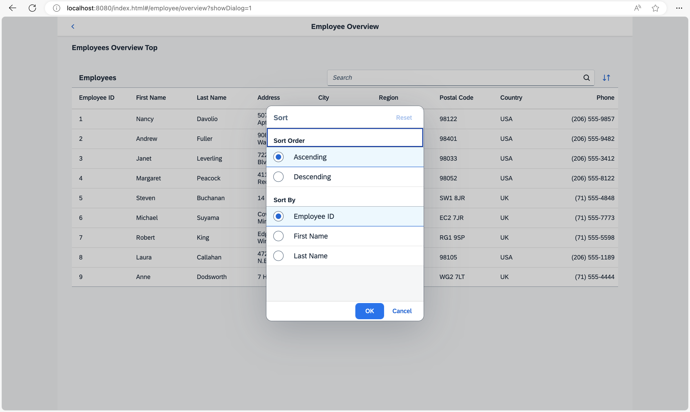

## Step 14: Make Dialogs Bookmarkable

In this step, we want to allow bookmarking of the dialog box that is opened when the user clicks the *Sort* button. The dialog should automatically open when the URL contains the query parameter `showDialog`.

### Preview

#### Bookmark for a dialog



You can view this step live: [🔗 Live Preview of Step 14](https://ui5.github.io/tutorials/navigation/build/14/index-cdn.html).

### Coding

You can download the solution for this step here: <span class="ts-only">[📥 Download step 14](https://ui5.github.io/tutorials/navigation/navigation-step-14.zip)<span class="lang-suffix"> (TS)</span></span><span class="js-only">[📥 Download step 14](https://ui5.github.io/tutorials/navigation/navigation-step-14-js.zip)<span class="lang-suffix"> (JS)</span></span>.

### webapp/controller/employee/overview/EmployeeOverviewContent.controller.ts/.js


```ts
// webapp/controller/employee/overview/EmployeeOverviewContent.controller.ts
import SearchField, { SearchField$SearchEvent } from "sap/m/SearchField";
import Table from "sap/m/Table";
import ViewSettingsDialog, { ViewSettingsDialog$ConfirmEvent, ViewSettingsDialog$CancelEvent } from "sap/m/ViewSettingsDialog";
import ViewSettingsItem from "sap/m/ViewSettingsItem";
import BaseController from "ui5/tutorial/navigation/controller/BaseController";
import Filter from "sap/ui/model/Filter";
import FilterOperator from "sap/ui/model/FilterOperator";
import ListBinding from "sap/ui/model/ListBinding";
import Sorter from "sap/ui/model/Sorter";
import { Route$MatchedEvent } from "sap/ui/core/routing/Route";

/**
 * @namespace ui5.tutorial.navigation.controller.employee.overview
 */
export default class EmployeeOverviewContent extends BaseController {
	...
	private _onRouteMatched(event: Route$MatchedEvent): void {
		// save the current query state
		this.routerArgs = event.getParameter("arguments");
		this.routerArgs["?query"] ||= {};
		const queryParameter = this.routerArgs["?query"];

		// search/filter via URL hash
		this._applySearchFilter(queryParameter.search);

		// sorting via URL hash
		this._applySorter(queryParameter.sortField, queryParameter.sortDescending);

		// show dialog via URL hash
		if (queryParameter.showDialog) {
			this.viewSettingsDialog.open();
		}
	}

	public onSortButtonPressed(): void {
		const router = this.getRouter();
		this.routerArgs["?query"].showDialog = 1;
		router.navTo("employeeOverview", this.routerArgs);
	}
	...
	private _initViewSettingsDialog(): void {
		const router = this.getRouter();

		this.viewSettingsDialog = new ViewSettingsDialog("vsd", {
			confirm: (event: ViewSettingsDialog$ConfirmEvent) => {
				const sortItem = event.getParameter("sortItem");

				this._applySorter(sortItem.getKey(), event.getParameter("sortDescending"));
				this.routerArgs["?query"].sortField = sortItem.getKey();
				this.routerArgs["?query"].sortDescending = event.getParameter("sortDescending");
				delete this.routerArgs["?query"].showDialog;
				router.navTo("employeeOverview", this.routerArgs, true /*without history*/);
			},
			cancel: (event: ViewSettingsDialog$CancelEvent) => {
				delete this.routerArgs["?query"].showDialog;
				router.navTo("employeeOverview", this.routerArgs, true /*without history*/);
			}
		});
		...
	}
	...
}
```



```js
// webapp/controller/employee/overview/EmployeeOverviewContent.controller.js
sap.ui.define(["sap/m/ViewSettingsDialog", "sap/m/ViewSettingsItem", "ui5/tutorial/navigation/controller/BaseController", "sap/ui/model/Filter", "sap/ui/model/FilterOperator", "sap/ui/model/Sorter"], function (ViewSettingsDialog, ViewSettingsItem, BaseController, Filter, FilterOperator, Sorter) {
	"use strict";

	const EmployeeOverviewContent = BaseController.extend("ui5.tutorial.navigation.controller.employee.overview.EmployeeOverviewContent", {
		constructor() {
			BaseController.prototype.constructor.apply(this, arguments);
			this.sortField = null;
			this.sortDescending = false;
			this.validSortFields = ["EmployeeID", "FirstName", "LastName"];
			this.searchQuery = null;
			this.routerArgs = null;
		},
		onInit() {
			const router = this.getRouter();
			this.table = this.byId("employeesTable");
			this._initViewSettingsDialog();

			// make the search bookmarkable
			router.getRoute("employeeOverview").attachMatched(this._onRouteMatched, this);
		},
		_onRouteMatched(event) {
			// save the current query state
			this.routerArgs = event.getParameter("arguments");
			this.routerArgs["?query"] ||= {};
			const queryParameter = this.routerArgs["?query"];

			// search/filter via URL hash
			this._applySearchFilter(queryParameter.search);

			// sorting via URL hash
			this._applySorter(queryParameter.sortField, queryParameter.sortDescending);

			// show dialog via URL hash
			if (queryParameter.showDialog) {
				this.viewSettingsDialog.open();
			}
		},
		onSortButtonPressed() {
			const router = this.getRouter();
			this.routerArgs["?query"].showDialog = 1;
			router.navTo("employeeOverview", this.routerArgs);
		},
		onSearchEmployeesTable(event) {
			const router = this.getRouter();

			// update the hash with the current search term
			this.routerArgs["?query"].search = event.getSource().getValue();
			router.navTo("employeeOverview", this.routerArgs, true /*no history*/);
		},
		_initViewSettingsDialog() {
			const router = this.getRouter();
			this.viewSettingsDialog = new ViewSettingsDialog("vsd", {
				confirm: event => {
					const sortItem = event.getParameter("sortItem");
					this._applySorter(sortItem.getKey(), event.getParameter("sortDescending"));
					this.routerArgs["?query"].sortField = sortItem.getKey();
					this.routerArgs["?query"].sortDescending = event.getParameter("sortDescending");
					delete this.routerArgs["?query"].showDialog;
					router.navTo("employeeOverview", this.routerArgs, true /*without history*/);
				},
				cancel: event => {
					delete this.routerArgs["?query"].showDialog;
					router.navTo("employeeOverview", this.routerArgs, true /*without history*/);
				}
			});

			// init sorting (with simple sorters as custom data for all fields)
			this.viewSettingsDialog.addSortItem(new ViewSettingsItem({
				key: "EmployeeID",
				text: "Employee ID",
				selected: true // by default the MockData is sorted by EmployeeID
			}));
			this.viewSettingsDialog.addSortItem(new ViewSettingsItem({
				key: "FirstName",
				text: "First Name",
				selected: false
			}));
			this.viewSettingsDialog.addSortItem(new ViewSettingsItem({
				key: "LastName",
				text: "Last Name",
				selected: false
			}));
		},
		_applySearchFilter(searchQuery) {
			// first check if we already have this search value
			if (this.searchQuery === searchQuery) {
				return;
			}
			this.searchQuery = searchQuery;
			this.byId("searchField").setValue(searchQuery);
			let filter = null;

			// add filters for search
			if (searchQuery?.length > 0) {
				const filters = [];
				filters.push(new Filter("FirstName", FilterOperator.Contains, searchQuery));
				filters.push(new Filter("LastName", FilterOperator.Contains, searchQuery));
				filter = new Filter({
					filters: filters,
					and: false
				}); // OR filter
			}

			// update list binding
			const binding = this.table.getBinding("items");
			binding.filter(filter, "Application");
		},
		/**
		 * Applies sorting on our table control.
		 * @param {string} fieldName the name of the field used for sorting
		 * @param {boolean} sortDescending whether to sort descending
		 * @private
		 */
		_applySorter(fieldName, sortDescending) {
			// only continue if we have a valid sort field
			if (fieldName && this.validSortFields.includes(fieldName)) {
				// sort only if the sorter has changed
				if (this.sortField && this.sortField === fieldName && this.sortDescending === sortDescending) {
					return;
				}
				this.sortField = fieldName;
				this.sortDescending = sortDescending;
				const sorter = new Sorter(fieldName, sortDescending);

				// sync with View Settings Dialog
				this._syncViewSettingsDialogSorter(fieldName, sortDescending);
				const binding = this.table.getBinding("items");
				binding.sort(sorter);
			}
		},
		_syncViewSettingsDialogSorter(sortField, sortDescending) {
			// the possible keys are: "EmployeeID" | "FirstName" | "LastName"
			// Note: no input validation is implemented here
			this.viewSettingsDialog.setSelectedSortItem(sortField);
			this.viewSettingsDialog.setSortDescending(sortDescending);
		}
	});
	return EmployeeOverviewContent;
});
```


Once again we will update the `EmployeeOverviewContent` controller to add support for the bookmarking of our sorting dialog. We decide to choose a query parameter `showDialog` that controls if the dialog is opened directly when we navigate to the page with a deep link. Therefore, we extend the matched event handler for the `employeeOverview` route. If the query parameter `showDialog` is set to `1`, we open the dialog.

Next we change the `press` handler of the sort button. In the `onSortButtonPressed` function we set `this.routerArgs["?query"].showDialog = 1` and call `navTo()` to let the router do the job instead of directly opening the dialog. Finally, we delete `this.routerArgs["?query"].showDialog` before calling `navTo()` in the `confirm` and `cancel` event handlers of the `ViewSettingsDialog`. This is important to make sure that the dialog does not open again by the matched handler.

We are now done with this step. Try to access the following pages:

- `webapp/index.html#/employees/overview?showDialog=1`

- `webapp/index.html#/employees/overview?search=an&sortField=EmployeeID&sortDescending=true&showDialog=1`

As you can see, the dialog opens automatically if the parameter `showDialog=1` is added to the URL. That’s exactly what we wanted.

***

**Next:** [Step 15: Reuse an Existing Route](../15/README.md)

**Previous:** [Step 13: Make Table Sorting Bookmarkable](../13/README.md)
