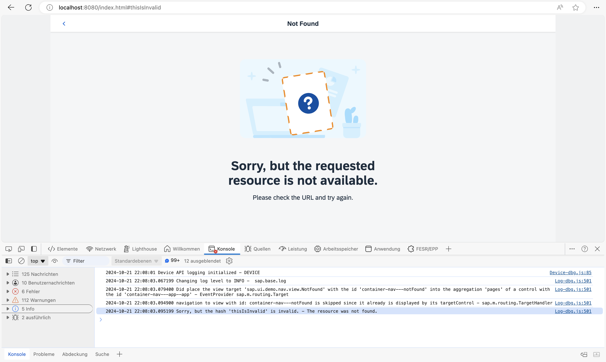

## Step 16: Handle Invalid Hashes by Listening to Bypassed Events

So far we have created many useful routes in our app. In the very early steps we have also made sure that a *Not Found* page is displayed in case the app was called with an invalid hash. Now, we proceed further and track invalid hashes to be able to detect and correct any invalid links or add new URL patterns that are often requested but not found. Therefore, we simply listen to the bypassed events

### Preview

#### Console output for invalid hashes when listening to bypassed events



You can view this step live: [🔗 Live Preview of Step 16](https://ui5.github.io/tutorials/navigation/build/16/index-cdn.html).

### Coding

You can download the solution for this step here: <span class="ts-only">[📥 Download step 16](https://ui5.github.io/tutorials/navigation/navigation-step-16.zip)<span class="lang-suffix"> (TS)</span></span><span class="js-only">[📥 Download step 16](https://ui5.github.io/tutorials/navigation/navigation-step-16-js.zip)<span class="lang-suffix"> (JS)</span></span>.

### webapp/controller/App.controller.ts/.js


```ts
// webapp/controller/App.controller.ts
import BaseController from "ui5/tutorial/navigation/controller/BaseController";
import Log from "sap/base/Log";
import { Router$BypassedEvent } from "sap/ui/core/routing/Router";

/**
 * @namespace ui5.tutorial.navigation.controller
 */
export default class App extends BaseController {

	public onInit(): void {
		// This is ONLY for being used within the tutorial.
		// The default log level of the current running environment may be higher than INFO,
		// in order to see the debug info in the console, the log level needs to be explicitly
		// set to INFO here.
		// But for application development, the log level doesn't need to be set again in the code.
		Log.setLevel(Log.Level.INFO);

		const router = this.getRouter();

		router.attachBypassed((event) => {
			const hash = event.getParameter("hash");
			// do something here, i.e. send logging data to the backend for analysis
			// telling what resource the user tried to access...
			Log.info(`Sorry, but the hash '${hash}' is invalid.`, "The resource was not found.");
		});
	}
}
```



```js
// webapp/controller/App.controller.js
sap.ui.define(["ui5/tutorial/navigation/controller/BaseController", "sap/base/Log"], function (BaseController, Log) {
	"use strict";

	const App = BaseController.extend("ui5.tutorial.navigation.controller.App", {
		onInit() {
			// This is ONLY for being used within the tutorial.
			// The default log level of the current running environment may be higher than INFO,
			// in order to see the debug info in the console, the log level needs to be explicitly
			// set to INFO here.
			// But for application development, the log level doesn't need to be set again in the code.
			Log.setLevel(Log.Level.INFO);
			const router = this.getRouter();
			router.attachBypassed(event => {
				const hash = event.getParameter("hash");
				// do something here, i.e. send logging data to the backend for analysis
				// telling what resource the user tried to access...
				Log.info(`Sorry, but the hash '${hash}' is invalid.`, "The resource was not found.");
			});
		}
	});
	return App;
});
```


All we need to do is listen to the bypassed event on the router. If the bypassed event is triggered, we simply get the current hash and log a message. In an actual app this is probably the right place to add some application analysis features, i.e. sending analytical logs to the back end for later evaluation and processing. This could be used to improve the app, for example, to find out why the user called the app with an invalid hash.

> 📝
> We have chosen to place this piece of code into the `App` controller because this is a global feature of the app. However, you could also place it anywhere else, for example in the `NotFound` controller file or in a helper module related to analysis.

Now try to access `webapp/index.html#/thisIsInvalid` while you have your browser console open. As you can see, there is a message that issues a faulty hash. Furthermore, our `NotFound` page is displayed.

***

**Next:** [Step 17: Listen to Matched Events of Any Route](../17/README.md)

**Previous:** [Step 15: Reuse an Existing Route](../15/README.md)
