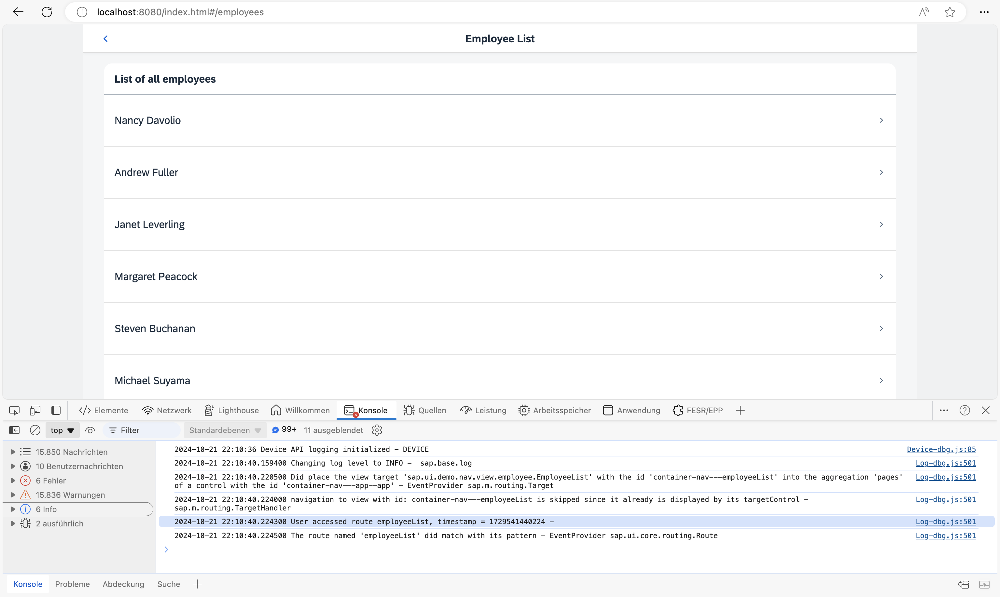

## Step 17: Listen to Matched Events of Any Route

In the previous step, we have listened for bypassed events to detect possible technical issues with our app. In this step, we want to improve the analysis use case even more by listening to any matched event of the route. We could use this information to measure how the app is used and how frequently the pages are called. Many Web analytic tools track page hits this way. The collected information can be used, for example to improve our app and its usability.

### Preview

#### Console output for routes matched by listening to routeMatched events



You can view this step live: [🔗 Live Preview of Step 17](https://ui5.github.io/tutorials/navigation/build/17/index-cdn.html).

### Coding

You can download the solution for this step here: <span class="ts-only">[📥 Download step 17](https://ui5.github.io/tutorials/navigation/navigation-step-17.zip)<span class="lang-suffix"> (TS)</span></span><span class="js-only">[📥 Download step 17](https://ui5.github.io/tutorials/navigation/navigation-step-17-js.zip)<span class="lang-suffix"> (JS)</span></span>.

### webapp/controller/App.controller.ts/.js


```ts
// webapp/controller/App.controller.ts
import BaseController from "ui5/tutorial/navigation/controller/BaseController";
import Log from "sap/base/Log";
import { Router$BypassedEvent, Router$RouteMatchedEvent } from "sap/ui/core/routing/Router";

/**
 * @namespace ui5.tutorial.navigation.controller
 */
export default class App extends BaseController {

	public onInit(): void {
		// This is ONLY for being used within the tutorial.
		// The default log level of the current running environment may be higher than INFO,
		// in order to see the debug info in the console, the log level needs to be explicitly
		// set to INFO here.
		// But for application development, the log level doesn't need to be set again in the code.
		Log.setLevel(Log.Level.INFO);

		const router = this.getRouter();

		router.attachBypassed((event: Router$BypassedEvent) => {
			const hash = event.getParameter("hash");
			// do something here, i.e. send logging data to the backend for analysis
			// telling what resource the user tried to access...
			Log.info(`Sorry, but the hash '${hash}' is invalid.`, "The resource was not found.");
		});

		router.attachRouteMatched((event: Router$RouteMatchedEvent) => {
			const sRouteName = event.getParameter("name");
			// do something, i.e. send usage statistics to backend
			// in order to improve our app and the user experience (Build-Measure-Learn cycle)
			Log.info(`User accessed route ${routeName}, timestamp = ${Date.now()}`);
		});
	}
}
```



```js
// webapp/controller/App.controller.js
sap.ui.define(["ui5/tutorial/navigation/controller/BaseController", "sap/base/Log"], function (BaseController, Log) {
	"use strict";

	const App = BaseController.extend("ui5.tutorial.navigation.controller.App", {
		onInit() {
			// This is ONLY for being used within the tutorial.
			// The default log level of the current running environment may be higher than INFO,
			// in order to see the debug info in the console, the log level needs to be explicitly
			// set to INFO here.
			// But for application development, the log level doesn't need to be set again in the code.
			Log.setLevel(Log.Level.INFO);
			const router = this.getRouter();
			router.attachBypassed(event => {
				const hash = event.getParameter("hash");
				// do something here, i.e. send logging data to the backend for analysis
				// telling what resource the user tried to access...
				Log.info(`Sorry, but the hash '${hash}' is invalid.`, "The resource was not found.");
			});
			router.attachRouteMatched(event => {
				const routeName = event.getParameter("name");
				// do something, i.e. send usage statistics to backend
				// in order to improve our app and the user experience (Build-Measure-Learn cycle)
				Log.info(`User accessed route ${routeName}, timestamp = ${Date.now()}`);
			});
		}
	});
	return App;
});
```


We extend the `App` controller again and listen to the `routeMatched` event. The `routeMatched` event is thrown for any route that matches to our route configuration in the descriptor file. In the event handler, we determine the name of the matched route from the event parameters and log it together with a time stamp. In an actual app, the information could be sent to a back-end system or an analytics server to find out more about the usage of your app.

Now you can access, for example, `webapp/index.html#/employees` while you have the console of the browser open. As you can see, there is a message logged for each navigation step that you do within the app.

***

**Previous:** [Step 16: Handle Invalid Hashes by Listening to Bypassed Events](../16/README.md)
