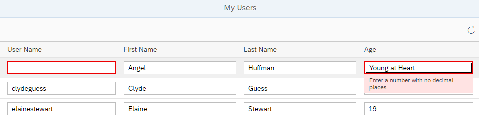

<nav class="tutorial-breadcrumb"><a href="../../../index.html">UI5 Tutorials</a> <span class="tutorial-breadcrumb-sep">&rsaquo;</span> <a href="../../index.html">OData V4 Tutorial</a></nav>

## Step 3: Automatic Data Type Detection

In this step, we use the automatic data type detection of the OData V4 model to parse, validate, and format user entries. The service metadata contains type information for the properties of each entity.

The OData V4 Model utilizes this information to compute the corresponding OpenUI5 type, including constraints, and sets this type to the OpenUI5 property binding for the entity property. For example, for `<Input value={Age}/>` the OpenUI5 type `Int64` is used, which corresponds to the OData type `Edm.Int64`.

### Preview

**Input does not match the underlying data type**



You can view this step live: [🔗 Live Preview of Step 3](https://ui5.github.io/tutorials/odatav4/build/03/index-cdn.html).

### Coding

You can download the solution for this step here: <span class="ts-only">[📥 Download step 3](https://ui5.github.io/tutorials/odatav4/odatav4-step-03.zip)<span class="lang-suffix"> (TS)</span></span><span class="js-only">[📥 Download step 3](https://ui5.github.io/tutorials/odatav4/odatav4-step-03-js.zip)<span class="lang-suffix"> (JS)</span></span>.

### webapp/manifest.json


```json
{
  "_version": "2.8.0",
  "sap.app": {...
  },
  "sap.ui": {
    "technology": "UI5",
    "deviceTypes": {

    }
  },
  "sap.ui5": {
    "rootView": {
    ...
    },
    "dependencies": {
      ...
      }
    },
    "contentDensities": {
      ...
    },
    "handleValidation": true,

    "models": {
      ...
    }
  },
  ...
}

```


In the `manifest.json` descriptor file, we add the `"handleValidation": true` setting. This makes sure that any validation errors that are detected by the OpenUI5 types are shown on the UI using the message manager.

We now run the app using the `index.html` file and enter values that don't match the type and constraints given in the metadata file. For example, enter the string value `Young at Heart` in field *Age*, which requires an integer input \(OpenUI5 type `sap.ui.model.odata.type.Int64`, corresponding to OData type `Edm.Int64`\), or remove an entry from the *User Name* or *First Name* fields, which are mandatory. Fields with incorrect entries are highlighted and an error message is displayed.

> 📝
> If you explicitly define a type in the binding info of a control, the automatic type detection for that binding will be turned off. For example, if you change the `Input` for `Age` in the view to `<Input value="{path:'Age', type:'sap.ui.model.type.String'}/>`, the `String` type will be used, not the `Int64` type from the service metadata.

### localService/metadata.xml


```xml
<EntityType Name="Person">
  <Key>
    <PropertyRef Name="UserName"/>
  </Key>
  <Property Name="UserName" Type="Edm.String" Nullable="false" />
  <Property Name="FirstName" Type="Edm.String" />
  <Property Name="LastName" Type="Edm.String"/>
  <Property Name="MiddleName" Type="Edm.String"/>
  <Property Name="Gender" Type="Microsoft.OData.Service.Sample.TrippinInMemory.Models.PersonGender"
        Nullable="false"/>
  <Property Name="Age" Type="Edm.Int64" />

```


To make the *User Name* optional, we remove the parameter `Nullable="false"` from the `UserName` property. You can play around with the settings for the other properties, for example, change the type of property `Age` to `Type="Edm.String"` to allow free text.

> 💡
> To see the metadata of an OData service, you append the `$metadata` variable to the URL of the service. You can try this, for example, with [http://services.odata.org/TripPinRESTierService/](http://services.odata.org/TripPinRESTierService/) and [http://services.odata.org/TripPinRESTierService/$metadata](http://services.odata.org/TripPinRESTierService/$metadata)

***

**Next:** [Step 4: Filtering, Sorting, and Counting](../04/index.html)

**Previous:** [Step 2: Data Access and Client-Server Communication](../02/index.html)

***

**Related Information**

[Type Determination](https://sdk.openui5.org/topic/53cdd55a77ce4f33a14bd0767a293063 "")

[API Reference: `sap.ui.model.odata.type`](https://sdk.openui5.org/#/api/sap.ui.model.odata.type)

[Sample for `sap.ui.core.mvc.XMLView`: *XML Templating: UI5 OData types*](https://sdk.openui5.org/#/entity/sap.ui.core.mvc.XMLView/sample/sap.ui.core.sample.ViewTemplate.types)
