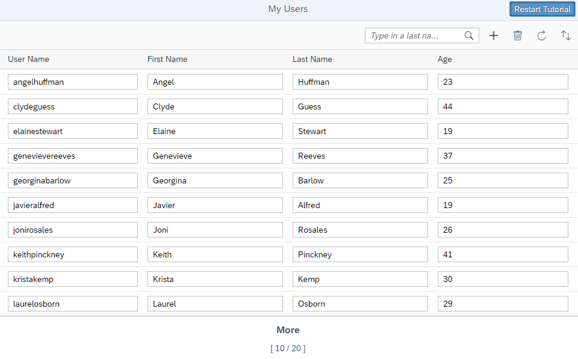

<nav class="tutorial-breadcrumb"><a href="../../../index.html">UI5 Tutorials</a> <span class="tutorial-breadcrumb-sep">&rsaquo;</span> <a href="../../index.html">OData V4 Tutorial</a></nav>

## Step 8: OData Operations

Our OData service provides one OData operation: the `ResetDataSource` action. In this step, we add a button that resets all data changes we made during the tutorial to their original state using this action.

### Preview

**A Restart Tutorial button is added**



You can view this step live: [🔗 Live Preview of Step 8](https://ui5.github.io/tutorials/odatav4/build/08/index-cdn.html).

### Coding

You can download the solution for this step here: <span class="ts-only">[📥 Download step 8](https://ui5.github.io/tutorials/odatav4/odatav4-step-08.zip)<span class="lang-suffix"> (TS)</span></span><span class="js-only">[📥 Download step 8](https://ui5.github.io/tutorials/odatav4/odatav4-step-08-js.zip)<span class="lang-suffix"> (JS)</span></span>.

### webapp/controller/App.controller.ts/.js


```ts
// webapp/controller/App.controller.ts
...
		onResetChanges() {
			this.byId("peopleList").getBinding("items").resetChanges();
			this._setUIChanges();
		},

		onResetDataSource() {
			const oModel = this.getView().getModel(),
				oOperation = oModel.bindContext("/ResetDataSource(...)");

			oOperation.invoke().then(function () {
					oModel.refresh();
					MessageToast.show(this._getText("sourceResetSuccessMessage"));
				}.bind(this), function (oError) {
					MessageBox.error(oError.message);
				}
			);
		},

		onSave() {
...
```



```js
// webapp/controller/App.controller.js
...
		onResetChanges : function () {
			this.byId("peopleList").getBinding("items").resetChanges();
			this._setUIChanges();
		},

		onResetDataSource : function () {
			var oModel = this.getView().getModel(),
				oOperation = oModel.bindContext("/ResetDataSource(...)");

			oOperation.invoke().then(function () {
					oModel.refresh();
					MessageToast.show(this._getText("sourceResetSuccessMessage"));
				}.bind(this), function (oError) {
					MessageBox.error(oError.message);
				}
			);
		},

		onSave : function () {
...

```


The `onResetDataSource` event handler calls the `ResetDataSource` action, which is an action of the *TripPin* OData service that resets the data of the service to its original state.

We call that action by first creating a deferred operation binding on the model. The `(…)` part of the binding syntax marks the binding as deferred. We use a deferred binding because we want to control when the action is invoked. Since it is deferred, we need to explicitly call its `invoke` method.

The invocation is asynchronous; the `invoke` method therefore returns a `Promise`. We attach simple success and error handlers to that `Promise` by calling its `then` method.

> 📝
> Many of the methods in the OData V4 API of OpenUI5 return a `Promise` to manage asynchronous processing

### webapp/view/App.view.xml


```xml
<mvc:View
  controllerName="ui5.tutorial.odatav4.controller.App"
  displayBlock="true"
  xmlns="sap.m"
  xmlns:mvc="sap.ui.core.mvc">
  <Shell>
    <App busy="{appView>/busy}" class="sapUiSizeCompact">
      <pages>
        <Page title="{i18n>peoplePageTitle}">
          <headerContent>
            <Button
              id="resetChangesButton"
              text="{i18n>resetChangesButtonText}"
              enabled="{= !${appView>/hasUIChanges}}"
              press="onResetDataSource"
              type="Emphasized">
            </Button>
          </headerContent>
...
```


We add the **headerContent** aggregation to the **Page** and insert the new **Button**. We add the **onResetDataSource** event handler to the **press** event.

### webapp/i18n/i18n.properties


```ini
...
# Toolbar
...
#XBUT: Button text for reset changes
resetChangesButtonText=Restart Tutorial
...
# Messages
...
#XMSG: Message for changes reverted
sourceResetSuccessMessage=All changes reverted back to start
```


We add the missing texts to the properties file.

And now we are done! We built a simple application with user data from an OData V4 service. We can display, edit, create, and delete users. And we use OData V4 features such as batch groups and automatic type detection.

***

**Next:** [Step 9: List-Detail Scenario](../09/index.html)

**Previous:** [Step 7: Delete](../07/index.html)

***

**Related Information**

[Bindings](https://sdk.openui5.org/topic/54e0ddf695af4a6c978472cecb01c64d "Bindings connect OpenUI5 view elements to model data, allowing changes in the model to be reflected in the view element and vice versa.")

[OData Operations](https://sdk.openui5.org/topic/b54f7895b7594c61a83fa7257fa9d13f "The OData V4 model supports OData operations (ActionImport, FunctionImport, bound Actions and bound Functions). Unbound parameters are limited to primitive values.")
