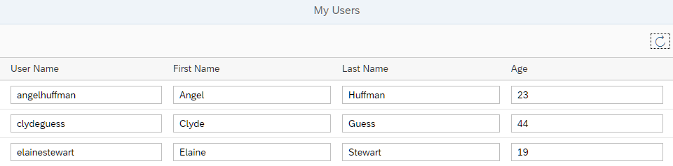

## Step 2: Data Access and Client-Server Communication

In this step, we see how the `Table` that is bound to the `People` entity set initially requests its data, and how the data can be refreshed. We use the *Console* tab in the browser developer tools to monitor the communication between the browser and the server. We see the initial request as well as the requests for refreshing the data.

### Preview

**App with a toolbar that contains a Refresh button**



You can view this step live: [🔗 Live Preview of Step 2](https://ui5.github.io/tutorials/odatav4/build/02/index-cdn.html).

### Coding

You can download the solution for this step here: <span class="ts-only">[📥 Download step 2](https://ui5.github.io/tutorials/odatav4/odatav4-step-02.zip)<span class="lang-suffix"> (TS)</span></span><span class="js-only">[📥 Download step 2](https://ui5.github.io/tutorials/odatav4/odatav4-step-02-js.zip)<span class="lang-suffix"> (JS)</span></span>.

### webapp/controller/App.controller.ts/.js


```ts
// webapp/controller/App.controller.ts
import Controller from "sap/ui/core/mvc/Controller";
import MessageToast from "sap/m/MessageToast";
import MessageBox from "sap/m/MessageBox";
import JSONModel from "sap/ui/model/json/JSONModel";
import ResourceModel from "sap/ui/model/resource/ResourceModel";
import ResourceBundle from "sap/base/i18n/ResourceBundle";
import Component from "sap/ui/core/Component";
import List from "sap/m/List";
import type ListBinding from "sap/ui/model/ListBinding";

/**
 * @namespace ui5.tutorial.odatav4.controller
 */
export default class App extends Controller {

	/**
	 *  Hook for initializing the controller
	 */
	onInit(): void {
		const jsonData = {
			busy: false
		};
		const model = new JSONModel(jsonData);

		this.getView().setModel(model, "appView");
	}

	/* =========================================================== */
	/*           begin: event handlers                             */
	/* =========================================================== */

	/**
	 * Refresh the data.
	 */
	onRefresh(): void {
		const binding = (this.byId("peopleList") as List).getBinding("items") as unknown as { hasPendingChanges(): boolean; refresh(): void };

		if (binding.hasPendingChanges()) {
			MessageBox.error(this._getText("refreshNotPossibleMessage"));
			return;
		}
		binding.refresh();
		MessageToast.show(this._getText("refreshSuccessMessage"));
	}

	/* =========================================================== */
	/*           end: event handlers                               */
	/* =========================================================== */

	/**
	 * Convenience method for retrieving a translatable text.
	 * @param sTextId - the ID of the text to be retrieved.
	 * @param aArgs - optional array of texts for placeholders.
	 * @returns the text belonging to the given ID.
	 */
	_getText(textId: string, args?: unknown[]): string {
		const bundle = ((this.getOwnerComponent() as Component).getModel("i18n") as ResourceModel).getResourceBundle() as ResourceBundle;
		return bundle.getText(textId, args as string[]);
	}
}
```



```js
// webapp/controller/App.controller.js
sap.ui.define(["sap/ui/core/mvc/Controller", "sap/m/MessageToast", "sap/m/MessageBox", "sap/ui/model/json/JSONModel"], function (Controller, MessageToast, MessageBox, JSONModel) {
  "use strict";

  const App = Controller.extend("ui5.tutorial.odatav4.controller.App", {
	/**
	 *  Hook for initializing the controller
	 */
	onInit() {
	  const jSONData = {
		busy: false
	  };
	  const model = new JSONModel(jSONData);
	  this.getView().setModel(model, "appView");
	},
	/* =========================================================== */
	/*           begin: event handlers                             */
	/* =========================================================== */
	/**
	 * Refresh the data.
	 */
	onRefresh() {
	  const binding = this.byId("peopleList").getBinding("items");
	  if (binding.hasPendingChanges()) {
		MessageBox.error(this._getText("refreshNotPossibleMessage"));
		return;
	  }
	  binding.refresh();
	  MessageToast.show(this._getText("refreshSuccessMessage"));
	},
	/* =========================================================== */
	/*           end: event handlers                               */
	/* =========================================================== */
	/**
	 * Convenience method for retrieving a translatable text.
	 * @param sTextId - the ID of the text to be retrieved.
	 * @param aArgs - optional array of texts for placeholders.
	 * @returns the text belonging to the given ID.
	 */
	_getText(textId, args) {
	  const bundle = this.getOwnerComponent().getModel("i18n").getResourceBundle();
	  return bundle.getText(textId, args);
	}
  });
  return App;
});
```


We add the event handler `onRefresh` to the controller. In this method, we retrieve the current data binding of the table. If the binding has unsaved changes, we display an error message, otherwise we call `refresh()` and display a success message.

> 📝
> At this stage, our app cannot have unsaved changes. We will change this in Step 6.

We also add the private method `_getText` to retrieve translatable texts from the resource bundle \(`i18n` model\).

### webapp/view/App.view.xml


```xml
...
<Page title="{i18n>peoplePageTitle}">
  <content>
    <Table
      id="peopleList"
      growing="true"
      growingThreshold="10"
      items="{
        path: '/People'
      }">
      <headerToolbar>
        <OverflowToolbar>
          <content>
            <ToolbarSpacer/>
            <Button
              id="refreshUsersButton"
              icon="sap-icon://refresh"
              tooltip="{i18n>refreshButtonText}"
              press=".onRefresh"/>
            </content>
          </OverflowToolbar>
        </headerToolbar>

        <columns>
...
```


We add the `headerToolbar` with a single `Button` to the `Table`. The button has a `press` event to which we attach an event handler called `onRefresh`.

### webapp/i18n/i18n.properties


```
# App Descriptor
...

# Toolbar
#XTOL: Tooltip for refresh data
refreshButtonText=Refresh Data

# Table Area
...

# Messages
#XMSG: Message for refresh failed
refreshNotPossibleMessage=Before refreshing, please save or revert your changes

#XMSG: Message for refresh succeeded
refreshSuccessMessage=Data refreshed
```


We add the tooltip and message texts to the `properties` file.

### Under the Hood

To get more insight into the client-server communication, we open the *Console* tab of the browser developer tools and then reload the app.

> 📝
> To monitor the client-server communication in a productive app, you would use the *Network* tab of the developer tools.
>
> In this tutorial, we are using a mock server instead of a real OData service so that we can run the code in every environment. The mock server does not generate any network traffic, so we use the *Console* tab to monitor the communication.
>
> If you want to switch to the real service, do the following:
>
> 1.  In the `index.html` file, remove the line `data-sap-ui-on-init="module:sap/ui/core/tutorial/odatav4/initMockServer"`.
>
> 2.  Check the URI of the default data source in the `manifest.json` file. Depending on the environment, change it to something that avoids cross-origin resource sharing \(CORS\) problems. For more information, see [Request Fails Due to Same-Origin Policy \(Cross-Origin Resource Sharing - CORS\)](https://sdk.openui5.org/)

We search for the following mock server requests:

-   [https://services.odata.org/TripPinRESTierService/\(S\(id\)\)/$metadata](https://services.odata.org/TripPinRESTierService/(S(id))/$metadata)

    This first request fetches the metadata that describes the entities of the service \(see also [OData Version 4.0. Part 3: Common Schema Definition Language \(CSDL\) Plus Errata 03](http://docs.oasis-open.org/odata/odata/v4.0/odata-v4.0-part3-csdl.html)\).

    The server responds with an XML file that describes the entities, for example, entity type `"Person"` has several properties such as `UserName`, `FirstName`, `LastName`, and `Age`.

    > ### Note:
    > The URL contains the session ID `(S(id))`. Since the public *TripPin* service can be used by multiple persons at the same time, the session ID separates read and write requests from different sources. You could use a different ID or request the service without a specified session ID. In the latter case, you will get a response with a new, random session ID.

-   [https://services.odata.org/TripPinRESTierService/\(S\(id\)\)/People?$select=Age,FirstName,LastName,UserName&$skip=0&$top=10](https://services.odata.org/TripPinRESTierService/(S(id))/People?$select=Age,FirstName,LastName,UserName&$skip=0&$top=10).

    The second request fetches the first 10 entities from the OData service. The `growingThreshold="10"` setting in the implementation of the `Table` control in the `App.view.xml` file defines that only 10 entities are fetched at the same time from the `'/people'` path. Further data is only loaded when requested from the user interface \(`growing="true"`\). Therefore, there are only 10 entities requested at the same time by using `$skip=0&$top=10` \(see [System Query Option $top and $skip](http://www.odata.org/getting-started/basic-tutorial/#topskip) in the Basic Tutorial on the OData home page.\)

    This request explicitly lists the fields that should be included in the response by using the `$select` query option. Although the *TripPin* service has more fields in its `People` entity set, only those four are included in the response. This is a feature of the OData V4 Model called "automatic determination of `$select`", or "auto-`$select`". It helps restricting the size of responses to what is really needed. The `ODataModel` computes the required fields from binding paths specified for controls. This feature is not active by default. In our case, this is activated by setting the `autoExpandSelect` property to `true` when instantiating the model in the `manifest.json` descriptor file .

***

**Next:** [Step 3: Automatic Data Type Detection](../03/README.md)

**Previous:** [Step 1: The Initial App](../01/README.md)

***

**Related Information**

[Bindings](https://sdk.openui5.org/topic/54e0ddf695af4a6c978472cecb01c64d "Bindings connect OpenUI5 view elements to model data, allowing changes in the model to be reflected in the view element and vice versa.")

[API Reference: `sap.ui.model.odata.v4.ODataMetaModel`](https://sdk.openui5.org/#/api/sap.ui.model.odata.v4.ODataMetaModel)

[API Reference: `sap.ui.model.odata.v4.ODataListBinding.refresh`](https://sdk.openui5.org/#/api/sap.ui.model.odata.v4.ODataListBinding/methods/refresh)

[Troubleshooting Tutorial Step 1: Browser Developer Tools](step-1-browser-developer-tools-eadd60a.md "In this step, you will learn how to use your browser's developers tools to troubleshoot your OpenUI5 app.")
