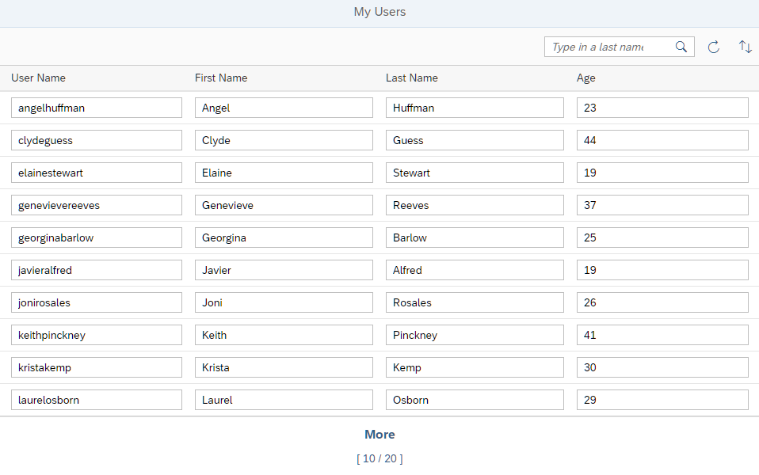

## Step 5: Batch Groups

In this step, we have a closer look at batch groups. Batch groups are used to group multiple requests into one server request to improve the overall performance.

### Preview

**No visual change compared to the last step**



You can view this step live: [🔗 Live Preview of Step 5](https://ui5.github.io/tutorials/odatav4/build/05/index-cdn.html).

### Coding

You can download the solution for this step here: <span class="ts-only">[📥 Download step 5](https://ui5.github.io/tutorials/odatav4/odatav4-step-05.zip)<span class="lang-suffix"> (TS)</span></span><span class="js-only">[📥 Download step 5](https://ui5.github.io/tutorials/odatav4/odatav4-step-05-js.zip)<span class="lang-suffix"> (JS)</span></span>.

### webapp/manifest.json


```json
...
        "": {
        "dataSource": "default",
        "settings": {
          "autoExpandSelect": true,
          "operationMode": "Server",
          "groupId": "$auto"
        }
...
```


In the previous steps, batch processing was turned off, so that we could monitor the network traffic between our app and the service more easily. Now we turn on batch processing by changing the `groupID` to `$auto`. You can also just remove the line from the code as this is the default.

We now run the app and open the browser developer tools. On the *Console* tab, we clear all messages and choose the *Refresh* button.

> 💡
> Change the settings of the *Console* so that it only displays information messages, not warnings and errors, to make it easier to find the messages we're looking for.

We see that the request is now bundled: To read the user data, the app now sends a `POST` request instead of a `GET` request to the server. The URL of the `POST` request does not include the `path` to the data we want. Instead it ends with `$batch` that indicates that this is a batch request.

A `$batch` request uses multipart MIME to put several requests into one. This makes it harder to analyze when looking at the request in the browser developer tools. To overcome this issue, you can:

-   Switch the group ID to `$direct` temporarily by changing the source code or changing the default value in the debugger.

-   Copy the relevant part of the request or response from the developer tools to an editor and auto-format it as JSON to analyze it.

***

**Next:** [Step 6: Create and Edit](../06/README.md)

**Previous:** [Step 4: Filtering, Sorting, and Counting](../04/README.md)

***

**Related Information**

[Batch Control](https://sdk.openui5.org/topic/74142a38e3d4467c8d6a70b28764048f "OData V4 allows you to group multiple operations into a single HTTP request payload, as described in the official OData V4 specification Part 1, Batch Requests (see the link under Related Information for more details).")

[Performance Aspects](https://sdk.openui5.org/topic/5a0d286c5606424b8e0d663c87445733 "The OData V4 model offers the features described below which influence performance.")
