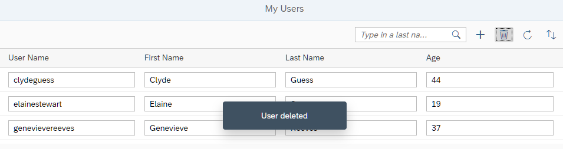

## Step 7: Delete

In this step, we make it possible to delete user data.

### Preview

**A new Delete User button is added**



You can view this step live: [🔗 Live Preview of Step 7](https://ui5.github.io/tutorials/odatav4/build/07/index-cdn.html).

### Coding

You can download the solution for this step here: <span class="ts-only">[📥 Download step 7](https://ui5.github.io/tutorials/odatav4/odatav4-step-07.zip)<span class="lang-suffix"> (TS)</span></span><span class="js-only">[📥 Download step 7](https://ui5.github.io/tutorials/odatav4/odatav4-step-07-js.zip)<span class="lang-suffix"> (JS)</span></span>.

### webapp/App.controller.ts/.js


```
...
		onInit: function () {
			...
				oViewModel = new JSONModel({
					busy : false,
					hasUIChanges : false,
					usernameEmpty : false,
					order : 0
				});
			...
		},
		onCreate : function () {
			var oList = this.byId("peopleList"),
				oBinding = oList.getBinding("items"),
				oContext = oBinding.create({
					"UserName" : "",
					"FirstName" : "",
					"LastName" : "",
					"Age" : "18"
				});

			this._setUIChanges();
			this.getView().getModel("appView").setProperty("/usernameEmpty", true);

			oList.getItems().some(function (oItem) {
				if (oItem.getBindingContext() === oContext) {
					oItem.focus();
					oItem.setSelected(true);
					return true;
				}
			});
		},

		onDelete : function () {
		    var oContext,
		        oSelected = this.byId("peopleList").getSelectedItem(),
		        sUserName;

		    if (oSelected) {
		        oContext = oSelected.getBindingContext();
		        sUserName = oContext.getProperty("UserName");
		        oContext.delete().then(function () {
		            MessageToast.show(this._getText("deletionSuccessMessage", sUserName));
		        }.bind(this), function (oError) {
		            this._setUIChanges();
		            if (oError.canceled) {
		                MessageToast.show(this._getText("deletionRestoredMessage", sUserName));
		                return;
		            }
		            MessageBox.error(oError.message + ": " + sUserName);
		        }.bind(this));
		        this._setUIChanges(true);
		    }
		},

		onInputChange : function (oEvt) {
			if (oEvt.getParameter("escPressed")) {
				this._setUIChanges();
			} else {
				this._setUIChanges(true);
				if (oEvt.getSource().getParent().getBindingContext().getProperty("UserName")) {
					this.getView().getModel("appView").setProperty("/usernameEmpty", false);
				}
			}
		},

...
```


We add the `onDelete` event handler to the controller. In the event handler, we check whether an item is selected in the table and if so, we retrieve the binding context of the selection and call its `delete` method. By doing this, the context is removed from the table on the client side and the deletion is stored as a pending change in the update group of the table's list binding. A call to `_setUIChanges` ensures that the `appView` model reflects the deletion as a pending change and that the *Save* button becomes enabled. The deletion will be submitted with all other changes related to the same update group once the *Save* button is pressed. If the deletion fails on the server side, or the changes are reset via API, the related entity is restored in the table automatically. To distinguish these two situations, the rejected error has `canceled` set to `true` in case of a reset.

### webapp/App.view.xml


```
<mvc:View
	controllerName="ui5.tutorial.odatav4.controller.App"
	displayBlock="true"
	xmlns="sap.m"
	xmlns:mvc="sap.ui.core.mvc">
	<Shell>
		<App busy="{appView>/busy}" class="sapUiSizeCompact">
			<pages>
				<Page title="{i18n>peoplePageTitle}">
					<content>
						<Table
							id="peopleList"
							growing="true"
							growingThreshold="10"
							items="{
								path: '/People',
								parameters: {
									$count: true,
									$$updateGroupId : 'peopleGroup'
								}
							}"
										mode="SingleSelectLeft">
							<headerToolbar>
								<OverflowToolbar>
									<content>
										<ToolbarSpacer/>
										<SearchField
										.../>
										<Button
										.../>
										<Button
											id="deleteUserButton"
											icon="sap-icon://delete"
											tooltip="{i18n>deleteButtonText}"
											press=".onDelete">
											<layoutData>
												<OverflowToolbarLayoutData priority="NeverOverflow"/>
											</layoutData>
										</Button>
										<Button
										.../>
										<Button
										...>
									</content>
								</OverflowToolbar>
							</headerToolbar>
							<columns>
								...
							</columns>
							<items>
								...
							</items>
						</Table>
					</content>
					<footer>
						...
					</footer>
				</Page>
			</pages>
		</App>
	</Shell>
</mvc:View>
```


We change the `mode` of the table to `SingleSelectLeft` to make it possible to select a row.

We add the *Delete* button to the toolbar. With the `OverflowToolbarLayoutData priority="NeverOverflow"` parameter, we make sure that the button is always visible.

### webapp/i18n/i18n.properties


```ini
...
# Toolbar
...
#XBUT: Button text for delete user
deleteButtonText=Delete User
...
# Messages
...
#XMSG: Message for user deleted
deletionSuccessMessage=User {0} deleted

#XMSG: Message for user restored (undeleted)
deletionRestoredMessage=User {0} restored
...
```


We add the missing texts to the properties file.

***

**Next:** [Step 8: OData Operations](../08/README.md)

**Previous:** [Step 6: Create and Edit](../06/README.md)

***

**Related Information**

[Deleting an Entity](https://sdk.openui5.org/topic/2613ebc835764abd9aefd2e6fa8b7392 "The v4.Context.delete method deletes an entity on the server and updates the user interface accordingly.")
