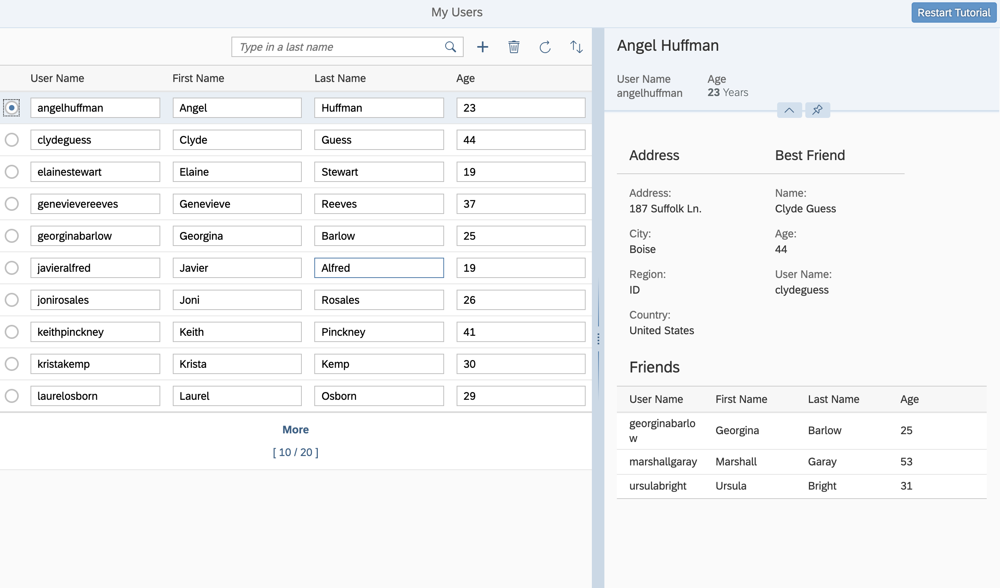

## Step 11: Add Table with :n Navigation to Detail Area

In this step we add a table with additional information to the detail area.

### Preview

**A table containing information about friends of the selected user is added**



You can view this step live: [🔗 Live Preview of Step 11](https://ui5.github.io/tutorials/odatav4/build/11/index-cdn.html).

### Coding

You can download the solution for this step here: <span class="ts-only">[📥 Download step 11](https://ui5.github.io/tutorials/odatav4/odatav4-step-11.zip)<span class="lang-suffix"> (TS)</span></span><span class="js-only">[📥 Download step 11](https://ui5.github.io/tutorials/odatav4/odatav4-step-11-js.zip)<span class="lang-suffix"> (JS)</span></span>.

### webapp/view/App.view.xml


```xml
<mvc:View
...
                      <VBox>
                        <FlexBox wrap="Wrap">
                            ...
                          <f:Form	editable="false">
                            <f:title>
                              <core:Title text="{i18n>bestFriendTitleText}" />
                            </f:title>
                            ...
                            <f:formContainers>
                              <f:FormContainer>
                                <f:formElements>
                                  ...
                                </f:formElements>
                              </f:FormContainer>
                            </f:formContainers>
                          </f:Form>
                        </FlexBox>
                        <Table
                          id="friendsTable"
                          width="auto"
                          items="{path: 'Friends',
                              parameters: {
                                $$ownRequest: true
                              }}"
                          noDataText="No Data"
                          class="sapUiSmallMarginBottom">
                          <headerToolbar>
                            <Toolbar>
                              <Title
                                text="Friends"
                                titleStyle="H3"
                                level="H3"/>
                            </Toolbar>
                          </headerToolbar>
                          <columns>
                            <Column>
                              <Text text="User Name"/>
                            </Column>
                            <Column>
                              <Text text="First Name"/>
                            </Column>
                            <Column>
                              <Text text="Last Name"/>
                            </Column>
                            <Column>
                              <Text text="Age"/>
                            </Column>
                          </columns>
                          <items>
                            <ColumnListItem>
                              <cells>
                                <Text text="{UserName}"/>
                              </cells>
                              <cells>
                                <Text text="{FirstName}"/>
                              </cells>
                              <cells>
                                <Text text="{LastName}"/>
                              </cells>
                              <cells>
                                <Text text="{Age}"/>
                              </cells>
                            </ColumnListItem>
                          </items>
                        </Table>
                      </VBox>
...
</mvc:View>
```


We extend the detail area of the `appView` by adding a table after the `FlexBox`. To this table we add a data binding for friends. It is important that we set the `$$ownRequest` binding parameter to `true`, so that the table containing all friends of the selected user makes its own OData requests separate from the request for best friend and best friend's address.

***

**Previous:** [Step 10: Enable Data Reuse](../10/README.md)
