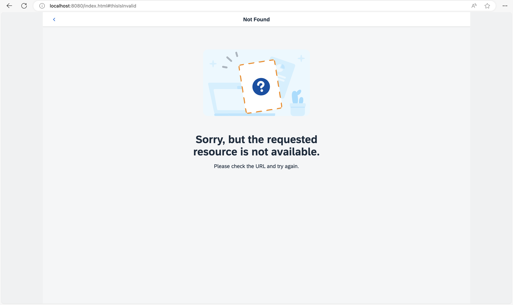

<!-- loio66670b0aab3948469d5cc8276113e9ea -->

# Step 4: Add a *Back* Button to *Not Found* Page

When we are on the *Not Found* page because of an invalid hash, we want to get back to our app to select another page. Therefore, we will add a *Back* button to the `NotFound` view and make sure that the user gets redirected to either the previous page or the overview page when the *Back* button is pressed.

## Preview

### Not Found page with Back button



### Folder structure for this step

```text
webapp/
├── controller/
│   ├── App.controller.?s
│   ├── BaseController.?s
│   ├── Home.controller.?s
│   └── NotFound.controller.?s
├── i18n/
│   └── i18n.properties
├── localService/
│   ├── mockdata/
│   │   ├── Employees.json
│   │   └── Resumes.json
│   ├── metadata.xml
│   └── mockserver.?s
├── view/
│   ├── App.view.xml
│   ├── Home.view.xml
│   └── NotFound.view.xml
├── Component.?s
├── index.html
├── initMockServer.?s
└── manifest.json
```

## Coding

You can view this step live: [🔗 Live Preview of Step 4](https://ui5.github.io/tutorials/navigation/build/04/index-cdn.html).

## webapp/view/NotFound.view.xml

```xml
<mvc:View
  controllerName="ui5.tutorial.navigation.controller.NotFound"
  xmlns="sap.m"
  xmlns:mvc="sap.ui.core.mvc"
  xmlns:core="sap.ui.core"
  core:require="{
    IllustratedMessageType: 'sap/m/IllustratedMessageType'
  }">
  <Page
    title="{i18n>NotFound}"
    titleAlignment="Center"
    showNavButton="true"
    navButtonPress=".onNavBack">
    <IllustratedMessage
      title="{i18n>NotFound.text}"
      description="{i18n>NotFound.description}"
      illustrationType="{= IllustratedMessageType.PageNotFound}"/>
  </Page>
</mvc:View>
```

In the `NotFound` view, we set the property `showNavButton` of the `Page` control to `true` which automatically displays the *Back* button. We also add an event handler function `onNavBack` to the `navButtonPress` event of the control. The `onNavBack` function will handle the actual back navigation. We could directly add this function to the `NotFound` view’s controller. However, we are smart enough to anticipate that we might need the same handler function for different views. DRY \(“Don’t Repeat Yourself”\) is the right approach for us, so let’s create a `BaseController` from which all other controllers will inherit.

## `webapp/controller/BaseController.?s` \(New\)

```ts
import Controller from "sap/ui/core/mvc/Controller";
import History from "sap/ui/core/routing/History";
import Router from "sap/ui/core/routing/Router";
import UIComponent from "sap/ui/core/UIComponent";

/**
 * @namespace ui5.tutorial.navigation.controller
 */
export default class BaseController extends Controller {

	public getRouter(): Router {
		return UIComponent.getRouterFor(this);
	}

	public onNavBack(): void {
		const history = History.getInstance();
		const previousHash = history.getPreviousHash();

		if (previousHash !== undefined) {
			window.history.go(-1);
		} else {
			this.getRouter().navTo("appHome", {}, true /*no history*/);
		}
	}
}
```

```js
sap.ui.define(["sap/ui/core/mvc/Controller", "sap/ui/core/routing/History", "sap/ui/core/UIComponent"], function (Controller, History, UIComponent) {
	"use strict";

	const BaseController = Controller.extend("ui5.tutorial.navigation.controller.BaseController", {
		getRouter() {
			return UIComponent.getRouterFor(this);
		},
		onNavBack() {
			const history = History.getInstance();
			const previousHash = history.getPreviousHash();
			if (previousHash !== undefined) {
				window.history.go(-1);
			} else {
				this.getRouter().navTo("appHome", {}, true /*no history*/);
			}
		}
	});
	return BaseController;
});
```

Create a new `BaseController.ts` file in the `webapp/controller` folder. The base controller implements a set of functions that are reused by its subclasses. The `onNavBack` handler is a great example of code that we don’t want to duplicate in our controllers for each page that has a back navigation.

The function checks if there is a previous hash value in the app history. If so, it redirects to the previous hash via the browser’s native `History` API. In case there is no previous hash we simply use the router to navigate to the route `appHome` which is our `Home` view.

The third parameter of `navTo("appHome", {}, true /*no history*/);` has the value `true` and makes sure that the hash is replaced. With the line `sap.ui.core.UIComponent.getRouterFor(this)` you can easily access your component’s router throughout the app. To make it even more comfortable, we also add a handy shortcut `getRouter` to the base controller. This function is now available in each subclass as well. It is also used in the `onNavBack` handler to get a reference to the router before calling `navTo`. We now have to implement the reuse in all other controllers.

> :note:
> In SAPUI5 there are multiple options to reuse code. We recommend to use a base controller for such helper methods because this allows us to decoratively use the `onNavBack` handler directly in any XML view without adding additional code to the controller. Our base controller is an abstract controller that will not be instantiated in any view. Therefore, the naming convention `*.controller.ts` does not apply, and we can just name the file `BaseController.ts`. By not using the naming convention `*.controller.ts` we can even prevent any unintentional usage in views.

## `webapp/controller/NotFound.controller.?s`

```ts
import BaseController from "ui5/tutorial/navigation/controller/BaseController";

/**
 * @namespace ui5.tutorial.navigation.controller
 */
export default class NotFound extends BaseController {

	public onInit(): void {

	}
}
```

```js
sap.ui.define(["ui5/tutorial/navigation/controller/BaseController"], function (BaseController) {
	"use strict";

	const NotFound = BaseController.extend("ui5.tutorial.navigation.controller.NotFound", {
		onInit() {}
	});
	return NotFound;
});
```

In order to reuse the base controller implementation, we have to change the dependency from `sap/ui/core/mvc/Controller` to `ui5/tutorial/navigation/controller/BaseController` and directly extend the base controller.

At this point you can open `index.html#/thisIsInvalid` in your browser and press the *Back* button to see what happens. You will be redirected to the app’s home page that is matched by the route `appHome` as you opened the *Not Found* page with an invalid hash. If you change the hash to something invalid when you are on the home page of the app, you will also go to the *Not Found* page but with a history entry. When you press back, you will get to the home page again, but this time with a native history navigation.

## `webapp/controller/App.controller.?s`

```ts
import BaseController from "ui5/tutorial/navigation/controller/BaseController";

/**
 * @namespace ui5.tutorial.navigation.controller
 */
export default class App extends BaseController {

	public onInit(): void {

	}
}
```

```js
sap.ui.define(["ui5/tutorial/navigation/controller/BaseController"], function (BaseController) {
	"use strict";

	const App = BaseController.extend("ui5.tutorial.navigation.controller.App", {
		onInit() {}
	});
	return App;
});
```

To be consistent, we will now adjust all of our controllers to extend to inherit from the `BaseController`. Change the `App` controller as described above.

## `webapp/controller/Home.controller.?s`

```ts
import BaseController from "ui5/tutorial/navigation/controller/BaseController";

/**
 * @namespace ui5.tutorial.navigation.controller
 */
export default class Home extends BaseController {

}
```

```js
sap.ui.define(["ui5/tutorial/navigation/controller/BaseController"], function (BaseController) {
	"use strict";

	const Home = BaseController.extend("ui5.tutorial.navigation.controller.Home", {});
	return Home;
});
```

The same applies to our `Home` controller, we now also inherit from the `BaseController`.

> :note:
> In this step we have added the *Back* button. The user can always use the browser’s native *Back* button as well. Each app can freely configure the behavior of the *Back* button. However, there is no clean way to apply the same logic for the browser’s *Back* button in single-page applications. Tweaking the browser history or using other quirks for cancelling backward or forward navigation is not recommended due to the implementation details of the browsers. The browser’s *Back* button always uses the browser history while the *Back* button of the app can make use of the browser history **or** can implement its own navigation logic. Make sure to understand this difference and only control the *Back* button inside the app.

## Conventions

- Implement a global `onNavBack` handler for back navigation in your app

- Query the history and go to the home page if there is no history available for the current app

***


***

**Next:** [Step 5: Display a Target Without Changing the Hash](../05/README.md)

**Previous:** [Step 3: Catch Invalid Hashes](../03/README.md)
