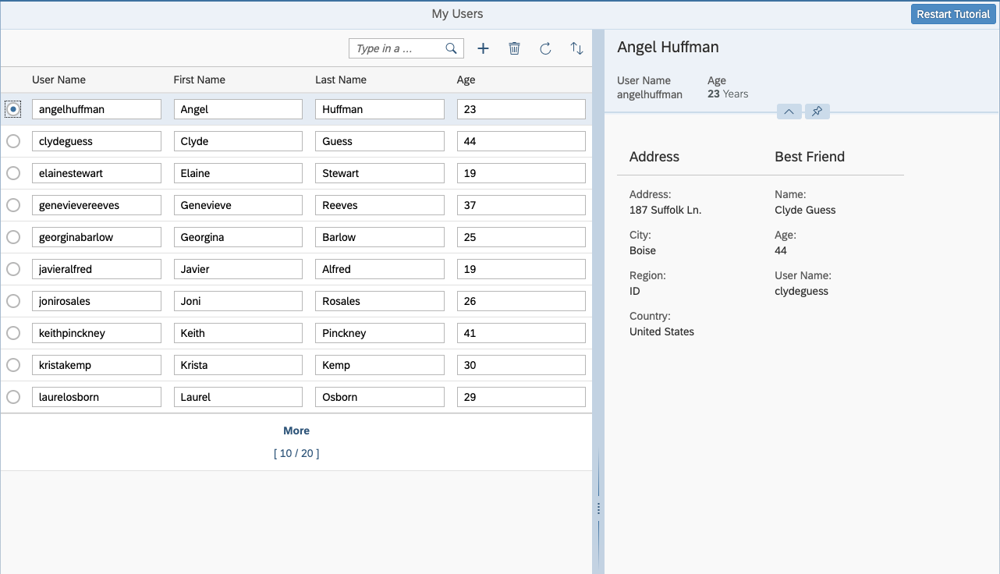

## Step 10: Enable Data Reuse

In this step we avoid unnecessary back-end requests by preventing the destruction of data shown in the detail area when sorting or filtering the list.

### Preview

**No visual change compared to the last step**



You can view this step live: [🔗 Live Preview of Step 10](https://ui5.github.io/tutorials/odatav4/build/10/index-cdn.html).

### Coding

You can download the solution for this step here: <span class="ts-only">[📥 Download step 10](https://ui5.github.io/tutorials/odatav4/odatav4-step-10.zip)<span class="lang-suffix"> (TS)</span></span><span class="js-only">[📥 Download step 10](https://ui5.github.io/tutorials/odatav4/odatav4-step-10-js.zip)<span class="lang-suffix"> (JS)</span></span>.

### webapp/controller/App.controller.ts/.js

```ts
// webapp/controller/App.controller.ts
...
		onMessageBindingChange(event: Event): void {
			...
		},

		onSelectionChange(event: Event<{ listItem: ColumnListItem }>): void {
			const listItem = event.getParameter("listItem");
			this._setDetailArea(listItem.getBindingContext() as Context);
		},
...
		/**
		 * Toggles the visibility of the detail area
		 * @param oUserContext - the current user context
		 */
		_setDetailArea(userContext?: Context): void {
			const detailArea = this.byId("detailArea") as Control;
			const layout = this.byId("defaultLayout") as SplitterLayoutData;
			const searchField = this.byId("searchField") as SearchField;

			if (!detailArea) {
				return; // do nothing during view destruction
			}

			const oldContext = detailArea.getBindingContext() as Context | null;
			if (oldContext && !oldContext.isTransient()) {
				oldContext.setKeepAlive(false);
			}
			if (userContext && !userContext.isTransient()) {
				userContext.setKeepAlive(true,
					// hide details if kept entity was refreshed but does not exist any more
					this._setDetailArea.bind(this));
			}
			detailArea.setBindingContext(userContext || null);
			// resize view
			detailArea.setVisible(!!userContext);
			layout.setSize(userContext ? "60%" : "100%");
			layout.setResizable(!!userContext);
			searchField.setWidth(userContext ? "40%" : "20%");
		}
 ...
```

```js
// webapp/controller/App.controller.js
...
    onMessageBindingChange(event) {
      ...
    },

    onSelectionChange(event) {
      const listItem = event.getParameter("listItem");
      this._setDetailArea(listItem.getBindingContext());
    },
...
    /**
     * Toggles the visibility of the detail area
     * @param oUserContext - the current user context
     */
    _setDetailArea(userContext) {
      const detailArea = this.byId("detailArea");
      const layout = this.byId("defaultLayout");
      const searchField = this.byId("searchField");
      if (!detailArea) {
        return; // do nothing during view destruction
      }
      const oldContext = detailArea.getBindingContext();
      if (oldContext && !oldContext.isTransient()) {
        oldContext.setKeepAlive(false);
      }
      if (userContext && !userContext.isTransient()) {
        userContext.setKeepAlive(true,
        // hide details if kept entity was refreshed but does not exist any more
        this._setDetailArea.bind(this));
      }
      detailArea.setBindingContext(userContext || null);
      // resize view
      detailArea.setVisible(!!userContext);
      layout.setSize(userContext ? "60%" : "100%");
      layout.setResizable(!!userContext);
      searchField.setWidth(userContext ? "40%" : "20%");
    }
 ...
```

We extend the logic of the `_setDetailArea` function. First, we check if there's an "old" binding context in the detail area. If so, the `keepAlive` for the old context is set to `false`.

For the new context we set `keepAlive` to `true` and add `_setDetailArea` as an `onBeforeDestroy` function to it, which hides the detail area when the user linked to it is deleted in the back end and the list is refreshed.

You can use the `Context#setKeepAlive` method to prevent the destruction of information shown in the detail area when the selected user is no longer part of the list from which the information was selected. This could otherwise happen if you filter or sort the list.

***

**Next:** [Step 11: Add Table with :n Navigation to Detail Area](../11/README.md)

**Previous:** [Step 9: List-Detail Scenario](../09/README.md)

***

**Related Information**

[Extending the Lifetime of a Context that is not Used Exclusively by a Table Collection](https://sdk.openui5.org/topic/648e360fa22d46248ca783dc6eb44531.html#loio648e360fa22d46248ca783dc6eb44531/section_ELC)
