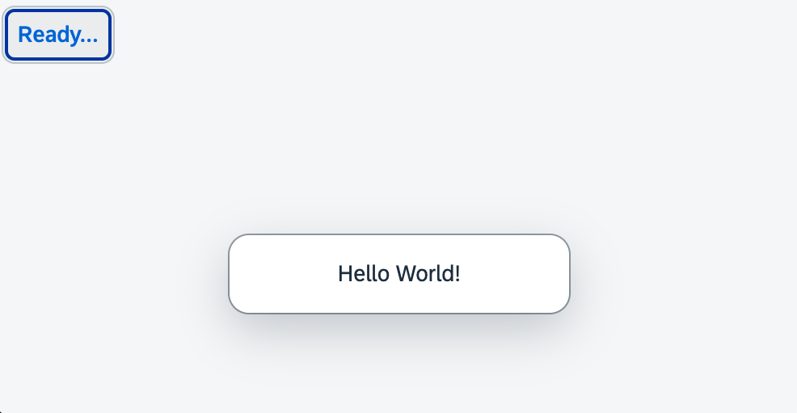

<nav class="tutorial-breadcrumb"><a href="../../../index.html">UI5 Tutorials</a> <span class="tutorial-breadcrumb-sep">&rsaquo;</span> <a href="../../index.html">Quickstart Tutorial</a></nav>

## Step 1: Ready...

Let's get you ready for your journey! We bootstrap OpenUI5 in an HTML page and implement a simple "Hello World" example.

&nbsp;

***

### Preview




You can access the live preview by clicking on this link: [🔗 Live Preview of Step 1](https://ui5.github.io/tutorials/quickstart/build/01/index-cdn.html).

***

### Coding

You can download the solution for this step here: <span class="ts-only">[📥 Download step 1](https://ui5.github.io/tutorials/quickstart-step-01.zip)<span class="lang-suffix"> (TS)</span></span><span class="js-only">[📥 Download step 1](https://ui5.github.io/tutorials/quickstart-step-01-js.zip)<span class="lang-suffix"> (JS)</span></span>.
***


### App root folder \(New\)

Create a folder on your local machine which will contain all the sources of the app we're going to build. We'll refer to this folder as the "app root folder".

### webapp \(New\)

Create a new folder named `webapp` in the app root folder. It will contain all the sources that become available in the browser later. We'll refer to this folder as the "webapp folder".

***

### webapp/index.html \(New\)

In our webapp folder, we create a new HTML file named `index.html` and copy the following content to it:


```html
<!DOCTYPE html>
<html>
	<head>
		<meta charset="utf-8">
		<title>Quickstart Tutorial</title>
		<script id="sap-ui-bootstrap"
			src="resources/sap-ui-core.js"
			data-sap-ui-libs="sap.m"
			data-sap-ui-compat-version="edge"
			data-sap-ui-async="true"
			data-sap-ui-on-init="module:ui5/tutorial/quickstart/index"
			data-sap-ui-resource-roots='{
				"ui5.tutorial.quickstart": "./"
			}'>
		</script>
	</head>
	<body class="sapUiBody" id="content"></body>
</html>
```


With the `script` tag, we load and initialize OpenUI5 with typical bootstrap parameters. We define, for example, a theme, control libraries, as well as performance and compatibility flags.
- The bootstrap property `resource-roots` defines the namespace for all resources of the app. This way, we can easily reference additional files that we are about to create in this step.
- The `index` module that we load with the `onInit` parameter will hold the application logic.
- The `body` tag is defined with the `sapUiBody` class and the `content` ID. This is where we will add the content of the app in the next steps.

***

### webapp/index.ts/.js \(New\)

In your `webapp` folder, create a new file `index.js` that will be called as soon as OpenUI5 is loaded and initialized. We load two UI controls - a button and a message toast - and place the button in the element with the `content` ID. The button is defined with a `text` property and a callback attached to its `press` event.


```ts
// webapp/index.ts
import Button from "sap/m/Button";
import MessageToast from "sap/m/MessageToast";

new Button({
	text: "Ready...",
	press() {
		MessageToast.show("Hello World!");
	}
}).placeAt("content");

```


```js
// webapp/index.js
sap.ui.define([
	"sap/m/Button",
	"sap/m/MessageToast"
], (Button, MessageToast) => {
	"use strict";

	new Button({
		text: "Ready...",
		press() {
			MessageToast.show("Hello World!");
		}
	}).placeAt("content");
});
```


***

### webapp/manifest.json \(New\)

Create a new file named `manifest.json` in the webapp folder; it's also known as the "app descriptor". All application-specific configuration options which we'll introduce in this tutorial will be added to this file. Enter the following content:


```json
{
  "_version": "2.8.0",
  "sap.app": {
    "id": "ui5.tutorial.quickstart"
  }
}
```


> 📝
> In this tutorial step, we focus on adding the absolute minimum configuration to the app descriptor file. In certain development environments you might encounter validation errors due to missing settings. However, for the purposes of this tutorial you can safely ignore these errors. In [Step 10: Descriptor for Applications](../10/index.html) we'll examine the purpose of the file in detail and configure some further options.

***

### Development Environment

The following steps are tailored for using this project with [UI5 CLI](https://ui5.github.io/cli/stable/pages/CLI/#local-vs-global-installation).

***

#### package.json \(New\)

Create a new file called `package.json` which will enable you to execute commands and consume packages from the[npm registry](https://www.npmjs.com/) via the npm command line interface.

Enter the following content:


```json
{
  "name": "ui5.tutorial.quickstart",
  "version": "1.0.0",
  "description": "The UI5 quickstart tutorial",
  "scripts": {
    "start": "ui5 serve -o index.html"
  }
}

```


<details class="ts-only" markdown="1">

#### TypeScript Setup

To work with TypeScript, we must install it in our project. To do this, we execute the following command in the terminal:



```sh
npm install typescript --save-dev
```


By running this command, npm will download the TypeScript package from the npm registry and install it in our project's "node_modules" directory. It will also add an entry for TypeScript in the "devDependencies" section of our package.json file, so that other developers working on the project can easily install the same version of TypeScript.


##### tsconfig.json \(New\)

As a next step, we need to create the file `tsconfig.json` in the app root directory to indicate that this folder is the root of a TypeScript project. This file specifies various compiler options and project settings that affect how TypeScript code is compiled into JavaScript.

We specify the compiler options as follow:



```json
{
  "compilerOptions": {
  "target": "es2023",
  "types": [
    "@openui5/types"
  ],
  "skipLibCheck": true,
  "allowJs": true,
  "strictPropertyInitialization": false,
  "rootDir": "./webapp",
  "paths": {
    "ui5/tutorial/quickstart/*": [
    "./webapp/*"
    ]
  }
  },
  "include": [
  "./webapp/**/*"
  ]
}
```



Let's go through the compiler options specified in the file:

- `"target": "es2023"`: The `target` parameter sets the JavaScript language level that the TypeScript code should be compiled down to. We set it to `es2023`, which means the generated JavaScript code is compatible with ECMAScript 2023.

- `"types": ["@openui5/types"]`: The `types` parameter defines the types used for TypeScript code. We configure this parameter to use the OpenUI5 types delivered by the `@openui5/types` package.

- `"skipLibCheck": true`: When the `skipLibCheck` parameter is set to `true`, it tells the compiler to skip type checking of declaration files (`.d.ts` files) that are part of external libraries. This can improve compilation speed.

- `"allowJs": true`: The `allwJs` parameter allows JavaScript files to be included in the TypeScript project. This option enables TypeScript to compile JavaScript code along with TypeScript code.

- `"strictPropertyInitialization": false`: The `strictPropertyInitialization` parameter is a specific type of strict check that ensures that each instance property of a class gets initialized in the constructor body, or by a property initializer. By setting this to false, it disables strict checking of uninitialized class properties. This means that class properties can be left uninitialized or assigned the value `undefined` without causing a compiler error.

- `"rootDir": "./webapp"`: The `rootDir` parameter specifies the root directory of the TypeScript source files. The compiler considers this directory as the starting point for resolving file paths. We set it to our `webapp` folder.

- `"paths": { "ui5/tutorial/quickstart/*": ["./webapp/**/*"] }`: The `path` paramter specifies path mappings for module resolution. It allows you to define custom module paths that map to specific directories or files. In this case, it maps the module path `ui5/tutorial/quickstart/*`.

- `"include": [ "./webapp/**/*" ]`: Specifies an array of filenames or patterns to include in TypeScript compilation. 

***

</details>

### UI5 CLI

Next, we install the UI5 CLI and add it as development dependency to our project. For this, we open a terminal in the app root folder and execute the following command:


```sh
npm install --save-dev @ui5/cli
```


Finally, we initialize the UI5 CLI configuration for our project by executing the following command on the app root folder: 


```sh
ui5 init
```


This will generate a `ui5.yaml` file in the app root directory, which is essential for using UI5 CLI with our project.
&nbsp;

To use OpenUI5, execute the following command:


```sh
ui5 use OpenUI5
```


To install the required OpenUI5 libraries, execute the following command:


```sh
ui5 add sap.m sap.tnt sap.ui.core sap.ui.layout themelib_sap_horizon
```


Let's enhance our tooling setup once again by installing some custom middleware for the ui5-server. This will help us handle our development project more efficiently.

We open a terminal and navigate to the root folder of our app. Then, we execute the following command:

<details class="ts-only" markdown="1">


```sh
npm install ui5-middleware-livereload ui5-middleware-serveframework ui5-tooling-transpile --save-dev
```

</details>

<details class="js-only" markdown="1">


```sh
npm install ui5-middleware-livereload ui5-middleware-serveframework --save-dev
```

</details>

When you run the command, npm will download the specified packages from the npm registry and store them in a folder called `node_modules` within your project directory. The `--save-dev` flag instructs npm to save these packages as development dependencies in the `devDependencies` section of the `package.json` file. Development dependencies are packages that are only needed during development and not in production. By separating them from production dependencies, we can keep our project clean and ensure that only the required packages are included when deploying the application.

Let's break down what each package does:

-	`ui5-middleware-livereload` is a middleware plugin for the UI5 CLI that enables live reloading of your application in the browser. Live-reloading means that whenever you make changes to your code, the browser automatically refreshes and displays the updated version without requiring manual refreshes (e.g. upon *Save*).

-	`ui5-middleware-serveframework` is another middleware plugin for the UI5 CLI that provides a web server to serve your OpenUI5 project during development. It allows you to easily serve the necessary OpenUI5 libraries and resources required by your application from your development environment.

<details class="ts-only" markdown="1">

- `ui5-tooling-transpile` is a plugin for the UI5 CLI that transpiles modern JavaScript (ES6+) and TypeScript into a compatible version for OpenUI5. OpenUI5 is based on older versions of JavaScript, so this plugin allows you to take advantage of the latest language features and syntax while ensuring that your code remains compatible with OpenUI5.

</details>

#### ui5.yaml

Next, we have to configure the tooling extension we installed from npm to our UI5 CLI setup, so we can use it in our project. To hook a custom task into a certain build phase of a project, it needs to reference another task that will get executed before or after it. The same applies for a custom middleware:
<details class="ts-only" markdown="1">

-   For the `ui5-tooling-transpile-task` we specify that this should happen after the`replaceVersion` task.

</details>

-   All our custom middleware extensions will be called after the `compression` middleware.

> ℹ️
> Middleware configurations are applied in the order in which they are defined. 

<details class="ts-only" markdown="1">


```yaml
builder:
  customTasks:
  - name: ui5-tooling-transpile-task
    afterTask: replaceVersion
server:
  customMiddleware:
  - name: ui5-tooling-transpile-middleware
    afterMiddleware: compression
  - name: ui5-middleware-serveframework
    afterMiddleware: compression
  - name: ui5-middleware-livereload
    afterMiddleware: compression
```

Now you can benefit from live reload on changes, built framework resources at development time, and make use of TypeScript in OpenUI5.

</details>

<details class="js-only" markdown="1">


```yaml
server:
  customMiddleware:
  - name: ui5-middleware-serveframework
    afterMiddleware: compression
  - name: ui5-middleware-livereload
    afterMiddleware: compression
```

Now you can benefit from live reload on changes and built framework resources at development time.

</details>

<br>
> 📝
> During its initial run, the `ui5-middleware-serveframework` middleware will build the framework, which can take a while. In all following steps, the build will not happen again and the framework is served from the built resources.

&nbsp;

To start the web server and to open a new browser window hosting your newly created `index.html`, execute the following command:


```sh
npm start 
```


***

### Conventions

-   The `index.html` file is located in the `webapp` folder.

&nbsp;

***

**Next:** [Step 2: Steady...](../02/index.html)

***

**Related Information**  

[Descriptor for Applications, Components, and Libraries \(manifest.json\)](https://sdk.openui5.org/topic/be0cf40f61184b358b5faedaec98b2da.html "The descriptor for applications, components, and libraries (in short: app descriptor) is inspired by the WebApplication Manifest concept introduced by the W3C. The descriptor provides a central, machine-readable, and easy-to-access location for storing metadata associated with an application, an application component, or a library.")

[ui5-manifest](https://github.com/SAP/ui5-manifest/tree/main)

[Development Environment](https://sdk.openui5.org/topic/7bb04e05f9484e1b95b38a2e48ecef4f.html "This part of the documentation introduces you to some common and recommended use cases for the installation, configuration, and setup of OpenUI5 development environments.")

[App Development](https://sdk.openui5.org/topic/b1fbe1a22f8d4a5bbb601591e27b68d1 "There are several ways to develop OpenUI5 applications. Select the one that meets the requirements of your projects and your expectations best.")

[UI5 CLI: Getting Started](https://ui5.github.io/cli/stable/pages/GettingStarted/)
