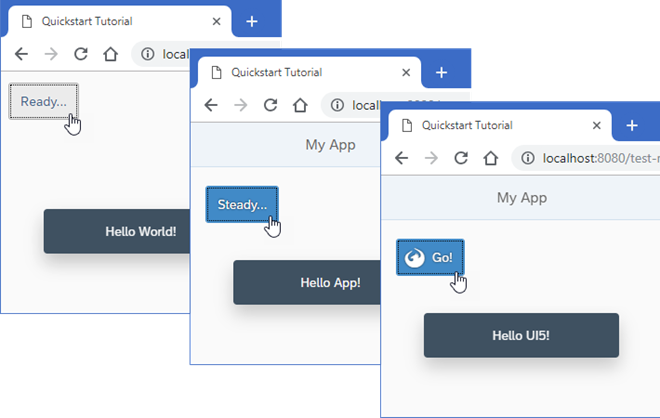

# Quickstart Tutorial

In this tutorial we'll get you up and running with OpenUI5 quickly with a hands-on first app.

## Description

We set up the development environment and bootstrap OpenUI5 in an HTML page with a simple "Hello World" button. We then extend the app to follow the "Model-View-Controller" pattern by introducing an XML view and a controller. Finally, we add a second page and showcase key OpenUI5 concepts like data binding, JSON models, and navigation in action.

### Preview

### Steps

The tutorial consists of the following steps. To start, just open the first link - you'll be guided from there. Each step also has a download link so you can jump in at any point with the complete code from the previous step, then run `npm install` and `npm start` in the unzipped folder.

- **[Step 1: Ready...](steps/01/index.html)** — Let's get you ready for your journey! We bootstrap OpenUI5 in an HTML page and implement a simple "Hello World" example. ([🔗 Live Preview](https://ui5.github.io/tutorials/quickstart/build/01/index-cdn.html) \| [📥 Download Solution](https://ui5.github.io/tutorials/quickstart/quickstart-step-01.zip) (TS)[📥 Download Solution](https://ui5.github.io/tutorials/quickstart/quickstart-step-01-js.zip) (JS) )
- **[Step 2: Steady...](steps/02/index.html)** — Now we extend our minimalist HTML page to a basic app with a view and a controller. ([🔗 Live Preview](https://ui5.github.io/tutorials/quickstart/build/02/index-cdn.html) \| [📥 Download Solution](https://ui5.github.io/tutorials/quickstart/quickstart-step-02.zip) (TS)[📥 Download Solution](https://ui5.github.io/tutorials/quickstart/quickstart-step-02-js.zip) (JS) )
- **[Step 3: Go!](steps/03/index.html)** — Finally, we add a second page to our app and showcase key OpenUI5 concepts like navigation, data binding, and JSON models in a hand-on playground. ([🔗 Live Preview](https://ui5.github.io/tutorials/quickstart/build/03/index-cdn.html) \| [📥 Download Solution](https://ui5.github.io/tutorials/quickstart/quickstart-step-03.zip) (TS)[📥 Download Solution](https://ui5.github.io/tutorials/quickstart/quickstart-step-03-js.zip) (JS) )

## License

Copyright (c) 2026 SAP SE or an SAP affiliate company. All rights reserved. This project is licensed under the Apache Software License, version 2.0 except as noted otherwise in the [LICENSE](https://github.com/UI5/tutorials/blob/-/LICENSE) file.
