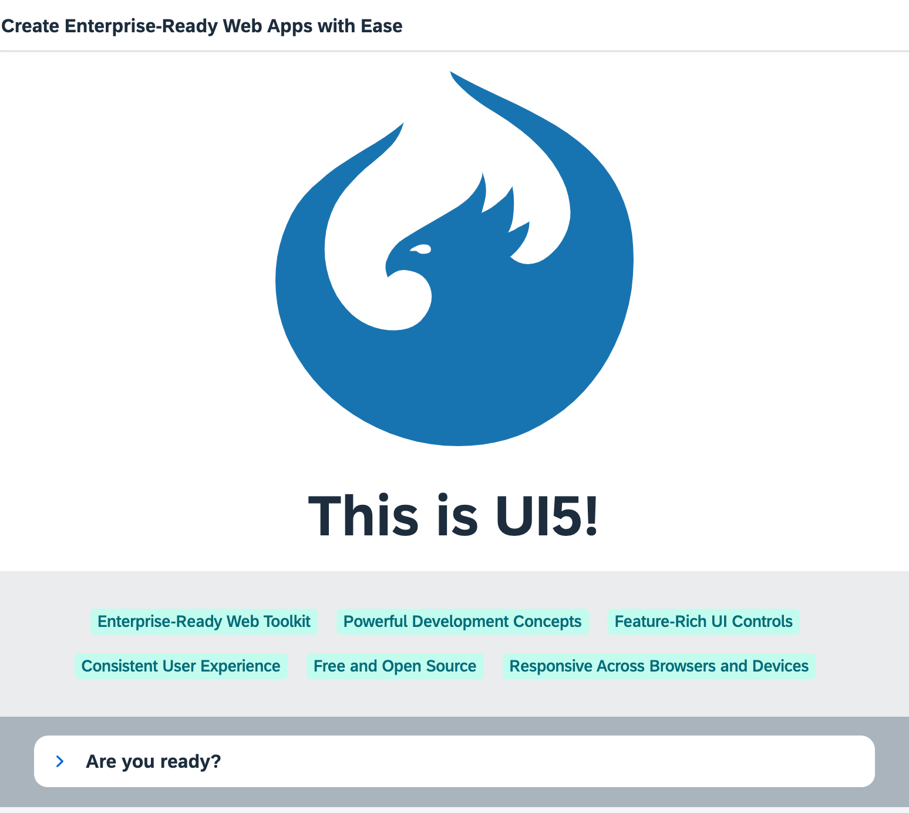

## Step 3: Go!

Finally, we add a second page to our app showcasing some of the key OpenUI5 concepts.

&nbsp;

***

### Preview




You can access the live preview by clicking on this link: [🔗 Live Preview of Step 3](https://ui5.github.io/tutorials/quickstart/build/03/index-cdn.html).

***

### Coding

You can download the solution for this step here: <span class="ts-only">[📥 Download step 3](https://ui5.github.io/tutorials/quickstart-step-03.zip)<span class="lang-suffix"> (TS)</span></span><span class="js-only">[📥 Download step 3](https://ui5.github.io/tutorials/quickstart-step-03-js.zip)<span class="lang-suffix"> (JS)</span></span>.
***


### webapp/index.html

Let's spice up our app by adding some more UI controls. We add two more libraries in the bootstrap tag: `sap.ui.layout` and `sap.tnt`.


```html
<!DOCTYPE html>
<html>
<head>
	<meta charset="utf-8">
	<title>Quickstart Tutorial</title>
	<script id="sap-ui-bootstrap"
		src="resources/sap-ui-core.js"
		data-sap-ui-libs="sap.m, sap.ui.layout, sap.tnt"
		data-sap-ui-compat-version="edge"
		data-sap-ui-async="true"
		data-sap-ui-on-init="module:ui5/tutorial/quickstart/index"
		data-sap-ui-resource-roots='{
			"ui5.tutorial.quickstart": "./"
		}'>
	</script>
</head>
<body class="sapUiBody" id="content"></body>
</html>
```


> 💡
> To browse all available controls and libraries, see the [Samples](https://sdk.openui5.org/#/controls). 

### webapp/App.view.xml

We also define the two new libraries in the `View` tag and give them a meaningful prefix. To the `App` control, we will assign an ID so that the controller can easily identify it The button now receives an icon and triggers our navigation to page two. Therefore, we change the text to "Go!".

Copy the second `Page` control with all its content into the view. It is defined with the `intro` ID and a new title. It contains several new UI controls like a `BlockLayout`, an `Icon`, and a `Panel`.

We use essential OpenUI5 concepts like navigation, data binding, and user interaction to define a nice playground on the second page of our app.

Don't worry too much about the details, we will explain them in the next tutorials.


```xml
<mvc:View
  controllerName="ui5.tutorial.quickstart.App"
  displayBlock="true"
  xmlns="sap.m"
  xmlns:mvc="sap.ui.core.mvc"
  xmlns:l="sap.ui.layout"
  xmlns:core="sap.ui.core"
  xmlns:tnt="sap.tnt">
  <App id="app">
    <Page title="My App">
      <Button
        icon="sap-icon://sap-ui5"
        text="Go!"
        press=".onPress"
        type="Emphasized"
        class="sapUiSmallMargin"/>
    </Page>
    <Page id="intro" title="Create Enterprise-Ready Web Apps with Ease">
      <l:BlockLayout background="Light">
        <l:BlockLayoutRow>
          <l:BlockLayoutCell>
            <core:Icon color="#1873B4" src="sap-icon://sap-ui5" size="20rem" class="sapUiMediumMarginBottom" width="100%"/>
            <Title level="H1" titleStyle="H1" text="This is UI5!" width="100%" textAlign="Center"/>
          </l:BlockLayoutCell>
        </l:BlockLayoutRow>
        <l:BlockLayoutRow>
          <l:BlockLayoutCell>
            <FlexBox items="{/features}" justifyContent="Center" wrap="Wrap" class="sapUiSmallMarginBottom">
              <tnt:InfoLabel text="{}" class="sapUiSmallMarginTop sapUiSmallMarginEnd"/>
            </FlexBox>
          </l:BlockLayoutCell>
        </l:BlockLayoutRow>

        <l:BlockLayoutRow>
          <l:BlockLayoutCell>
            <Panel headerText="Are you ready?" expandable="true">
              <Switch change=".onChange" customTextOn="yes" customTextOff="no"/>
              <l:HorizontalLayout id="ready" visible="false" class="sapUiSmallMargin">
                <Text text="Ok, let's get you started!" class="sapUiTinyMarginEnd"/>
                <Link text="Learn more" href="https://sdk.openui5.org/"/>
              </l:HorizontalLayout>
            </Panel>
          </l:BlockLayoutCell>
        </l:BlockLayoutRow>
      </l:BlockLayout>
    </Page>

  </App>
</mvc:View>
```



### webapp/App.controller.ts/.js

The `onPress` function now also triggers the navigation to the `intro` page. We fetch the `app` control by its ID and instruct it to navigate by calling the `to` method.

The `onInit` method is a lifecycle hook that is called automatically when the controller is initialized. It defines a simple JSON model with some texts located at the `features` key.

We display these texts on the second page using data binding. The `InfoLabel` tag from our view is a template that is repeated as many times as we have entries in our model.

Finally, we make the Panel in the lower part of the view interactive by attaching an `onChange` event to the switch defined there. OpenUI5 comes with a large set of feature-rich controls that you can combine as you need.


```ts
// webapp/App.controller.ts
import Controller from "sap/ui/core/mvc/Controller";
import MessageToast from "sap/m/MessageToast";
import JSONModel from "sap/ui/model/json/JSONModel";
import App from "sap/m/App";
import HorizontalLayout from "sap/ui/layout/HorizontalLayout";
import { Switch$ChangeEvent } from "sap/m/Switch";

export default class AppController extends Controller {
	onPress(): void {
		MessageToast.show("Hello UI5!");
		(this.byId("app") as App).to(this.byId("intro") as App);
	}

	onInit(): void {
		this.getView()!.setModel(new JSONModel({
			features: [
				"Enterprise-Ready Web Toolkit",
				"Powerful Development Concepts",
				"Feature-Rich UI Controls",
				"Consistent User Experience",
				"Free and Open Source",
				"Responsive Across Browsers and Devices"
			]
		}));
	}

	onChange(oEvent: Switch$ChangeEvent): void {
		const bState = oEvent.getParameter("state");
		(this.byId("ready") as HorizontalLayout).setVisible(bState);
	}
}

```


```js
// webapp/App.controller.js
sap.ui.define([
	"sap/ui/core/mvc/Controller",
	"sap/m/MessageToast",
	"sap/ui/model/json/JSONModel"
], (Controller, MessageToast, JSONModel) => {
	"use strict";

	return Controller.extend("ui5.tutorial.quickstart.App", {
		onPress() {
			MessageToast.show("Hello UI5!");
			this.byId("app").to(this.byId("intro"));
		},

		onInit() {
			this.getView().setModel(new JSONModel({
					features: [
						"Enterprise-Ready Web Toolkit",
						"Powerful Development Concepts",
						"Feature-Rich UI Controls",
						"Consistent User Experience",
						"Free and Open Source",
						"Responsive Across Browsers and Devices"
					]
				})
			);
		},

		onChange(oEvent) {
			const bState = oEvent.getParameter("state");
			this.byId("ready").setVisible(bState);
		}
	});

});
```


You now have a little playground in your app that you can modify and extend as you wish. We intentionally did not go into all the details. If you want to know more, just continue with the Walkthrough tutorial.

Have fun with OpenUI5!

***

**Related Information** 

[Working with Controls](https://sdk.openui5.org/topic/91f0a22d6f4d1014b6dd926db0e91070 "Controls are used to define the appearance and behavior of screen areas.")

[Data Binding](https://sdk.openui5.org/topic/68b9644a253741e8a4b9e4279a35c247 "You use data binding to bind UI elements to data sources to keep the data in sync and allow data editing on the UI.")

[Routing and Navigation](https://sdk.openui5.org/topic/3d18f20bd2294228acb6910d8e8a5fb5 "OpenUI5 offers hash-based navigation, which allows you to build single-page apps where the navigation is done by changing the hash. In this way the browser does not have to reload the page; instead there is a callback to which the app and especially the affected view can react. A hash string is parsed and matched against patterns which will then inform the handlers.")
