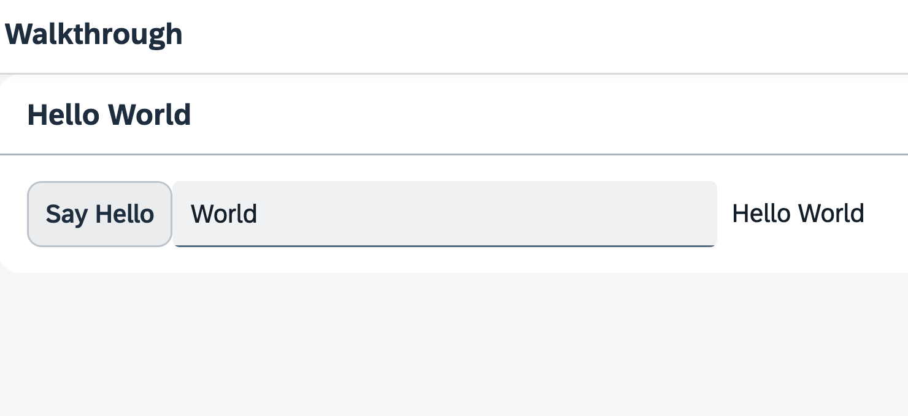

## Step 11: Pages and Panels

After all the work on the app structure it’s time to improve the look of our app. We will use two controls from the `sap.m` library to add a bit more "bling" to our UI. You will also learn about control aggregations in this step.

&nbsp;

***

### Preview

  

<sup>*A panel is now displaying the controls from the previous steps*</sup>

You can access the live preview by clicking on this link: [🔗 Live Preview of Step 11](https://sap-samples.github.io/ui5-typescript-walkthrough/build/11/index-cdn.html).

Download solution for step 11 in [📥 TypeScript](https://sap-samples.github.io/ui5-typescript-walkthrough/ui5-typescript-walkthrough-step-11.zip) or [📥 JavaScript](https://sap-samples.github.io/ui5-typescript-walkthrough/ui5-typescript-walkthrough-step-11-js.zip).
***

### Coding

### webapp/i18n/i18n.properties

We add new key/value pairs to the '# Hello Panel' section of our text bundle for the start page title and the panel title.

```ini
# Manifest
appTitle=Hello World
appDescription=A simple walkthrough app that explains the most important concepts of OpenUI5

# Hello Panel
showHelloButtonText=Say Hello
helloMsg=Hello {0}
homePageTitle=UI5 TypeScript Walkthrough
helloPanelTitle=Hello World
```
***

### webapp/view/App.view.xml

In your App view, we put both the input field and the button inside a containing control called `sap/m/Page`. The page provides an aggregation to `0..N` other controls called `content`. It also displays the title attribute in a header section on top of the content. The page itself is placed into the `pages` aggregation of another control called `sap/m/App`.

In order to make the fullscreen height of the view work properly, we add the `displayBlock` attribute with the value `true` to the view. The actual content is wrapped inside a `Panel` control, in order to group related content. It displays the `headerText` attribute in a header section on top of the panel.

```xml
<mvc:View
   controllerName="ui5.walkthrough.controller.App"
   xmlns="sap.m"
   xmlns:mvc="sap.ui.core.mvc"
   displayBlock="true">
   <App>
      <pages>
         <Page title="{i18n>homePageTitle}">
            <content>
               <Panel
                  headerText="{i18n>helloPanelTitle}">
                  <content>
                     <Button
                        text="{i18n>showHelloButtonText}"
                        press=".onShowHello"/>
                     <Input
                        value="{/recipient/name}"
                        description="Hello {/recipient/name}"
                        valueLiveUpdate="true"
                        width="60%"/>
                  </content>
               </Panel>
            </content>
         </Page>
      </pages>
   </App>
</mvc:View>

```

The `App` control does the following important things for us:
-   It writes a bunch of properties into the header of the `index.html` that are necessary for proper display on mobile devices.
-   It offers functionality to navigate between pages with animations. We will use this soon.

> 📝 **Note:** <br>
> The `sap/m/Page` control used here is one of the most popular view-level containers in OpenUI5. However, OpenUI5 applications are used in different environments: they can be embedded within shells that come with their own header (like e.g. SAP Build Work Zone or the SAP Fiori launchpad). Or they are displayed stand-alone without such a shell around them. This has implications on how the header area of a OpenUI5 application should look:
> - A stand-alone OpenUI5 application could use a `sap/m/Page` control as root control of its views. This Page control provides a visually distinguished header bar with a title and has a built-in "back" button using which the user can navigate back to the previous page. (This back button can be enabled by setting the Page’s `showNavButton` property to `true`.)
> - When, on the other hand, a containing shell already comes with a header that has a "back" button and a title, then using `sap/m/Page` controls will lead to duplicate headers (and possibly even duplicate back buttons). The `sap/f/DynamicPage` control would be a preferred alternative in such a scenario, as it comes without a header bar and back button, but still offers the option to configure a title if needed – and many other features on top of a plain `sap/m/Page`. Further alternatives are `sap/f/semantic/SemanticPage` and `sap/uxap/ObjectPageLayout`, depending on the use-case. Note that they are part of other control libraries than sap.m, so you might need to add the respective library to your application setup. For some scenarios, the `sap/tnt/ToolPage` may be another alternative. But also the `sap/m/Page` can be configured to have its header hidden.

> So while this tutorial uses a `sap/m/Page`, it's important to be aware of the above considerations when developing applications. For further guidance, refer to the [SAP Fiori for Web Design Guidelines regarding Page Layouts and Floorplans](https://experience.sap.com/fiori-design-web/floorplan-overview/).  


&nbsp;

***

**Next:** [Step 12: Shell Control as Container](../12/README.md "Now we use a shell control as container for our app and use it as our new root element. The shell takes care of visual adaptation of the application to the device’s screen size by introducing a so-called letterbox on desktop screens.")

**Previous:** [Step 10: Manifest (Descriptor for Applications)](../10/README.md "All application-specific configuration settings will now further be put into the manifest. This clearly separates the application coding from the configuration settings and makes our app even more flexible.")

***

**Related Information**  

[API Reference: `sap.m.Panel`](https://sdk.openui5.org/api/sap.m.Panel)

[Samples: `sap.m.Panel` ](https://sdk.openui5.org/entity/sap.m.Panel)

[API Reference: `sap.m.Page`](https://sdk.openui5.org/api/sap.m.Page)

[Samples: `sap.m.Page` ](https://sdk.openui5.org/entity/sap.m.Page)
