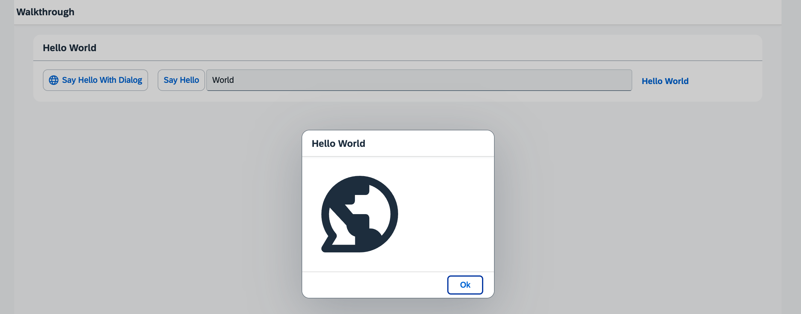

## Step 18: Icons

Our dialog is still pretty much empty. Since OpenUI5 is shipped with a large icon font that contains more than 500 icons, we will add an icon to greet our users when the dialog is opened.

&nbsp;

***

### Preview
  


<sup>*An icon is now displayed in the dialog box*</sup>

You can access the live preview by clicking on this link: [🔗 Live Preview of Step 18](https://sap-samples.github.io/ui5-typescript-walkthrough/build/18/index-cdn.html).

Download solution for step 15 in [📥 TypeScript](https://sap-samples.github.io/ui5-typescript-walkthrough/ui5-typescript-walkthrough-step-18.zip) or [📥 JavaScript](https://sap-samples.github.io/ui5-typescript-walkthrough/ui5-typescript-walkthrough-step-18-js.zip).

***

### Coding

### webapp/view/HelloPanel.view.xml

We add an icon to the button that opens the dialog. The `sap-icon://` protocol is indicating that an icon from the *SAP icon font* should be loaded. The identifier `world` is the readable name of the icon in the icon font.

```xml
<mvc:View
   controllerName="ui5.walkthrough.controller.HelloPanel"
   xmlns="sap.m"
   xmlns:mvc="sap.ui.core.mvc">
   <Panel
      headerText="{i18n>helloPanelTitle}"
      class="sapUiResponsiveMargin"
      width="auto" >
      <content>
         <Button
            id="helloDialogButton"
            icon="sap-icon://world"
            text="{i18n>openDialogButtonText}"
            press=".onOpenDialog"
            class="sapUiSmallMarginEnd"/>
         <Button
            text="{i18n>showHelloButtonText}"
            press=".onShowHello"
            class="myCustomButton"/>
         <Input
            value="{/recipient/name}"
            valueLiveUpdate="true"
            width="60%"/>
         <FormattedText
            htmlText="Hello {/recipient/name}"
            class="sapUiSmallMargin sapThemeHighlight-asColor myCustomText"/>
      </content>
   </Panel>
</mvc:View>
```

>💡 **Tip:** <br>
> You can look up other icons using the [Icon Explorer tool](https://sdk.openui5.org/test-resources/sap/m/demokit/iconExplorer/webapp/index.html).
> To call any icon, use its name as listed in the *Icon Explorer* in <code>sap-icon://<i>&lt;iconname&gt;</i></code>.

***

### webapp/view/HelloDialog.fragment.xml

In the dialog fragment, we add an icon control to the content aggregation of the dialog. Luckily, the icon font also comes with a “Hello World” icon that is perfect for us here. We also define the size of the icon to `8rem` and set a medium margin on it.

```xml
<core:FragmentDefinition
   xmlns="sap.m"
   xmlns:core="sap.ui.core" >
   <Dialog
      id="helloDialog"
      title="Hello {/recipient/name}">
      <content>
         <core:Icon
            src="sap-icon://hello-world"
            size="8rem"
            class="sapUiMediumMargin"/>
      </content>
      <beginButton>
         <Button
            text="{i18n>dialogCloseButtonText}"
            press=".onCloseDialog"/>
      </beginButton>
   </Dialog>
</core:FragmentDefinition>
```

***

### Conventions

-   Always use icon fonts rather than images wherever possible, as they are scalable without quality loss \(vector graphics\) and do not need to be loaded separately.

&nbsp;

***

**Next:** Step 19: [Aggregation Binding](../19/README.md "Now that we have established a good structure for our app, it's time to add some more functionality. We start exploring more features of data binding by adding some invoice data in JSON format that we display in a list below the panel.")

**Previous** Step 17: [Fragment Callbacks](../17/README.md "Now that we have integrated the dialog, it's time to add some user interaction. The user will definitely want to close the dialog again at some point, so we add a button to close the dialog and assign an event handler.")

***

**Related Information**

[Icon and Icon Pool](https://sdk.openui5.org/topic/21ea0ea94614480d9a910b2e93431291 "The sap-icon:// protocol supports the use of icons in your application based on the icon font concept, which uses an embedded font instead of a pixel image.")

[API Reference: `sap.ui.core.Icon`](https://sdk.openui5.org/#/api/sap.ui.core.Icon)

[Samples: `sap.ui.core.Icon` ](https://sdk.openui5.org/#/entity/sap.ui.core.Icon)

