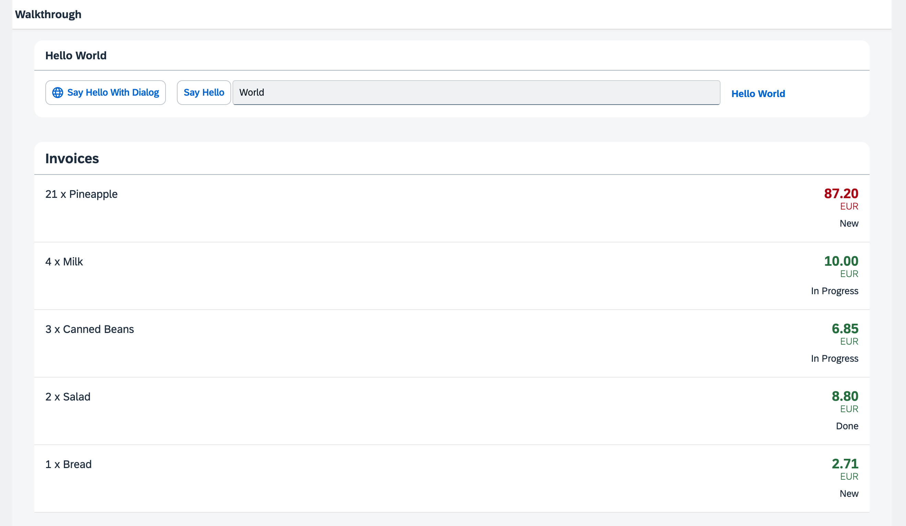

## Step 22: Custom Formatters

If we want to do a more complex logic for formatting properties of our data model, we can also write a custom formatting function. We will now add a localized status with a custom formatter, because the status in our data model is in a rather technical format.

&nbsp;

***

### Preview
  


<sup>*A status is now displayed with a custom formatter*</sup>

You can access the live preview by clicking on this link: [🔗 Live Preview of Step 22](https://sap-samples.github.io/ui5-typescript-walkthrough/build/22/index-cdn.html).

***

### Coding

<details class="ts-only">

You can download the solution for this step here: [📥 Download step 22](https://sap-samples.github.io/ui5-typescript-walkthrough/ui5-typescript-walkthrough-step-22.zip).

</details>

<details class="js-only">

You can download the solution for this step here: [📥 Download step 22](https://sap-samples.github.io/ui5-typescript-walkthrough/ui5-typescript-walkthrough-step-22-js.zip).

</details>
***

### webapp/i18n/i18n.properties

We will add three new entries to the resource bundle that reflect translated status texts 'New', 'In Progess', and 'Done'. We will use these texts to format the status values 'A', 'B', and 'C' of our invoices when displayed in the invoice list view.


### webapp/i18n/i18n.properties

```ini
...
# Invoice List
invoiceListTitle=Invoices
invoiceStatusA=New
invoiceStatusB=In Progress
invoiceStatusC=Done
```

### webapp/model/formatter.?s \(New\)

We will create a formatter function to transform status codes into user-friendly text labels. 

We create a file named `formatter.?s` within the `model` folder. This module contains the `statusText` function which takes a status code as input, retrieves the corresponding descriptive text from the resource bundle, and returns it. If no matching text is found in the resource bundle, or if the resource bundle can't be found, the function returns the original status code itself.

```ts
import ResourceBundle from "sap/base/i18n/ResourceBundle";
import Controller from "sap/ui/core/mvc/Controller";
import ResourceModel from "sap/ui/model/resource/ResourceModel";

export default  {
    statusText: function (this: Controller, status: string): string | undefined {
        const resourceBundle = (this?.getOwnerComponent()?.getModel("i18n") as ResourceModel)?.getResourceBundle() as ResourceBundle;
        switch (status) {
            case "A":
                return resourceBundle.getText("invoiceStatusA");
            case "B":
                return resourceBundle.getText("invoiceStatusB");
            case "C":
                return resourceBundle.getText("invoiceStatusC");
            default:
                return status;
        }
    }
};

```

```js
sap.ui.define([], function () {
  "use strict";

  return {
    statusText: function (status) {
      const resourceBundle = this?.getOwnerComponent()?.getModel("i18n")?.getResourceBundle();
      switch (status) {
        case "A":
          return resourceBundle.getText("invoiceStatusA");
        case "B":
          return resourceBundle.getText("invoiceStatusB");
        case "C":
          return resourceBundle.getText("invoiceStatusC");
        default:
          return status;
      }
    }
  };
});

```
&nbsp;
This time we do not extend from any base object but just return an object with our `formatter` functions inside.

The new `formatter` file is placed in the model folder of the app, because formatters are working on data properties and format them for display on the UI. 

&nbsp;

>📌 **Important:** <br>
> In the above example, `this` refers to the controller instance as soon as the formatter gets called. We access the resource bundle via the component using `this.getOwnerComponent().getModel()` instead of using `this.getView().getModel()`. The latter call might return `undefined`, because the view might not have been attached to the component yet, and thus the view can't inherit a model from the component.

**Additional Information:**

-   [API Reference: `sap.ui.core.mvc.Controller#getOwnerComponent`](https://sdk.openui5.org/#/api/sap.ui.core.mvc.Controller/methods/getOwnerComponent). 
-   [API Reference: `sap.ui.core.mvc.Controller#onInit`](https://sdk.openui5.org/#/api/sap.ui.core.mvc.Controller/methods/onInit). 

### webapp/view/InvoiceList.view.xml

We add the `ObjectStatus` control to our `ObjectListItem` using the `firstStatus` aggregation. We bind the control not only to the technical status but also to the `statusText` function in our formatter to displaly the human-readable texts per invoice we specified in our resource bundle.

```xml
<mvc:View
   controllerName="ui5.walkthrough.controller.InvoiceList"
   xmlns="sap.m"
   xmlns:core="sap.ui.core"
   xmlns:mvc="sap.ui.core.mvc">
   <List
      headerText="{i18n>invoiceListTitle}"
      class="sapUiResponsiveMargin"
      width="auto"
      items="{invoice>/Invoices}" >
      <items>
         <ObjectListItem
            core:require="{
               Currency: 'sap/ui/model/type/Currency'
            }"
            title="{invoice>Quantity} x {invoice>ProductName}"
            number="{
               parts: [
                  'invoice>ExtendedPrice', 
                  'view>/currency'
               ],
               type: 'Currency',
               formatOptions: {
                  showMeasure: false
               }
            }"
            numberUnit="{view>/currency}"
            numberState="{= ${invoice>ExtendedPrice} > 50 ? 'Error' : 'Success' }">
            <firstStatus>
               <ObjectStatus
                  core:require="{
                     Formatter: 'ui5/walkthrough/model/formatter'
                  }"
                  text="{
                     path: 'invoice>Status',
                     formatter: 'Formatter.statusText.bind($controller)'
                  }"
               />
            </firstStatus>
         </ObjectListItem>
      </items>
   </List>
</mvc:View>
```
&nbsp;
We used the `require` attribute with the namespace URI `sap.ui.core`, for which the prefix `core` is already defined in our XML view. This allows us to write the attribute as `core:require`. We then added our custom formatter module to the list of required modules and assigned it the alias `Formatter`, making it available for use within the view.

in the `ObjectStatus` control we defined our alias `Formatter` that holds our formatter functions, so we can access our function by `Formatter.statusText`. When called, we want the `this` context to be set to the controller instance of the current view. To achieve this, we used `.bind($controller)`.

&nbsp; 
 
***

**Next:** [Step 23: Filtering](../23/README.md "In this step, we add a search field for our product list and define a filter that represents the search term. When searching, the list is automatically updated to show only the items that match the search term.")

**Previous:** [Step 21: Expression Binding](../21/README.md "Sometimes the predefined types of OpenUI5 are not flexible enough and you want to do a simple calculation or formatting in the view - that is where expressions are really helpful. We use them to format our price according to the current number in the data model..")

***

**Related Information** 

[Formatting, Parsing, and Validating Data](https://sdk.openui5.org/topic/07e4b920f5734fd78fdaa236f26236d8.html "Data that is presented on the UI often has to be converted so that is human readable and fits to the locale of the user. On the other hand, data entered by the user has to be parsed and validated to be understood by the data source. For this purpose, you use formatters and data types.")

[Require Modules in XML View and Fragment](https://sdk.openui5.org/topic/b11d853a8e784db6b2d210ef57b0f7d7.html "Modules can be required in XML views and fragments and assigned to aliases which can be used as variables in properties, event handlers, and bindings.")

[API Reference: `sap.ui.base.ManagedObject.PropertyBindingInfo`](https://sdk.openui5.org/api/sap.ui.base.ManagedObject.PropertyBindingInfo#overview)
