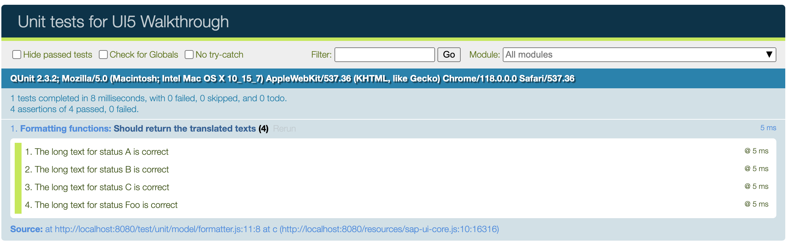
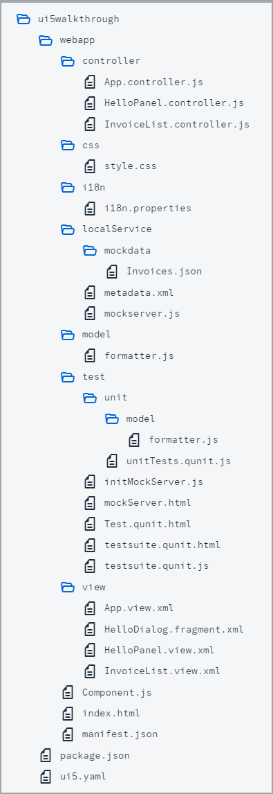

## Step 27: Unit Test with QUnit

Now that we have a test folder in the app, we can start to increase our test coverage.

Actually, every feature that we added to the app so far, would require a separate test case. We have totally neglected this so far, so let’s add a simple unit test for our custom formatter function from Step 23. We will test if the long text for our status is correct by comparing it with the texts from our resource bundle.

> 📝 **Note:** <br>  
> In this tutorial, we focus on a simple use case for the test implementation. If you want to learn more about QUnit tests, have a look at the [Testing Tutorial](https://sdk.openui5.org/topic/291c9121e6044ab381e0b51716f97f52.html) tutorial, especially [Step 2: A First Unit Test](https://sdk.openui5.org/topic/b81736e0fcb246efb3b0cf0ca422f8fd.html).

&nbsp;

***

### Preview  
  


<sup>*A unit test for our formatters is now available*</sup>

We add a new folder `unit` under the `test` folder and a `model` subfolder where we will place our formatter unit test. The folder structure matches the app structure to easily find the corresponding unit tests.
  

<sup>*Folder Structure for this Step*</sup>

You can access the live preview by clicking on this link: [🔗 Live Preview of Step 27](https://sap-samples.github.io/ui5-typescript-walkthrough/build/27/test/Test.cdn.qunit.html?testsuite=test-resources/ui5/walkthrough/testsuite.cdn.qunit&test=unit/unitTests).

***

### Coding

<details class="ts-only">

You can download the solution for this step here: [📥 Download step 27](https://sap-samples.github.io/ui5-typescript-walkthrough/ui5-typescript-walkthrough-step-27.zip).

</details>

<details class="js-only">

You can download the solution for this step here: [📥 Download step 27](https://sap-samples.github.io/ui5-typescript-walkthrough/ui5-typescript-walkthrough-step-27-js.zip).

</details>
***

### webapp/test/unit/model/formatter.?s \(New\)

We create a new `formatter.?s` file under `webapp/test/unit/model` where the unit test for the custom formatter is implemented. The formatter function that we want to test is from the `formatter.ts` file located in the `webapp/model` folder.

The new formatter file just contains one QUnit module for our formatter function and one unit test for the formatter function. In the implementation of the `statusText` function that we created in Step 23, we use the translated texts when calling the formatter. As we do not want to test the OpenUI5 binding functionality, we just use text in the test instead of a `ResourceBundle`.

Finally, we perform our assertions. We check each branch of the formatter logic by invoking the isolated formatter function with the values that we expect in the data model \(`A`, `B`, `C`, and everything else\). We strictly compare the result of the formatter function with the hard-coded strings that we expect from the resource bundle and give a meaningful error message if the test should fail.

> 📝 **Note:** <br>  
> Test code needs to import the modules under test (i.e. productive code) using their full namespace (in our case `ui5/walkthrough/`), rather than using relative paths. This is because the test code uses a different namespace (`test-resources/ui5/walkthrough/`).

```ts
import ResourceModel from "sap/ui/model/resource/ResourceModel";
import Controller from "sap/ui/core/mvc/Controller";
import formatter from "ui5/walkthrough/model/formatter";

QUnit.module("Formatting function", {});

QUnit.test("Should return the translated texts", (assert) => {
    const resourceModel = new ResourceModel({
        bundleUrl: sap.ui.require.toUrl("ui5/walkthrough/i18n/i18n.properties"),
        supportedLocales: [
            ""
        ],
        fallbackLocale: ""
    });

    const controllerMock = {
        getOwnerComponent() {
            return {
                getModel() {
                    return resourceModel;
                }
            };
        }
    } as any as Controller;

    // System under test
    const fnIsolatedFormatter = formatter.statusText.bind(controllerMock);

    // Assert
    assert.strictEqual(fnIsolatedFormatter("A"), "New", "The long text for status A is correct");
    assert.strictEqual(fnIsolatedFormatter("B"), "In Progress", "The long text for status B is correct");
    assert.strictEqual(fnIsolatedFormatter("C"), "Done", "The long text for status C is correct");
    assert.strictEqual(fnIsolatedFormatter("Foo"), "Foo", "The long text for status Foo is correct");
});

```

```js
sap.ui.define(["sap/ui/model/resource/ResourceModel", "ui5/walkthrough/model/formatter"], function (ResourceModel, formatter) {
  "use strict";

  QUnit.module("Formatting function", {});
  QUnit.test("Should return the translated texts", assert => {
    const resourceModel = new ResourceModel({
      bundleUrl: sap.ui.require.toUrl("ui5/walkthrough/i18n/i18n.properties"),
      supportedLocales: [""],
      fallbackLocale: ""
    });
    const controllerMock = {
      getOwnerComponent() {
        return {
          getModel() {
            return resourceModel;
          }
        };
      }
    };

    // System under test
    const fnIsolatedFormatter = formatter.statusText.bind(controllerMock);

    // Assert
    assert.strictEqual(fnIsolatedFormatter("A"), "New", "The long text for status A is correct");
    assert.strictEqual(fnIsolatedFormatter("B"), "In Progress", "The long text for status B is correct");
    assert.strictEqual(fnIsolatedFormatter("C"), "Done", "The long text for status C is correct");
    assert.strictEqual(fnIsolatedFormatter("Foo"), "Foo", "The long text for status Foo is correct");
  });
});

```

### webapp/test/unit/unitTests.qunit.?s \(New\)

We create a new `unitTests.qunit.?s` file under `webapp/test/unit/`.
This module will serve as the entry point for all our unit tests. It will be referenced in the test suite that we will set up later on.

Inside the `unitTests.qunit.?s` file, we import the unit test for the custom formatter. This ensures that any tests related to the custom formatter functionality will be included when running our unit tests.

```ts
import "./model/formatter";

```

```js
sap.ui.define(["./model/formatter"], function (___model_formatter) {
  "use strict";
});

```

### webapp/test/Test.qunit.html \(New\)

We also need a generic test page that will be used to run individual tests.

It includes the `sap/ui/test/starter/runTest.js` script which is responsible for loading the test suite configuration and starting the test.

Unlike with the UI5 bootstrap, this script only accepts the `data-sap-ui-resource-roots` configuration where we need to register our project-specific test namespace so that our modules can be loaded.

The page will be referenced in the test suite that we will create next.

```html
<!DOCTYPE html>
<html>
<head>
	<meta charset="utf-8">
	<script
		src="../resources/sap/ui/test/starter/runTest.js"
		data-sap-ui-resource-roots='{
			"test-resources.ui5.walkthrough": "./"
		}'
	></script>
</head>
<body class="sapUiBody">
	<div id="qunit"></div>
	<div id="qunit-fixture"></div>
</body>
</html>

```


### webapp/test/testsuite.qunit.js \(New\)

The `testsuite.qunit.js` file contains the configuration for our test suite.
Although it comes with a set of defaults, we recommend specifying the used QUnit version to prevent potential future updates from breaking our tests.
Additionally, the `sap_horizon` theme is configured in the `ui5` section, where you can provide the UI5 runtime configuration.

The test suite serves as the entry point for all tests within our project such as the previously created `unit/unitTests` (The `.qunit.ts` extension is omitted and will be added automatically during runtime).

The previously created generic `Test.qunit.html` file is referenced as the test `page` and configured with query parameters so that individual tests can be run. The placeholders `{suite}` and `{name}` are replaced with the suite and test names respectively.

For more information, read [Test Starter - Concept and Basic Setup](https://sdk.openui5.org/#/topic/22f50c0f0b104bf3ba84620880793d3f).

> 📝 **Note:** <br>
> There are currently no types available for the test suite configuration. Please refer to [Test Starter - Configuration Options](https://sdk.openui5.org/topic/738ed025b36e484fa99046d0f80552fd) to see all available options.

```ts
export default {
	name: "QUnit test suite for UI5 TypeScript Walkthrough",
	defaults: {
		page: "ui5://test-resources/ui5/walkthrough/Test.qunit.html?testsuite={suite}&test={name}",
		qunit: {
			version: 2
		},
		ui5: {
			theme: "sap_horizon"
		},
		loader: {
			paths: {
				"ui5/walkthrough": "../"
			}
		}
	},
	tests: {
		"unit/unitTests": {
			title: "UI5 TypeScript Walkthrough - Unit Tests"
		}
	}
};

```

```js
sap.ui.define([], function () {
  "use strict";

  return {
    name: "QUnit test suite for UI5 TypeScript Walkthrough",
    defaults: {
      page: "ui5://test-resources/ui5/walkthrough/Test.qunit.html?testsuite={suite}&test={name}",
      qunit: {
        version: 2
      },
      ui5: {
        theme: "sap_horizon"
      },
      loader: {
        paths: {
          "ui5/walkthrough": "../"
        }
      }
    },
    tests: {
      "unit/unitTests": {
        title: "UI5 TypeScript Walkthrough - Unit Tests"
      }
    }
  };
});

```

### webapp/test/testsuite.qunit.html \(New\)

We also create a corresponding `testsuite.qunit.html` in the same folder. 

This is the page we will open in the browser to see a list of all our tests and run them by clicking on the test name.

It registers a resource root mapping for the test resources of our project and references the `testsuite.qunit` module we created in the previous step.

```html
<!DOCTYPE html>
<html>
<head>
	<meta charset="utf-8">
	<script
		src="../resources/sap/ui/test/starter/createSuite.js"
		data-sap-ui-testsuite="test-resources/ui5/walkthrough/testsuite.qunit"
		data-sap-ui-resource-roots='{
			"test-resources.ui5.walkthrough": "./"
		}'
	></script>
</head>
<body>
</body>
</html>

```

If we now open the `webapp/test/testsuite.qunit.html` file in the browser and select `unit/unitTests`, we should see our test running and verifying the formatter logic.

### Conventions

-   All unit tests are placed in the webapp/test/unit folder of the app.

-   The default naming convention for the test suite is `testsuite.qunit.html` and `testsuite.qunit.ts`. When adding additional test suites, the naming must follow the pattern `testsuite.<name>.qunit.html` / `testsuite.<name>.qunit.ts`.

-   Test files referenced in the test suite end with `.qunit.ts`.

-   A unit test should be written for formatters, controller logic, and other individual functionality.

-   All dependencies are replaced by stubs to test only the functionality in scope.

&nbsp;

***

**Next:** [Step 28: Integration Test with OPA](../28/README.md "If we want to test interaction patterns or more visual features of our app, we can also write an integration test.")

**Previous:** [Step 26: Mock Server Configuration](../26/README.md "We just ran our app against a real service, but for developing and testing our app we do not want to rely on the availability of the “real” service or put additional load on the system where the data service is located.")

***

**Related Information** 

[Test Starter](https://sdk.openui5.org/topic/032be2cb2e1d4115af20862673bedcdb.html "The test starter is a concept intended to simplify the test setup for OpenUI5 applications and libraries by orchestrating your QUnit and OPA5 tests.")

[Unit Testing with QUnit](https://sdk.openui5.org/topic/09d145cd86ee4f8e9d08715f1b364c51.html "QUnit is a powerful, easy-to-use JavaScript unit testing framework. It is used by the jQuery, jQuery UI and jQuery Mobile projects and is capable of testing any generic JavaScript code. It supports asynchronous tests out-of-the-box.")

[QUnit Home Page](https://qunitjs.com/)

[Testing Tutorial](https://sdk.openui5.org/topic/291c9121e6044ab381e0b51716f97f52.html "We just ran our app against a real service, but for developing and testing our app we do not want to rely on the availability of the “real” service or put additional load on the system where the data service is located.")
