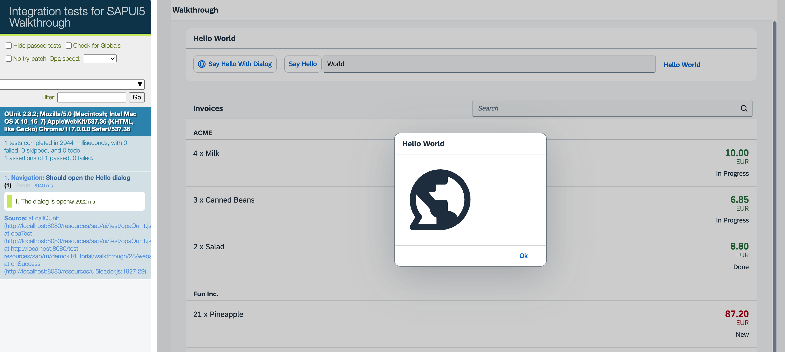
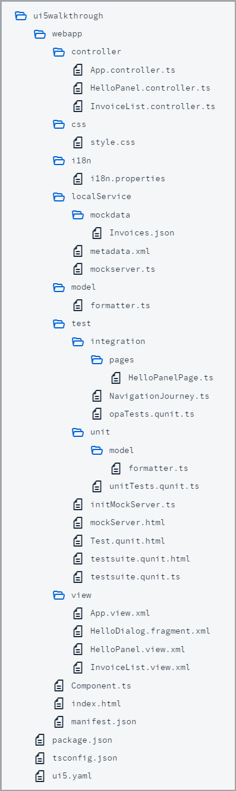

## Step 28: Integration Test with OPA

If we want to test interaction patterns or more visual features of our app, we can also write an integration test.

We haven’t thought about testing our interaction with the app yet, so in this step we will check if the dialog actually opens when we click the “Say Hello with Dialog” button. We can easily do this with OPA5, a feature of OpenUI5 that is easy to set up and is based on JavaScript and QUnit. Using integration and unit tests and running them consistently in a continuous integration \(CI\) environment, we can make sure that we don’t accidentally break our app or introduce logical errors in existing code.
&nbsp;
> 📝 **Note:** 
> In this tutorial, we focus on a simple use case for the test implementation. If you want to learn more about OPA tests, have a look at our [Testing Tutorial](https://sdk.openui5.org/topic/291c9121e6044ab381e0b51716f97f52.html) tutorial, especially [Step 6: A First OPA Test](https://sdk.openui5.org/topic/1b47457cbe4941ee926317d827517acb.html).

&nbsp;

***

### Preview



<sup>*An OPA test opens the "Hello" dialog from step 16*</sup>

We add a new folder `integration` below the `test` folder, where we put our new test cases. Page objects that help structuring such integration tests are put in the `pages` subfolder that we also create now.


<sup>*Folder Structure for this Step*</sup>

You can access the live preview by clicking on this link: [🔗 Live Preview of Step 28](https://sap-samples.github.io/ui5-typescript-walkthrough/build/28/test/Test.cdn.qunit.html?testsuite=test-resources/ui5/walkthrough/testsuite.cdn.qunit&test=integration/opaTests).

***

### Coding  
  

<details class="ts-only">

You can download the solution for this step here: [📥 Download step 28](https://sap-samples.github.io/ui5-typescript-walkthrough/ui5-typescript-walkthrough-step-28.zip).

</details>

<details class="js-only">

You can download the solution for this step here: [📥 Download step 28](https://sap-samples.github.io/ui5-typescript-walkthrough/ui5-typescript-walkthrough-step-28-js.zip).

</details>
***

### webapp/test/integration/pages/HelloPanelPage.ts \(New\)

We create a new `HelloPanelPage.ts` file under `webapp/test/integration/pages`.

A `page object` is a structuring element of OPA that encapsulates actions and assertions needed to describe the journey - we will come the journey in the next step. Typically those are related to a view in the app but there can also be stand-alone pages for browsers or common functionality. This page object relates to the `HelloPanel` view.
	
In the actions section of the page object we define a function to click the "Hello" dialog button. This is done in OPA5 with a `waitFor` statement, it is basically a loop that checks for the conditions defined as parameters. If the conditions are met, the success callback is executed, if the test fails because the conditions have not been met, the text in the `errorMessage` property is displayed on the result page.

In the assertions section we define a `waitFor` statement that checks if a `sap.m.Dialog` control is existing in the DOM of the app. When the dialog has been found, the test is successful and we can immediately confirm by calling an `ok` statement with a meaningful message.

```ts
import Opa5 from "sap/ui/test/Opa5";
import Press from "sap/ui/test/actions/Press";

const viewName = "ui5.walkthrough.view.HelloPanel";

export default class HelloPanelPage extends Opa5 {
	// Actions
	iPressTheSayHelloWithDialogButton() {
		return this.waitFor({
			id: "helloDialogButton",
			viewName,
			actions: new Press(),
			errorMessage: "Did not find the 'Say Hello With Dialog' button on the HelloPanel view"
		});
	}

	// Assertions
	iShouldSeeTheHelloDialog() {
		return this.waitFor({
			controlType: "sap.m.Dialog",
			success: function () {
				// we set the view busy, so we need to query the parent of the app
				Opa5.assert.ok(true, "The dialog is open");
			},
			errorMessage: "Did not find the dialog control"
		});
	}
};
```

***

### webapp/test/integration/NavigationJourney.ts \(New\)

We create a new `NavigationJourney` file under `webapp/test/integration/`.

A `journey` is another structuring element of OPA. It consists of a series of integration tests that belong to the same context such as navigating through the app. Similar to the QUnit test implementation, OPA5 uses QUnit, that's why we first set up a QUnit module `Navigation` that will be displayed on our result page.

The function `opaTest` is the main aspect for defining integration tests with OPA. Its parameters define a test name and a callback function that gets executed with the following OPA5 helper objects to write meaningful tests that read like a user story.

-   `Given`
	On the given object we can call arrangement functions like `iStartMyUIComponent` to load our app component for integration testing.

-   `When`
	Contains custom actions that we can execute to get the application in a state where we can test the expected behavior.

-   `Then`
	Contains custom assertions that check a specific constellation in the application and the teardown function that removes our component again.

In our journey, we create a very simple test that starts the `MainPage` and load our app. Then, we carry out the the actions we defined in our `MainPage` and expect that they will be executed successfully. Finally, we shut down the page again by calling function `iTeardownMyApp` on the `MainPage`.

```ts
import opaTest from "sap/ui/test/opaQunit";
import HelloPanelPage from "./pages/HelloPanelPage";

const onTheHelloPanelPage = new HelloPanelPage();

QUnit.module("Navigation");

opaTest("Should open the Hello dialog", function () {

	// Arrangements
	onTheHelloPanelPage.iStartMyUIComponent({
		componentConfig: {
			name: "ui5.walkthrough"
		}
	});

	// Actions
	onTheHelloPanelPage.iPressTheSayHelloWithDialogButton();

	// Assertions
	onTheHelloPanelPage.iShouldSeeTheHelloDialog();

	// Cleanup
	onTheHelloPanelPage.iTeardownMyApp();
});
```

As you can see, the test case reads like a user story, we actually do not need the implementation of the methods yet to understand the meaning of the test case. This approach is called "Behavior Driven Development" or simply BDD and is popular in "Agile Software Development".

***

### webapp/test/integration/opaTests.qunit.ts \(New\)

We create a new `opaTests.qunit.ts` file under `webapp/test/integration/`. 
This module imports our `NavigationJourney` and is the entrypoint for all integration tests in the project.

```ts
import "./NavigationJourney";
```

***

### webapp/test/testsuite.qunit.ts

Finally we reference the new `integration/opaTests.qunit.ts` in the `testsuite.qunit.ts` file. The `.qunit.ts` extension is omitted and will be added automatically during runtime.

```ts
export default {
  // ...
	tests: {
		"unit/unitTests": {
			title: "UI5 TypeScript Walkthrough - Unit Tests"
		},
		"integration/opaTests": {
			title: "UI5 TypeScript Walkthrough - Integration Tests"
		}
	}
};
```

If we now open the `webapp/test/testsuite.qunit.html` file in the browser and select `integration/opaTests`, the QUnit layout should appear and a test “Should see the Hello dialog” will run immediately. This action will load the app component on the right side of the page. There you can see the operations the test is performing on the app. If everything works correctly, a button click will be triggered, then a dialog will be displayed and the test case will be green.

***

### Conventions

-   OPA tests are located in the `webapp/test/integration` folder of the application.

-   Use `page` objects and `journeys` for structuring OPA tests.

&nbsp;

***

**Next:** [Step 29: Debugging Tools](../29/README.md "Even though we have added a basic test coverage in the previous steps, it seems like we accidentally broke our app, because it does not display prices to our invoices anymore. We need to debug the issue and fix it before someone finds out.")

**Previous:** [Step 27: Unit Test with QUnit](../27/README.md "Now that we have a test folder in the app, we can start to increase our test coverage.")

***

**Related Information**  

[Integration Testing with One Page Acceptance Tests \(OPA5\)](https://sdk.openui5.org/topic/2696ab50faad458f9b4027ec2f9b884d.html "OPA5 is an API for OpenUI5 controls. It hides asynchronicity and eases access to OpenUI5 elements. This makes OPA especially helpful for testing user interactions, integration with OpenUI5, navigation, and data binding.")

[API Reference: `sap.ui.test.Opa5`](https://sdk.openui5.org/api/sap.ui.test.Opa5)

[Samples: `sap.ui.test.Opa5` ](https://sdk.openui5.org/entity/sap.ui.test.Opa5)

[API Reference: `sap.ui.test.actions`](https://sdk.openui5.org/api/sap.ui.test.actions)

[QUnit Home Page](https://qunitjs.com/)

[Testing Tutorial](https://sdk.openui5.org/topic/291c9121e6044ab381e0b51716f97f52.html "In this tutorial we will test application functionality with the testing tools that are delivered with OpenUI5. At different steps of this tutorial you will write tests using QUnit, OPA5, and the OData V2 mock server. Additionally, you will learn about testing strategies, Test Driven Development (TDD), and much more.")
