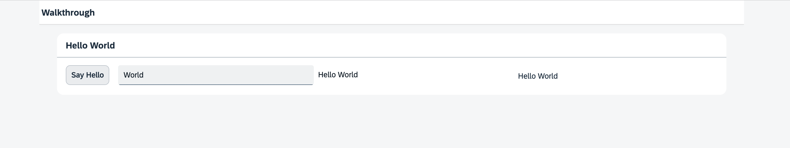

<nav class="tutorial-breadcrumb"><a href="../../../index.html">UI5 Tutorials</a> <span class="tutorial-breadcrumb-sep">&rsaquo;</span> <a href="../../index.html">Walkthrough Tutorial</a></nav>

## Step 12: Shell Control as Container

Now we use a shell control as container for our app and use it as our new root element. The shell takes care of visual adaptation of the application to the device’s screen size by introducing a so-called letterbox on desktop screens.

&nbsp;

***

### Preview
  


You can access the live preview by clicking on this link: [🔗 Live Preview of Step 12](https://ui5.github.io/tutorials/walkthrough/build/12/index-cdn.html).

***

### Coding

You can download the solution for this step here: <span class="ts-only">[📥 Download step 12](https://ui5.github.io/tutorials/walkthrough/walkthrough-step-12.zip)<span class="lang-suffix"> (TS)</span></span><span class="js-only">[📥 Download step 12](https://ui5.github.io/tutorials/walkthrough/walkthrough-step-12-js.zip)<span class="lang-suffix"> (JS)</span></span>.
***

### webapp/view/App.view.xml

In your App view, we put the `App` control inside a `sap/m/Shell` control.


```xml
<mvc:View
  controllerName="ui5.tutorial.walkthrough.controller.App"
  xmlns="sap.m"
  xmlns:mvc="sap.ui.core.mvc"
  displayBlock="true">
  <Shell>
    <App>
      <pages>
        <Page title="{i18n>homePageTitle}">
          <content>
            <Panel
              headerText="{i18n>helloPanelTitle}">
              <content>
                <Button
                  text="{i18n>showHelloButtonText}"
                  press=".onShowHello"/>
                <Input
                  value="{/recipient/name}"
                  description="Hello {/recipient/name}"
                  valueLiveUpdate="true"
                  width="60%"/>
              </content>
            </Panel>
          </content>
        </Page>
      </pages>
    </App>
  </Shell>
</mvc:View>
```


The `Shell` control is now the outermost control of our app and automatically displays a so-called letterbox, if the screen size is larger than a certain width.

> ℹ️ **Note:**
> We don't add the `Shell` control to the declarative UI definition in the XML view if apps run in an external shell, like the SAP Fiori launchpad that already has a shell around the component UI.
There are further options to customize the shell, like setting a custom background image or color and setting a custom logo. Check the related API reference for more details.

&nbsp;

***

**Next:** [Step 13: Margins and Paddings](../13/index.html)

**Previous:** [Step 11: Pages and Panels](../11/index.html)

***

**Related Information**  

[API Reference: `sap.m.Shell`](https://sdk.openui5.org/#/api/sap.m.Shell)
