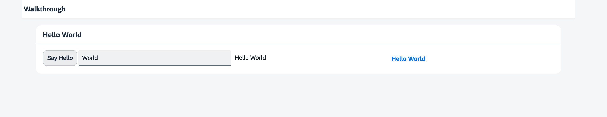

<nav class="tutorial-breadcrumb"><a href="../../../index.html">UI5 Tutorials</a> <span class="tutorial-breadcrumb-sep">&rsaquo;</span> <a href="../../index.html">Walkthrough Tutorial</a></nav>

## Step 14: Custom CSS and Theme Colors

Sometimes we need to define some more fine-granular layouts and this is when we can use the flexibility of CSS by adding custom style classes to controls and style them as we like.

> ### 🚨 Caution:  
> As stated in the [Compatibility Rules](https://sdk.openui5.org/topic/91f087396f4d1014b6dd926db0e91070.html), the HTML and CSS generated by OpenUI5 is not part of the public API and may change in patch and minor releases. If you decide to override styles, you need to test and update your modifications each time OpenUI5 is updated. A prerequisite for this is that you have control over the version of OpenUI5 being used, for example in a standalone scenario. This is not possible when running your app in the SAP Fiori launchpad where OpenUI5 is centrally loaded for all apps. As such, SAP Fiori launchpad apps should not override styles.

&nbsp;

***

### Preview
  


You can access the live preview by clicking on this link: [🔗 Live Preview of Step 14](https://ui5.github.io/tutorials/walkthrough/build/14/index-cdn.html).


***


### Coding
You can download the solution for this step here: <span class="ts-only">[📥 Download step 14](https://ui5.github.io/tutorials/walkthrough/walkthrough-step-14.zip)<span class="lang-suffix"> (TS)</span></span><span class="js-only">[📥 Download step 14](https://ui5.github.io/tutorials/walkthrough/walkthrough-step-14-js.zip)<span class="lang-suffix"> (JS)</span></span>.
***

### webapp/css/style.css \(New\)

We create a folder `css` which will contain our CSS files. In a new style definition file inside the `css` folder we create our custom classes combined with a custom namespace class. This makes sure that the styles will only be applied on controls that are used within our app.

A button has a default margin of `0` that we want to override: We add a custom margin of `2px` \(or `0.125rem` calculated relatively to the default font size of `16px`\) to the button with the style class `myCustomButton`. We add the CSS class `sapMBtn` to make our selector more specific: in CSS, the rule with the most specific selector "wins".

For right-to-left \(rtl\) languages, like Arabic, you set the left margin and reset the right margin as the app display is inverted. If you only use standard OpenUI5 controls, you don't need to care about this, in this case where we use custom CSS, you have to add this information.

In an additional class `myCustomText` we define a bold text and set the display to `inline-block`. This time we just define our custom class without any additional selectors. We do not set a color value here yet, we will do this in the view.


```css
html[dir="ltr"] .myAppDemoWT .myCustomButton.sapMBtn {
    margin-right: 0.125rem
 }
 
 html[dir="rtl"] .myAppDemoWT .myCustomButton.sapMBtn {
    margin-left: 0.125rem
 }
 
 .myAppDemoWT .myCustomText {
    display: inline-block;
    font-weight: bold;
 }
```


### webapp/manifest.json

We configure the CSS file to our app descriptor: In the `resources` section of the `sap.ui5` namespace, additional resources for the app can be loaded. We load the CSS styles by defining a URI relative to the component. OpenUI5 then adds this file to the header of the HTML page as a `<link>` tag, just like in plain Web pages, and the browser loads it automatically.


```json
{
...
  "sap.ui5": {
    ...
    "models": {
      ...
    },
    "resources": {
      "css": [
        {
        "uri": "css/style.css"
        }
      ]
    }     
  }
}        
```


### webapp/view/App.view.xml

The app control is configured with our custom namespace class `myAppDemoWT`. This class has no styling rules set and is used in the definition of the CSS rules to define CSS selectors that are only valid for this app.

We add our custom CSS class `myCustomButton` to the button to precisely define the space between the button and the input field. Now we have a pixel-perfect design for the panel content.

To highlight the output text, we replace the text control by a `FormattedText` control which can be styled individually, either by using custom CSS or with HTML code. We add a theme-dependent CSS class \(`sapThemeHighlight-asColor`\) to set the highlight color that is defined in the theme and our custom CSS class `myCustomText`.


```xml
<mvc:View
  controllerName="ui5.tutorial.walkthrough.controller.App"
  xmlns="sap.m"
  xmlns:mvc="sap.ui.core.mvc"
  displayBlock="true">
  <Shell>
    <App class="myAppDemoWT">
      <pages>
        <Page title="{i18n>homePageTitle}">
          <content>
            <Panel
              headerText="{i18n>helloPanelTitle}"
              class="sapUiResponsiveMargin"
              width="auto">
              <content>
                <Button
                  text="{i18n>showHelloButtonText}"
                  press=".onShowHello"
                  class="myCustomButton"/>
                <Input
                  value="{/recipient/name}"
                  valueLiveUpdate="true"
                  width="60%"/>
                <FormattedText
                  htmlText="Hello {/recipient/name}"
                  class="sapUiSmallMargin sapThemeHighlight-asColor myCustomText"/>	
              </content>
            </Panel>
          </content>
        </Page>
      </pages>
    </App>
  </Shell>
</mvc:View>
```

&nbsp;
The actual color now depends on the selected theme which ensures that the color always fits to the theme and is semantically clear. For a complete list of the available CSS class names, see [CSS Classes for Theme Parameters](https://sdk.openui5.org/topic/ea08f53503da42c19afd342f4b0c9ec7.html).

***

### Conventions

-   Do not specify colors in custom CSS but use the standard theme-dependent classes instead.

&nbsp;

***

**Related Information**  


**Next:** [Step 15: Nested Views](../15/index.html)

**Previous:** [Step 13: Margins and Paddings](../13/index.html)

***

**Related Information**  

[Descriptor for Applications, Components, and Libraries \(manifest.json\)](https://sdk.openui5.org/topic/be0cf40f61184b358b5faedaec98b2da.html "The descriptor for applications, components, and libraries (in short: app descriptor) is inspired by the WebApplication Manifest concept introduced by the W3C. The descriptor provides a central, machine-readable, and easy-to-access location for storing metadata associated with an application, an application component, or a library.")

[CSS Classes for Theme Parameters](https://sdk.openui5.org/topic/ea08f53503da42c19afd342f4b0c9ec7.html " OpenUI5 provides a set of essential adjustable colors behind the generic predefined CSS rules that enable custom content to use the respective CSS classes for the required colors.")

[Creating Themable User Interfaces](https://sdk.openui5.org/topic/a2c67acd17a948ee89344676762e0c2a.html "There are several things you should keep in mind to ensure that an application can actually be themed.")

[Compatibility Rules](https://sdk.openui5.org/topic/91f087396f4d1014b6dd926db0e91070.html "The following sections describe what SAP can change in major, minor, and patch releases. Always consider these rules when developing apps, features, or controls with or for  OpenUI5.")

[API Reference: `sap.ui.core.theming`](https://sdk.openui5.org/api/sap.ui.core.theming)

[Samples: `sap.ui.core.theming` ](https://sdk.openui5.org/entity/sap.ui.core.theming)
