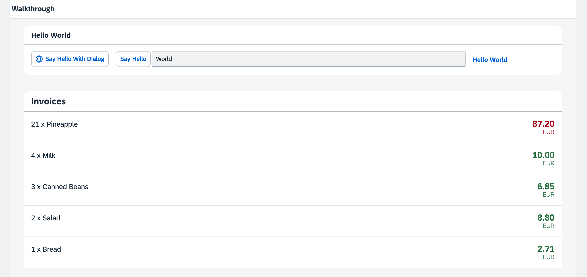

<nav class="tutorial-breadcrumb"><a href="../../../index.html">UI5 Tutorials</a> <span class="tutorial-breadcrumb-sep">&rsaquo;</span> <a href="../../index.html">Walkthrough Tutorial</a></nav>

## Step 21: Expression Binding

Sometimes the predefined types of OpenUI5 are not flexible enough and you want to do a simple calculation or formatting in the view - that is where expressions are really helpful. We use them to format our price according to the current number in the data model.

&nbsp;

***

### Preview
  


You can access the live preview by clicking on this link: [🔗 Live Preview of Step 21](https://ui5.github.io/tutorials/walkthrough/build/21/index-cdn.html).

***

### Coding

You can download the solution for this step here: <span class="ts-only">[📥 Download step 21](https://ui5.github.io/tutorials/walkthrough/walkthrough-step-21.zip)<span class="lang-suffix"> (TS)</span></span><span class="js-only">[📥 Download step 21](https://ui5.github.io/tutorials/walkthrough/walkthrough-step-21-js.zip)<span class="lang-suffix"> (JS)</span></span>.
***

### webapp/view/InvoiceList.view.xml

We add the `numberState` attribute to the `ObjectListItem` control in our invoices list view. We use the '=' symbol to initiate an expression binding and specify that the number in `numberState` appears in red, in case the price is greater than 50, otherwise in green.


```xml
<mvc:View
   controllerName="ui5.tutorial.walkthrough.controller.InvoiceList"
   xmlns="sap.m"
   xmlns:core="sap.ui.core"
   xmlns:mvc="sap.ui.core.mvc">
   <List
      headerText="{i18n>invoiceListTitle}"
      class="sapUiResponsiveMargin"
      width="auto"
      items="{invoice>/Invoices}" >
      <items>
         <ObjectListItem
            core:require="{
               Currency: 'sap/ui/model/type/Currency'
            }"
            title="{invoice>Quantity} x {invoice>ProductName}"
            number="{
               parts: [
                  'invoice>ExtendedPrice', 
                  'view>/currency'
               ],
               type: 'Currency',
               formatOptions: {
                  showMeasure: false
               }
            }"
            numberUnit="{view>/currency}"
            numberState="{= ${invoice>ExtendedPrice} > 50 ? 'Error' : 'Success' }"/>
      </items>
   </List>
</mvc:View>
```


Expression binding can do simple calculation logic like the ternary operator shown here.

The condition of the operator is a value from our data model. A model binding inside an expression binding has to be escaped with the `$` sign as you can see in the code. We set the state to "Error" \(the number will appear in red\) if the price is higher than 50 and to "Success" \(the number will appear in green\) otherwise.

Expressions are limited to a particular set of operations that help formatting the data such as Math expression, comparisons, and such. You can look up the possible operations in the [documentation](https://sdk.openui5.org/topic/daf6852a04b44d118963968a1239d2c0.html).

***

### Conventions

-   Only use expression binding for trivial calculations.

&nbsp;

***

**Next:** [Step 22: Custom Formatters](../22/index.html)

**Previous:** [Step 20: Data Types](../20/index.html)

***

**Related Information**  

[Expression Binding](https://sdk.openui5.org/topic/daf6852a04b44d118963968a1239d2c0.html "Expression binding is an enhancement of the OpenUI5 binding syntax, which allows for providing expressions instead of custom formatter functions.")
