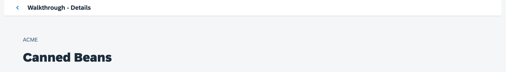

<nav class="tutorial-breadcrumb"><a href="../../../index.html">UI5 Tutorials</a> <span class="tutorial-breadcrumb-sep">&rsaquo;</span> <a href="../../index.html">Walkthrough Tutorial</a></nav>

## Step 32: Routing Back and History

Now we can navigate to our detail page and display an invoice, but we cannot go back to the overview page yet. We'll add a back button to the detail page and implement a function that shows our overview page again.

&nbsp;

***

### Preview
  
  


You can access the live preview by clicking on this link: [🔗 Live Preview of Step 32](https://ui5.github.io/tutorials/walkthrough/build/32/test/mockServer-cdn.html).

***

### Coding

You can download the solution for this step here: <span class="ts-only">[📥 Download step 32](https://ui5.github.io/tutorials/walkthrough/walkthrough-step-32.zip)<span class="lang-suffix"> (TS)</span></span><span class="js-only">[📥 Download step 32](https://ui5.github.io/tutorials/walkthrough/walkthrough-step-32-js.zip)<span class="lang-suffix"> (JS)</span></span>.

***

### webapp/controller/Detail.controller.ts/.js

To be able to navigate from the detail view back to the view we came from we implement a new event handler function in the controller of the detail view. 
For a start we load a new class called `History` from the `sap.ui.core.routing` namespace. This class provides methods for navigating through the history of the application.

In the event handler we access the navigation history and try to determine the previous hash. In contrast to the browser history, we will get a valid result only if a navigation step inside our app has already happened. The `History.getInstance()` method returns a singleton instance of the `History` class. Then, we use the `getPreviousHash` method to get the hash of the previous page. If there's a previous page (i.e., `previousHash` isn't `undefined`), we will simply use the browser history to go back to the previous page. 

If no navigation has happened before, we get a reference to the router and use the `navTo` method to navigate to the "overview" route. As a second parameter we specify an empty array \(`{}`\) as we do not pass any additional parameters to the route. The third parameter is set to `true`. This tells the router to replace the current history state with the new one since we actually do a back navigation by ourselves and we do not want to have an entry in the browser history.


```ts
// webapp/controller/Detail.controller.ts
import Controller from "sap/ui/core/mvc/Controller";
import { Route$PatternMatchedEvent } from "sap/ui/core/routing/Route";
import History from "sap/ui/core/routing/History";
import UIComponent from "sap/ui/core/UIComponent";

/**
 * @namespace ui5.tutorial.walkthrough.controller
 */
export default class Detail extends Controller {
	
	//...

	onNavBack(): void {
		const history = History.getInstance();
		const previousHash = history.getPreviousHash();

		if (previousHash !== undefined) {
			window.history.go(-1);
		} else {
			const router = UIComponent.getRouterFor(this);
			router.navTo("overview", {}, true);
		}
	}    
};

```



```js
// webapp/controller/Detail.controller.js
sap.ui.define(["sap/ui/core/mvc/Controller", "sap/ui/core/routing/History", "sap/ui/core/UIComponent"], function (Controller, History, UIComponent) {
	"use strict";

	const Detail = Controller.extend("ui5.tutorial.walkthrough.controller.Detail", {
		//...
		onNavBack() {
			const history = History.getInstance();
			const previousHash = history.getPreviousHash();
			if (previousHash !== undefined) {
				window.history.go(-1);
			} else {
				const router = UIComponent.getRouterFor(this);
				router.navTo("overview", {}, true);
			}
		}
	});
	return Detail;
});

```


This implementation is a bit better than the browser’s back button for our use case. The browser would simply go back one step in the history even though we were on another page outside of the app. In the app, we always want to go back to the overview page even if we came from another link or opened the detail page directly with a bookmark. You can try it by loading the detail page in a new tab directly and clicking on the back button in the app, it will still go back to the overview page.

### webapp/view/Detail.view.xml

Now only the back button is missing on the detail page. We do this by telling the page control on the view to display the back button using the control parameter `showNavButton` and register the event handler we defined in its controller to be called when the back button is pressed.


```xml
<mvc:View
  controllerName="ui5.tutorial.walkthrough.controller.Detail"
  xmlns="sap.m"
  xmlns:mvc="sap.ui.core.mvc">
  <Page
    title="{i18n>detailPageTitle}"
    showNavButton="true"
    navButtonPress=".onNavBack">
    <ObjectHeader
      intro="{invoice>ShipperName}"
      title="{invoice>ProductName}"/>
  </Page>
</mvc:View>
```

&nbsp;
You should now see a back button when navigating to the detail page and being able to get back to the overview when clicking on it.

***

### Conventions

-   Add a path to go back to the parent page when the history state is unclear.

&nbsp;

***

**Next:** [Step 33: Custom Controls](../33/index.html)

**Previous:** [Step 31: Routing with Parameters](../31/index.html)

***

**Related Information**  

[API Reference: `sap.m.routing.Router`](https://sdk.openui5.org/api/sap.m.routing.Router)

[Samples: `sap.m.routing.Router`](https://sdk.openui5.org/entity/sap.m.routing.Router)

[API Reference: `sap.ui.core.routing.History`](https://sdk.openui5.org/api/sap.ui.core.routing.History)
