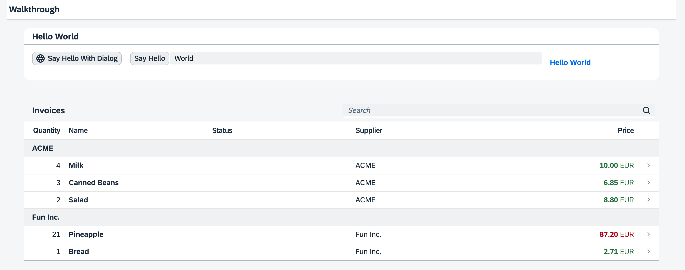

<nav class="tutorial-breadcrumb"><a href="../../../index.html">UI5 Tutorials</a> <span class="tutorial-breadcrumb-sep">&rsaquo;</span> <a href="../../index.html">Walkthrough Tutorial</a></nav>

## Step 36: Content Density

In this step of our Walkthrough tutorial, we adjust the content density based on the user’s device. Content density refers to the spacing and sizing of the UI controls and elements within your application. OpenUI5 contains different content densities allowing you to display larger controls for touch-enabled devices and a smaller, more compact design for devices that are operated by mouse. In our app, we will detect the device and adjust the density accordingly.

&nbsp;

***

### Preview 



You can access the live preview by clicking on this link: [🔗 Live Preview of Step 36](https://ui5.github.io/tutorials/walkthrough/build/36/test/mockServer-cdn.html).

***

### Coding
You can download the solution for this step here: <span class="ts-only">[📥 Download step 36](https://ui5.github.io/tutorials/walkthrough/walkthrough-step-36.zip)<span class="lang-suffix"> (TS)</span></span><span class="js-only">[📥 Download step 36](https://ui5.github.io/tutorials/walkthrough/walkthrough-step-36-js.zip)<span class="lang-suffix"> (JS)</span></span>.
***

### webapp/Component.ts/.js

To prepare the content density feature we add a helper method `getContentDensityClass` to the app component. OpenUI5 controls can be displayed in multiple sizes, for example in a `compact` size that is optimized for desktop and non-touch devices, and in a `cozy` mode that is optimized for touch interaction. The controls look for a specific CSS class in the HTML structure of the application to adjust their size.

This helper method queries the `Device` API directly for touch support of the client and returns the CSS class `sapUiSizeCompact` if touch interaction is not supported and `sapUiSizeCozy` for all other cases. We will use it throughout the application coding to set the proper content density CSS class.


```ts
// webapp/Component.ts
import UIComponent from "sap/ui/core/UIComponent";
import JSONModel from "sap/ui/model/json/JSONModel";
import Device from "sap/ui/Device";

/**
 * @namespace ui5.tutorial.walkthrough
 */
export default class Component extends UIComponent {
	public static metadata = {
		"interfaces": ["sap.ui.core.IAsyncContentCreation"],
		"manifest": "json"
	};
	init(): void {
		// call the init function of the parent
		...
	};
	
	getContentDensityClass(): string {
		return Device.support.touch ? "sapUiSizeCozy" : "sapUiSizeCompact";
	}
};

```



```js
// webapp/Component.js
sap.ui.define(["sap/ui/core/UIComponent", "sap/ui/model/json/JSONModel", "sap/ui/Device"], function (UIComponent, JSONModel, Device) {
	"use strict";

	const Component = UIComponent.extend("ui5.tutorial.walkthrough.Component", {
		metadata: {
			"interfaces": ["sap.ui.core.IAsyncContentCreation"],
			"manifest": "json"
		},
		init() {
			// call the init function of the parent
			...
		},
		getContentDensityClass() {
			return Device.support.touch ? "sapUiSizeCozy" : "sapUiSizeCompact";
		}
	});
	;
	return Component;
});

```


### webapp/controller/App.controller.ts/.js

We add the `onInit` method to the app controller that is called when the app view is instantiated. There, we query the helper function that we defined on the app component in order to set the corresponding style class on the app view. All controls inside the app view will now automatically adjust to either the compact or the cozy size, as defined by the style.


```ts
// webapp/controller/App.controller.ts
import Controller from "sap/ui/core/mvc/Controller";
import Component from "../Component";

/**
 * @namespace ui5.tutorial.walkthrough.controller
 */
export default class App extends Controller {
	onInit(): void {
      this.getView()?.addStyleClass((this.getOwnerComponent() as Component).getContentDensityClass() as string);
    }
};

```



```js
// webapp/controller/App.controller.js
sap.ui.define(["sap/ui/core/mvc/Controller"], function (Controller) {
	"use strict";

	const App = Controller.extend("ui5.tutorial.walkthrough.controller.App", {
		onInit() {
			this.getView().addStyleClass(this.getOwnerComponent().getContentDensityClass());
		}
	});
	;
	return App;
});

```


### webapp/manifest.json

In the `sap.ui5` namespace of the manifest we add the `contentDensities` section to specify the modes that the application supports. Containers like the SAP Fiori launchpad allow switching the content density based on these settings.

As we have just enabled the app to run in both modes depending on the devices capabilities, we can set both to `true` in the manifest.


```json
{
...
  "sap.ui5": {
  "contentDensities": {
    "compact": true,
    "cozy": true
  },
  "dependencies": {
    "minUI5Version": "1.148",
    "libs": {
      "sap.ui.core": {},
      "sap.m": {}
    }
  },    
  ...
  }
}
```


&nbsp;

***

**Next:** [Step 37: Accessibility](../37/index.html)

**Previous:** [Step 35: Device Adaptation](../35/index.html)

***

**Related Information**  

[Content Densities](https://sdk.openui5.org/topic/e54f729da8e3405fae5e4fe8ae7784c1.html "The devices used to run apps that are developed with OpenUI5 run on various different operating systems and have very different screen sizes. OpenUI5 contains different content densities for certain controls that allow your app to adapt to the device in question, allowing you to display larger controls for touch-enabled devices and a smaller, more compact design for devices that are operated by mouse.")

[API Reference: `sap.ui.Device`](https://sdk.openui5.org/api/sap.ui.Device)
